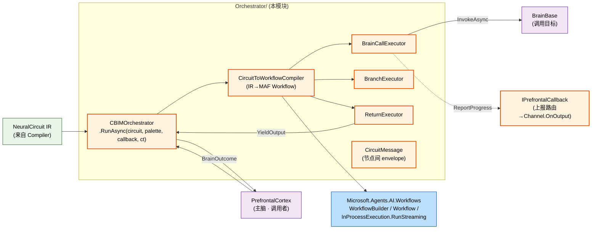
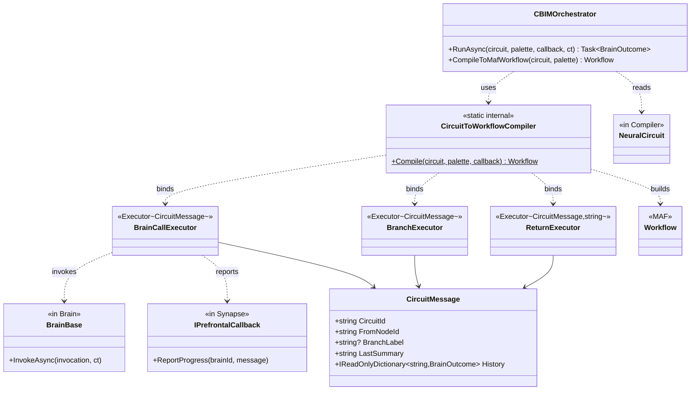
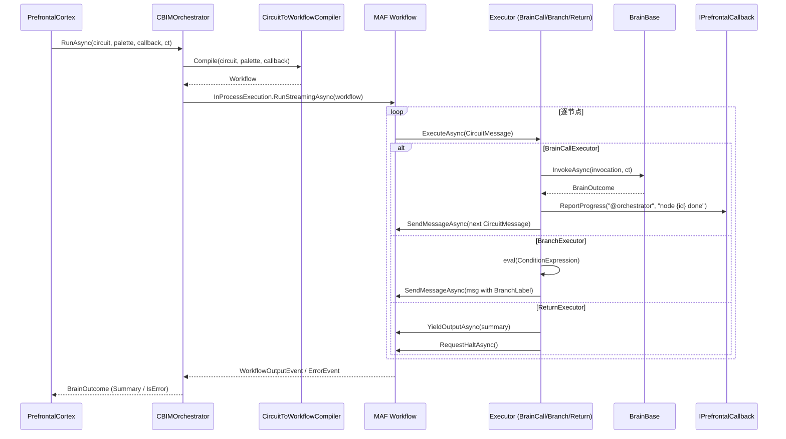

## Positioning

- **CBIMOrchestrator 是 FlowGraph 的「后端」**——拿 Compiler 产出的 `NeuralCircuit` IR，硬性按图执行。
- **核心决策：包一层 MAF `WorkflowBuilder` / `Workflow`，不重造**。遵用户明文要求。
- 平级 Compiler：Synapse 三 leaf 之一。LLM 只在 CallBrain / CallTool 节点内部发挥智能，节点间走确定性边。
- CBIM 负责：**IR → MAF Workflow** 翻译器 + CBIM 业务节点包（`BrainCallExecutor` / `BranchExecutor` / `ReturnExecutor`）+ 进度事件转译。

## 架构图



## 类图



## RunAsync 序流



## IR → MAF 节点映射

| CBIM IR 节点 | MAF Executor | 备注 |
|---------------|--------------|------|
| `CallBrainNode` | `BrainCallExecutor : Executor<CircuitMessage>` | 构造期扣 BrainBase + IPrefrontalCallback |
| `BranchNode` | `BranchExecutor : Executor<CircuitMessage>` | eval ConditionExpression 后 SendMessage 携 BranchLabel |
| `ReturnNode` | `ReturnExecutor : Executor<CircuitMessage, string>` | 渲染 SummaryTemplate + YieldOutput + RequestHalt |
| `CircuitEdge` | `AddEdge(from, to, condition: msg => msg.BranchLabel == edge.BranchLabel)` | BranchLabel 为 null 走无条件 AddEdge |

**CircuitMessage** 是节点间 envelope：`{ CircuitId, FromNodeId, BranchLabel?, LastSummary, History: Dict<nodeId, BrainOutcome> }`。`History` 是路经现场记账，Branch 表达式可引 `previous.summary contains "x"` / `node_n03.summary contains "x"`（v1 仅 contains/equals）。

## Contract Surface

```csharp
namespace CBIM.AgentSystem.Kernel.Synapse.Orchestrator;

using Microsoft.Agents.AI.Workflows;
using CBIM.AgentSystem.Brain;
using CBIM.AgentSystem.Kernel.Synapse;             // IPrefrontalCallback
using CBIM.AgentSystem.Kernel.Synapse.Compiler;    // NeuralCircuit

public sealed class CBIMOrchestrator
{
    public Task<BrainOutcome> RunAsync(
        NeuralCircuit circuit,
        IReadOnlyList<BrainBase> brainPalette,
        IPrefrontalCallback callback,
        CancellationToken ct);

    public Workflow CompileToMafWorkflow(
        NeuralCircuit circuit,
        IReadOnlyList<BrainBase> brainPalette);
}

public sealed class CircuitMessage
{
    public string CircuitId { get; }
    public string FromNodeId { get; }
    public string? BranchLabel { get; }
    public string LastSummary { get; }
    public IReadOnlyDictionary<string, BrainOutcome> History { get; }
}
```

## 失败 / 重试 / 图回滚

v1 走最简路径：

- 单节点失败（`BrainBase.InvokeAsync` 招异常 / IsError=true）→ BrainCallExecutor 调 `AddEventAsync(ExecutorFailedEvent)` + `RequestHaltAsync()`
- RunAsync 看到 WorkflowErrorEvent → 返 `BrainOutcome(IsError=true)`
- **不做自动重试 / 节点级重试 / fallback 路由**——交主脑下一轮重编译解决（fail-fast 上翻 → 主脑 LLM 重规划，表达性更强）
- **图状态不落盘重启**——v1 单进程；需恢复走 MAF `CheckpointManager`（默认不启）

## 进度回报

MAF `WorkflowEvent` 转译：

- `ExecutorInvokedEvent` → `callback.ReportProgress("@orchestrator", "running node {id}")`
- `ExecutorCompletedEvent` → `callback.ReportProgress("@orchestrator", "node {id} done")`
- `WorkflowOutputEvent` → 收集为 finalSummary
- `WorkflowErrorEvent` → 记 error

**本模块不直接接 Channel**——绕 `IPrefrontalCallback` 走，Channel 在依赖图上保持完整外层位置。

## 并发与并行

- 一个 Agent 同时只跑 1 个 NeuralCircuit（主脑装在 sequential `ChatClientAgent`）
- 图内并行走 MAF FanOut/FanIn（`ParallelNode` v1 不实装，占位）
- 多图 / 多 Agent 并发交给 `AgentSystem.ListInstances` + 多个 Channel，与本模块无关
- 单机约束——不考虑跨进程调度

## Dependencies

- `Microsoft.Agents.AI.Workflows` —— 核心 · **不重造引擎**
- `CBIM.AgentSystem.Brain` —— `BrainBase` / `BrainInvocation` / `BrainOutcome`
- `CBIM.AgentSystem.Kernel.Synapse` —— `IPrefrontalCallback`
- `CBIM.AgentSystem.Kernel.Synapse.Compiler` —— `NeuralCircuit` / `CircuitNode` 子类
- **不依赖** `CBIM.Channel`（进度绕 IPrefrontalCallback）
- **不依赖** `Kernel.Neuron`（K4：调 BrainBase 透传全 Neuron）
- **不依赖** `Microsoft.Agents.AI`（调脑区走 BrainBase 抽象，不拿 AIAgent）

## 铁律

- **O1 · 不重造 MAF** —— IR 路由 / 图验证 / Checkpoint / 并行 能交 MAF 都交；CBIM Executor 只包「调 BrainBase + eval ConditionExpression」业务表面
- **O2 · 图不在执行期修改** —— `NeuralCircuit` immutable；重规划 = 主脑重编译
- **O3 · Fail-fast 不 fail-creative** —— 节点失败 → 中断返主脑；不做启发式 fallback 跳节点
- **O4 · 上报绕 IPrefrontalCallback 走** —— 不直接接 Channel；依赖图上 Channel 保留外层位置
- **O5 · Compiler ⊥ Orchestrator** —— namespace 互不 using；中间仅共享抽象 `NeuralCircuit`（定义在 Compiler）

## Non-Goals

- 不实装 ParallelNode / WaitUserNode / CallToolNode（与 Compiler v1 范围一致）
- 不实装复杂表达式语言——v1 ConditionExpression 仅 contains / equals
- 不起独立进程 / 跨机调度——单机约束
- 不重造 MAF 检查点——需要时包 MAF `CheckpointManager` 加一个选项
- 不接管 SystemTool / MCP 装配——BrainBase.Neuron 负责

