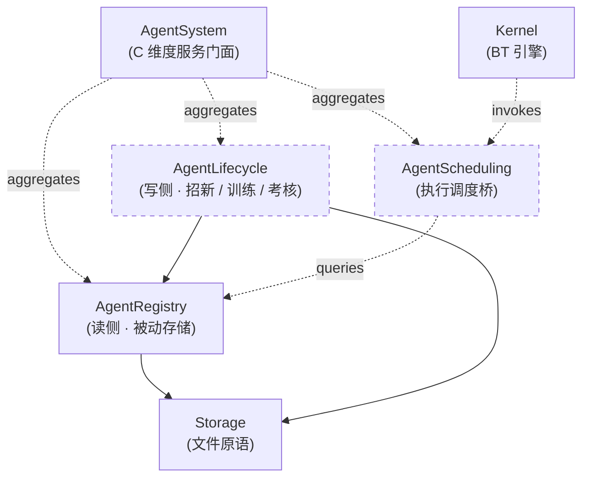

## Positioning

**能力系统是 CBIM 的服务层（C 维度）—— 与记忆系统、业务模块系统并列的三大核心系统之一。**

对应 CBIM 缩写里的 **C（Capability / Cognitive Body）**。负责管理 **agent 的能力、角色、调度**——即「**谁能干什么、谁向谁汇报、什么时候谁来上场**」这一整类问题。

对外：暴露统一的 CRUD + 调度门面——查询能力、匹配能力、加载/导出 agent 定义、（未来）调度 agent 进入执行流。所有调用方都只通过这一组接口看见能力系统。

对内：当前**仅落地读侧**——由 `AgentRegistry/` 子模块承担被动存储，把 `.claude/agents/*.md` 的能力数据落到 Unity 的 `persistentDataPath/.cbim/agents/` 之下。写侧（在 Unity 内编辑 / 招新 / 训练）与调度门面（连接 Kernel 的执行循环）都是后续切片，本模块以 spec 形态先把架构画清楚。

本模块当前 status = `spec`——只承载架构定义、不落代码。后续按路线图分阶段落地子模块。

## Children（规划 + 现状）

| 子模块 | 一句话职责 | 当前状态 | 物理路径 |
|--------|-----------|----------|----------|
| `AgentRegistry` | 长期记忆 · 能力维度被动存储——只读门面，对齐 `.claude/agents/*.md` | **已落地（spec → planned）** | `v2/cbim/Assets/CBIM/AgentRegistry/` |
| `AgentLifecycle`（规划） | 招新 / 训练 / 考核 / 退役工作流，按 HR agent 的脚本调用 AgentRegistry 写侧 | 未落地 | 未来 `v2/cbim/Assets/CBIM/AgentSystem/Lifecycle/`（或保持扁平） |
| `AgentScheduling`（规划） | 把候选 agent 注入 Kernel 执行循环的桥接面——根据任务能力需求选 agent、记录调度结果 | 未落地 | 未来 `v2/cbim/Assets/CBIM/AgentSystem/Scheduling/`（或保持扁平） |

> **物理布局说明**：现阶段 `AgentRegistry/` 物理上是 `Assets/CBIM/AgentRegistry/`，与 `AgentSystem/` 并列。这是 v1 → v2 演进过程中的过渡形态——AgentRegistry 先存在，AgentSystem 是后补的概念门面。两种合并路径都可接受，由实现期决定：
>
> 1. **保持现状**：AgentRegistry 留在原路径，AgentSystem 通过 module.md 的引用关系声明逻辑归属。
> 2. **物理收编**：把 `AgentRegistry/` 移到 `AgentSystem/AgentRegistry/`，与未来的 Lifecycle / Scheduling 物理同层。
>
> 任何一条都不破坏当前的依赖铁律。本模块文档不锁死，由后续 architect 切片决定。

## Child Relationships（规划）

虚线 = 规划中未落地；实线 = 已存在。依赖方向铁律：

- **AgentRegistry 只依赖 Storage**——这是已有铁律，本服务层重构不破坏。
- **AgentLifecycle 依赖 AgentRegistry**——写侧调读侧的接口，单向。
- **AgentScheduling 依赖 AgentRegistry 的只读查询，不持有写侧**——调度本身不修改 agent 定义。
- **Kernel 调 AgentScheduling，不反过来**——调度桥是被动门面，由 Kernel 执行循环触发。**AgentSystem 不依赖 Kernel**，依赖方向与 Memory 子树一致。

## Origin Context

用户提出的「CBIM 三大核心系统」框架要求把能力维度提到与记忆系统、业务模块系统平级的位置。在此之前，v2 子树里只有 `AgentRegistry/` 这一个扁平模块，定位是「长期记忆 · 能力维度被动存储」——它只承担「读」这一个面。

但「能力系统」远不止读取 agent 定义：它还要管 agent 的**生命周期**（招新、训练、考核、退役）和**调度**（什么任务派给谁、谁能上场）。这些职责在 Python 内核里散落在 `v1/kernel/cbi/agents/` + HR agent + Kernel 的 `loops/` 里，没有一个统一的服务门面。Unity 移植本可以延续这种散落形态，但用户的三系统框架明确要求**把这些能力收敛到一个服务门面**——这是本模块存在的根因。

现阶段不强行重构 `AgentRegistry/`，原因有二：
1. 它是已落地的 spec 模块，依赖图已经稳定。
2. Lifecycle / Scheduling 子模块尚未到实现期，提前物理收编会变成「为重构而重构」。

本模块以 spec 形态先把「能力系统作为服务门面」的定位写死，给未来切片留接入点。

## Service-Layer Extension Model（与 Memory 同构）

能力系统门面 `AgentSystemService`（规划名）承诺对外暴露稳定的 CRUD + 匹配 + 调度接口，内部可挂多种实现：

| 对外能力 | 当前实现 | 未来可扩展 |
|----------|----------|-----------|
| `List() / Get(name)` | AgentRegistry 直读 | + 远端 agent 仓库同步 |
| `Match(capability, topK)` | AgentRegistry 关键词匹配 | + 向量检索 + 能力图推理 |
| `Save(record)` / `Retire(name)`（规划） | 未落地 | AgentLifecycle 写侧 |
| `Schedule(taskRequirement)`（规划） | 未落地 | AgentScheduling 调度桥 |
| `Stats()` | AgentRegistry 计数 | + 调度统计 + 生命周期统计 |

**铁律**：扩展走「门面内部装配」，不允许通过另开 Service 类绕过门面。这是 Memory 模块「服务层 + CRUD 门面 + 内部可扩展」的同构落点。

## Dependencies

- **聚合关系**：`AgentRegistry/`、未来的 `AgentLifecycle/`、未来的 `AgentScheduling/`。
- **不依赖 Kernel、不依赖 Memory、不依赖 Workspace、不依赖 Dna**——服务层之间互不依赖。
- `Storage` 是子模块依赖（AgentRegistry 已声明），本服务门面不直接持有 Storage 引用。

## Emergent Insights（跨子模块视角）

1. **能力数据有「读」「写」「用」三个面，它们的稳定性不同。** 「读」最稳定（`.claude/agents/*.md` 的 schema 几乎不变）；「写」中等（HR agent 招新逻辑会演化）；「用（调度）」最易变（任务匹配策略会随 BT 拓扑迭代）。三个面分到三个子模块，让易变的不污染稳定的——这是 C6（稳定抽象原则）的落点。
2. **调度是「能力系统出 → Kernel 用」，不是「Kernel 出 → 能力系统接」。** AgentScheduling 是能力系统对外暴露的桥，Kernel 调它而不是它调 Kernel。这条单向性把「调度策略」的演化封在能力系统内部，不让 BT 拓扑迭代每次都波及 Kernel 代码。
3. **三大系统在服务门面层互不依赖。** AgentSystem 不依赖 Memory，也不依赖 Workspace；它们三者通过 Kernel 的执行循环 / 治理循环编排在一起。这与记忆系统在三层架构里的位置一致——服务层是被动门面，编排在更上层。

## Non-Goals（本模块 spec 范围）

- **不落任何代码。** 本模块当前是架构 spec，代码落在子模块（AgentRegistry 已落、Lifecycle / Scheduling 后续切片）。
- **不重新定义 `AgentRecord` schema。** schema 归 AgentRegistry 拥有；本服务门面只透传。
- **不规定 HR agent 的招新流程。** 招新工作流是 HR agent 的 skill，本服务门面只提供它需要调用的 CRUD 接口。
- **不持有任何记忆条目。** 与 Memory 是不同 schema、不同服务面。

## Mirror in Python kernel

Python 侧没有显式的「AgentSystem 门面类」——能力相关接口散落在 `v1/kernel/cbi/agents/`、`v1/kernel/services/agent_service.py`、HR agent 的 skill 文件里。Unity 移植在此处**提出了比 Python 更明确的门面收敛**——这是用户「三大核心系统」框架带来的架构演进。后续 Python 侧是否对齐这一收敛、把 `services/agent_service.py` 升级为正式的 `AgentSystemService`，由 Python 侧 architect 切片决定，不在本模块管辖范围。

