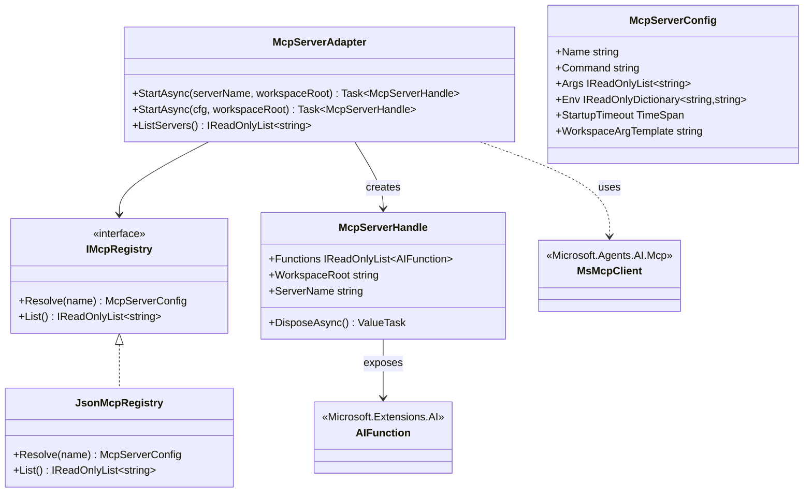

## Positioning

**MCP 客户端适配子模块**——AgentSystem 子模块（C 维度）。负责把外部 **MCP（Model Context Protocol）server** 接入 CBIM 的能力装配链：按 AgentDescription 声明，在 OpenInstance 期启动 MCP server 进程 + 建立 IPC 连接 + 把 server 暴露的工具包成 `Microsoft.Extensions.AI.AIFunction` 列表，挂给本次 `AIAgent`；在 CloseInstance 期关闭连接 + 终止 server 进程。

本模块**不实现 MCP 协议本身**——直接复用 `Microsoft.Agents.AI.Mcp`（Microsoft 官方 MCP client 包）。CBIM 只写「`AgentDescription.mcp_servers` 声明 → MCP server 启停 → AIFunction 包装」的胶水。

## 维度归属（与 StandardTools / agent_extension_clis 并列）

本模块**属于能力维度（C）**，挂在 `AgentSystem/` 下而非 `Workspace/` 下。理由与 StandardTools 完全同型：

- 「该 agent 能不能调 unity-mcp / blender-mcp」是 agent 的能力构成，与「该 agent 拿哪些工具家族 / 哪些 CLI」并列。
- 不是业务 module 的属性——module 只描述「业务工作流程 + 领域知识」。
- 装配链路：`Task.Who（agent）→ AgentDescription.mcp_servers → McpServerAdapter.StartAsync → AIFunction 列表`。

## 三种工具来源的并列关系（关键定位）

CBIM 的「能力维度」内，AIFunction 来源有且仅有三类，本模块是第三类：

| 类型 | 形态 | 实现 | 例子 |
|------|------|------|------|
| **1. StandardTools** | CBIM 内置 C# AIFunction | `StandardToolsService.CreateFamilies` | `Read` / `Write` / `Grep` / `Glob` |
| **2. CLI 包装** | subprocess + stdin/stdout | `agent_extension_clis` 白名单 + Bash 家族 | `dotnet` / `git` / `unity-cli` |
| **3. MCP server** | MCP 协议 + IPC 进程间通信 | **`McpServerAdapter`（本模块）** | `unity-mcp` / `blender-mcp` |

三者**同维度、同装配点（OpenInstance）、同生命周期（绑 AIAgent 实例）**——唯一差异在底层调用形态。

## Responsibility（一句话）

给定一份 MCP server 配置 + 工作区根（`task.Where` 物理路径），按需启动 server 进程，建立 MCP 客户端连接，发现 server 上暴露的 tools，每个 tool 包成一个 `Microsoft.Extensions.AI.AIFunction`，统一返回给 OpenInstance；在 CloseInstance 期反向释放（断连 + 终止 server 进程 + 释放 AIFunction）。

## 生命周期（绑 Task）

```
Task 开始（Channel.SendAsync / FlowGraph 启 task）
  ↓
AgentSystem.OpenInstance(descriptionName, options)
  - 读 AgentDescription.tools / agent_extension_clis / mcp_servers
  - 内置 tools 装配（StandardToolsService.CreateFamilies）
  - CLI 白名单注入 Bash 家族（若 Bash 在 tools 中）
  - **MCP server 启**（本模块）：
      foreach mcpServerName in AgentDescription.mcp_servers:
          cfg = McpRegistry.Resolve(mcpServerName)
          handle = await McpServerAdapter.StartAsync(cfg, task.Where)
          aiFunctions.AddRange(handle.Functions)
          register handle for CloseInstance
  - 合并三源 AIFunction → AIAgentBuilder.Tools
  - 返回 AIAgent
  ↓
AIAgent.RunAsync（业务工作流）
  ↓
Task 结束
  ↓
AgentSystem.CloseInstance(instanceId)
  - **MCP 关**（本模块）：foreach handle: await handle.DisposeAsync()（断 IPC + Kill server 进程）
  - CLI 子进程清理（Bash 家族职责）
  - 内置 tools 工具集释放
```

**绑定语义**：MCP server 进程 = 本次 AgentInstance 私有，**不复用、不共享**——同一 server 名被两个 instance 同时持有时，启两份独立 server 进程，各连各的 `task.Where`。这是 CBIM「per-agent 沙盒」原则在 MCP 维度的延伸。

## 连接目标 = task.Where（关键铁律）

**MCP server 启动时必须连接到 `task.Where` 指向的业务实例工作区根**——这是 MCP 维度的「沙盒约束」：

- `task.Where` = 当前 task 激活的 ModuleInstance 物理路径（业务工作区，B 维度）。
- `McpServerAdapter.StartAsync(cfg, workspaceRoot)` 的 `workspaceRoot` 参数固定取 `task.Where`。
- 不允许 MCP server 访问 `task.Where` 之外的目录——由 server 启动参数 / 环境变量约束（具体机制由 server cfg 决定，本模块只透传）。
- **能力归能力，目标归业务**——MCP 是能力维度（agent 自带），但目标是业务维度（task.Where 指向的业务实例）。两个维度在 MCP 启动这一刻交叉。

## AgentDescription Schema 扩展（本模块责任的外侧表现）

AgentSystem 父模块负责 schema 演进，但本模块对 `mcp_servers` 字段语义定义如下：

```yaml
---
name: unity-programmer
mcp_servers:                        # 本模块新增——agent 装配时启动的 MCP server 列表
  - unity-mcp                       # 字符串名，对应 McpRegistry 中一份 cfg
  - blender-mcp
---
```

- **字符串名 vs 完整配置**：frontmatter 只写名字（kebab-case），完整 server 配置（命令行 / 环境变量 / 协议端口）由 `McpRegistry`（注册表）维护——分离声明与配置。
- **未知 server 名**：装配时 warning，跳过（不阻塞）。
- **启动失败**：警告 + 跳过该 server（不阻塞整个 AIAgent 装配，其他工具来源照常）。
- **裂变阈值**：`mcp_servers` 长度纳入 Agent 裂变规则（AgentSystem 父模块 schema 演进时定阈值，建议 ≤ 3）。

## Contract Surface

```csharp
namespace CBIM.AgentSystem.McpAdapter;

using Microsoft.Extensions.AI;

/// <summary>本模块的门面。OpenInstance 调本接口启 MCP server；CloseInstance 调 handle.DisposeAsync 关。</summary>
public sealed class McpServerAdapter
{
    public McpServerAdapter(IMcpRegistry registry, ILogger? logger = null);

    /// <summary>按 server 名 + 工作区根启动一个 MCP server 进程并连接，返回握手后的 handle。</summary>
    /// <param name="serverName">McpRegistry 中已注册的 server 名（来自 AgentDescription.mcp_servers）。</param>
    /// <param name="workspaceRoot">task.Where 指向的物理路径——MCP server 启动时连接到此目录。</param>
    public Task<McpServerHandle> StartAsync(string serverName, string workspaceRoot, CancellationToken ct = default);

    /// <summary>同上，但直接传入已解析的 cfg（绕过注册表，用于测试）。</summary>
    public Task<McpServerHandle> StartAsync(McpServerConfig cfg, string workspaceRoot, CancellationToken ct = default);

    /// <summary>已知 server 名集合（从 McpRegistry 读）。</summary>
    IReadOnlyList<string> ListServers();
}

/// <summary>启动后的 server 句柄，IAsyncDisposable——CloseInstance 期 Dispose 即关进程 + 断连。</summary>
public sealed class McpServerHandle : IAsyncDisposable
{
    /// <summary>该 server 暴露的工具，已包成 AIFunction，可直接挂给 AIAgentBuilder。</summary>
    public IReadOnlyList<AIFunction> Functions { get; }

    /// <summary>所连接的 workspaceRoot。</summary>
    public string WorkspaceRoot { get; }

    /// <summary>server 名。</summary>
    public string ServerName { get; }

    public ValueTask DisposeAsync(); // 断 IPC + Kill server 进程
}

/// <summary>MCP server 启动配置——由 McpRegistry 维护。</summary>
public sealed record McpServerConfig(
    string Name,
    string Command,                                 // 启动命令（如 npx / dotnet / python）
    IReadOnlyList<string> Args,                     // 命令参数
    IReadOnlyDictionary<string, string>? Env,       // 额外环境变量
    TimeSpan? StartupTimeout = null,                // 启动握手超时
    string? WorkspaceArgTemplate = null);           // workspaceRoot 注入方式（如 "--workspace={0}"）

/// <summary>MCP server 注册表——按名字找配置。实现可读 JSON / YAML / 内存表。</summary>
public interface IMcpRegistry
{
    McpServerConfig? Resolve(string name);
    IReadOnlyList<string> List();
}
```

## Class Diagram



## Key Decisions

1. **不实现 MCP 协议本身**——MCP client / 握手 / tool discovery / call serialization 全部走 `Microsoft.Agents.AI.Mcp`。本模块只写「按 agent 声明启停 server + 把 server tools 包成 AIFunction」的胶水。若 Microsoft 包尚未稳定/缺失，等待，不重造（与 Bash / Tools.Shell 的策略一致）。
2. **server 进程 = 本次 AgentInstance 私有**——不复用、不共享、不池化。理由：sandbox 一致性（per-instance）+ 生命周期清晰（OpenInstance 启 / CloseInstance 关）+ task.Where 隔离。多 instance 同名 server 跑两份是可接受成本。
3. **connection target 强制 = task.Where**——MCP server 启动参数中的 workspaceRoot 由 OpenInstance 注入 `task.Where`，agent / 调用方不可覆盖。能力归能力，目标归业务，在启动一刻交叉。
4. **声明与配置分离**——AgentDescription 只写 server 名（kebab-case），完整 cfg（命令行 / env / 协议）由 `IMcpRegistry` 维护。注册表实现首批用 JSON 文件落 `<project>/.cbim/mcp-servers.json` 或类似位置（具体路径待 install 时定）。
5. **启动失败不阻塞 AIAgent 装配**——单 server 启失败 → warning + 跳过，其他工具来源（StandardTools / CLI / 其他 MCP）照常；本次 AIAgent 仍可用，只是少了该 server 的能力。理由：生产环境 MCP server 不可用（崩溃 / 网络问题）时仍能降级运行。
6. **DisposeAsync 必须可重入**——CloseInstance 可能被多次调用（异常路径），handle.DisposeAsync 必须幂等。
7. **不挂全局共享 server**——没有「全局 MCP server」概念，一切按 AgentDescription 声明。与 StandardTools「无全局工具栏」铁律同源。
8. **不与 StandardTools / Bash 家族双向耦合**——本模块产出 AIFunction 列表，OpenInstance 负责合并三源；本模块不感知 StandardTools，StandardTools 不感知本模块。
9. **Microsoft.Agents.AI.Mcp 包评估前置**——首批切片实施前，先评估该包是否覆盖：lib target（netstandard2.1 / Unity 兼容？）、传递依赖、API 稳定度。若 Unity 不兼容，本模块降级为 stub 直至 Microsoft 出 Unity 友好版本。

## Dependencies

- `Microsoft.Extensions.AI`——`AIFunction` 抽象。
- `Microsoft.Agents.AI.Mcp`——MCP client 实现（**待评估 Unity 兼容性**）。
- `CBIM.Storage`——`IMcpRegistry` 的 JSON 实现读 `<project>/.cbim/mcp-servers.json`（或等价路径）。
- **不依赖** AgentSystem 父服务 / StandardTools / Kernel / Memory / Workspace——纯被调侧。

## 与 AgentDescription / OpenInstance 的协议

本模块**不主动装配**——是被调侧。装配协议：

1. `AgentDescription` frontmatter 持有 `mcp_servers: [unity-mcp, blender-mcp]` 字段（schema 演进归 AgentSystem 父模块）。
2. `AgentSystem.OpenInstance(descriptionName, options)` 装配 AIAgent 流程中追加一步：
   - 读 `AgentDescription.McpServers` 拿 server 名列表。
   - 拿 `task.Where`（从 options 透传 / 或当前 Task 上下文）。
   - foreach name: `await McpServerAdapter.StartAsync(name, task.Where)` → handle。
   - 把所有 handle 的 `Functions` 合并到 AIAgentBuilder.Tools。
   - 把所有 handle 注册到 AgentInstance 元数据，CloseInstance 期统一 DisposeAsync。
3. AgentSystem 不感知 MCP 协议细节——只是把 AIFunction 列表透传给 `AIAgentBuilder`，把 handle 透传给生命周期管理。

## 铁律

1. **每次 OpenInstance 启独立 server 进程**——不复用、不共享、不池化。
2. **server 进程连接目标必须 = task.Where**——能力归能力，目标归业务，启动一刻交叉。
3. **CloseInstance 必须 DisposeAsync 所有 handle**——异常路径也要走，否则 server 进程泄漏。
4. **不主动管理 server 实现 / 协议升级**——交 Microsoft.Agents.AI.Mcp。
5. **AIFunction 描述沿用 server 提供**——本模块不改名 / 不重写描述。
6. **失败优雅降级**——单 server 启失败 warning + skip，不阻塞 AIAgent 装配。
7. **不发明全局 server 开关 / 环境变量**——一切按 agent 声明。
8. **`mcp_servers` schema 字段名**——`AgentDescription.mcp_servers`（snake_case in YAML, McpServers in C#）；与 `tools` / `agent_extension_clis` 并列。

## Origin Context

CBIM v2 Unity 顶层重构裁决「工具归能力维度」后，能力维度内的工具来源已识别两类：

- StandardTools（CBIM 内置 AIFunction）；
- agent_extension_clis（外部 CLI 白名单，通过 Bash 家族调用）。

本轮新增第三类来源：**外部 MCP server**。MCP 是与 LLM 工具调用标准化的协议（Anthropic 主导），允许 server 端以独立进程暴露工具集合。CBIM 不实现协议（交 Microsoft.Agents.AI.Mcp），但负责把 MCP server 接入装配链——按 AgentDescription 启停 + 连 task.Where + 包 AIFunction。

关键设计取舍：

- **per-instance server 启**（vs 全局共享 server）：选 per-instance，与 StandardTools per-agent 沙盒原则一致；多 instance 同名 server 跑两份是可接受成本，换得清晰生命周期与隔离。
- **声明与配置分离**：与 `.claude/agents/*.md` 的轻量化原则一致——frontmatter 只写名字，cfg 落注册表。
- **不阻塞装配**：MCP server 是外部进程，不可避免会有不可用窗口；硬阻塞会让 agent 完全无法运行——降级优于全瘫。

## Non-Goals

- 不实现 MCP 协议（client / server / 握手 / serialization）——交 Microsoft.Agents.AI.Mcp。
- 不实现 MCP server 本身——CBIM 是 client 侧，server 是第三方（unity-mcp / blender-mcp 等）。
- 不实现 server 进程池 / 复用——per-instance 独立启停。
- 不实现 server 健康监控 / 自动重启——失败即 skip。
- 不实现 MCP server 注册表的 UI / 写侧——首批仅读 JSON。
- 不实现 MCP server 沙盒强化——sandbox 由 server cfg 自身约束（命令行参数 / env），本模块不二次校验。
- 不与 Python 侧 `.cbim/mcp_server` 共享代码——那是 CBIM kernel 暴露 MCP server 给 Claude Code 用，方向相反。

## Implementation Order

1. **`Microsoft.Agents.AI.Mcp` 包评估**——lib target / Unity 兼容性 / 传递依赖 / API 稳定度。若不兼容，本模块进 stub 模式，等待。
2. `McpServerConfig` record + `IMcpRegistry` 抽象 + `JsonMcpRegistry` 实现（读 `.cbim/mcp-servers.json`）。
3. `McpServerHandle` + `McpServerAdapter.StartAsync(cfg, workspaceRoot)`——核心启停 + AIFunction 包装。
4. `McpServerAdapter.StartAsync(serverName, workspaceRoot)` 重载——经注册表解析。
5. AgentSystem 端 OpenInstance 装配胶水接入（在 AgentSystem `.dna` 描述，本模块只暴露 contract）。
6. （后续）集成测试：一个 toy MCP server + e2e AIAgent 工具调用验证。
7. （远期）若 Microsoft 出 server 池化 / 健康监控能力，下沉本模块到 Microsoft 包对应 API。
