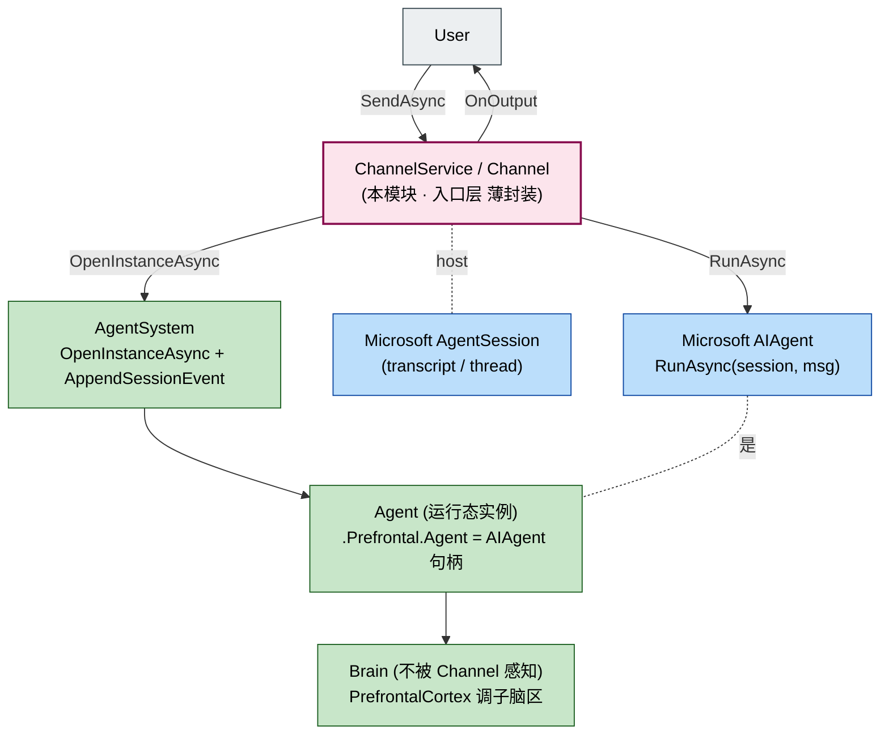
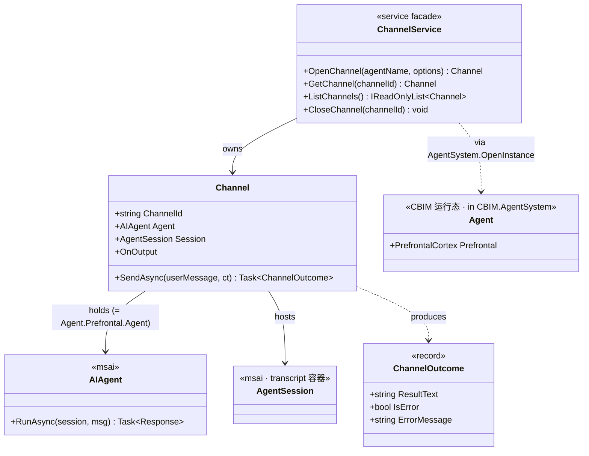
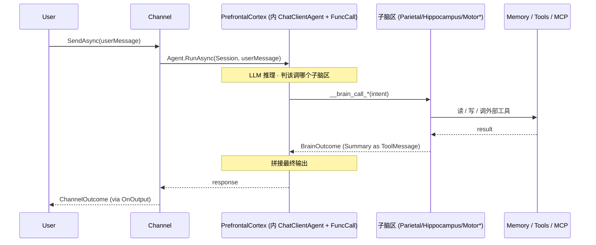

## Positioning

**Channel 是 CBIM 的入口层**——一个 Channel = 用户打开的一个交互界面实例，1:1 绑定一个 Microsoft `AIAgent`，承载 IO 流。

- **薄封装于 Microsoft `AgentSession`**——多轮 transcript / thread 能力直接复用。
- **CBIM 调用约定面**——`OpenChannel` / `SendAsync` / `OnOutput` / `CloseChannel` 四件事。
- **不感知脑区**——`Channel.Agent` 始终 = `instance.Prefrontal.Agent`；子脑区调度是主脑内部事务。
- **不管业务路由**——路由 ⊥ Channel，主脑 PrefrontalCortex 独咬调度职责（铁律 A：唯一通路）。

## 架构图（三层模型中的位置）



**依赖方向**：Channel → AgentSystem → Brain；不反向、不绕走。

## 类图（核心类型关系）



**关键关系**：`Channel.Agent` 实际是 `Agent.Prefrontal.Agent`（主脑的 msai 句柄）；其他脑区 Channel 不可见。

## SendAsync 全链路序流



## 核心概念

| 概念 | 定义 | 来源 |
|------|------|------|
| **Channel** | 用户交互窗口实例，1:1 绑 AIAgent | CBIM 薄封装 |
| **AgentSession**（底层） | Microsoft 的交互 transcript 容器 | `Microsoft.Agents.AI.AgentSession` |
| **AIAgent** | 该窗口运行的「进程」（= 主脑 ChatClientAgent） | `Microsoft.Agents.AI.AIAgent` |
| **Session（CBIM 工作日志）** | Agent 内部执行轨迹事件流 · 写入 AgentSystem | 与上项不同 schema |

> Channel 的 transcript（msai AgentSession）与 Agent 工作日志（AgentSystem 的 Session）是两套不同记录：前者是「用户看见的对话」，后者是「Agent 内部执行轨迹」。

## Contract Surface

```csharp
namespace CBIM.Channel;

using Microsoft.Agents.AI;

public sealed class ChannelService
{
    Channel OpenChannel(string agentDescriptionName, ChannelOptions options);
    Channel? GetChannel(string channelId);
    IReadOnlyList<Channel> ListChannels();
    void CloseChannel(string channelId);
}

public sealed class Channel
{
    string ChannelId { get; }
    AIAgent Agent { get; }              // = instance.Prefrontal.Agent
    AgentSession Session { get; }       // msai transcript

    Task<ChannelOutcome> SendAsync(string userMessage, CancellationToken ct = default);

    event Action<ChannelOutputEvent> OnOutput;
}

public sealed record ChannelOutcome(string ResultText, bool IsError, string? ErrorMessage);
```

## Dependencies

- `Microsoft.Agents.AI` —— `AIAgent` / `AgentSession`。
- `CBIM.AgentSystem` —— `OpenInstance` 拿 `AIAgent` 句柄；`AppendSessionEvent` 写工作日志。
- **不依赖** Memory / Workspace / Storage —— 上下文装配走 Brain 内部机制。

## 铁律

- **C1** · 不直接访问 Memory / Workspace / Storage。
- **C2** · 不直接调 `IChatClient` —— 拿 AIAgent 后调 `RunAsync`。
- **C3** · 不写 Session 日志 —— Session 写侧唯一调用方 = Brain.MotorCortex。
- **C4** · 不加业务路由 —— 路由 = PrefrontalCortex 主脑职责（铁律 A）。
- **C5** · 薄封装 —— 自定义 API 仅 「OpenChannel / SendAsync / OnOutput / CloseChannel」 四件；其余直暴 `AgentSession` 给高阶调用方。

## Non-Goals

- 不持久化 Channel —— 纯进程内对象。
- 不实现 Channel 之间协作 —— 多 Agent 协作由 PrefrontalCortex 调度。
- 不感知 Microsoft Compaction / ContextProvider 装配 —— 是 OpenInstance / Brain 装配机制职责。
- 不感知脑区 —— Channel 看到的仅主脑 AIAgent + RunAsync 接口。

