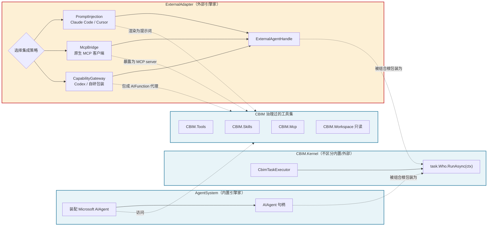

# CBIM.ExternalAdapter

> CBIM v2 第 4 个顶层服务层模块——与 `AgentSystem` / `Workspace` / `Memory` 平级。
> 把『非 Microsoft.Agents.AI 引擎驱动的外部 Agent』接入 CBIM 治理体系，
> 使其成为 `task.Who` 的合法值之一。

---

## Positioning

**一句话定位：** ExternalAdapter 是 CBIM 的『外部引擎家』——AgentSystem 装 Microsoft AIAgent，ExternalAdapter 装一切非 Microsoft.Agents.AI 引擎驱动的外部 Agent（Claude Code / Cursor / Codex / 其他 CLI / SaaS Agent）的句柄；两者输出都是一个『可被 `task.Who` 引用、可 `RunAsync` 的执行体』，Kernel/FlowGraph 不区分二者。

**唯一职责（C2 单一职责）：** 把外部 Agent 执行体抽象成 CBIM 可调度的句柄，并保证调用过程中外部引擎能够（按选定策略）使用 CBIM 治理过的工具集（CBIM.Tools / CBIM.Skills / CBIM.Workspace 子集）。

**不是什么（划清边界）：**
- 不是 `AgentSystem` 的子模块——独立成顶层模块的根本原因见下方『为什么独立成顶层』。
- 不是外部引擎的二次实现——CBIM 不重写 Claude Code / Cursor，只做适配。
- 不是 Agent 编排器——编排仍由 Kernel/FlowGraph 负责，本模块只产出执行体。
- 不是工具集——CBIM.Tools/Mcp/Skills 仍是工具的唯一源头，本模块只把它们『投喂』给外部引擎。

---

## 为什么独立成顶层（C3 单向依赖）

```
稳定 ←──────────────────────────────────────────────── 易变

Kernel  ──→  AgentSystem ──→ Microsoft.Agents.AI SDK     （稳定耦合）
        ──→  Workspace                                    （稳定耦合）
        ──→  Memory                                       （稳定耦合）
        ──→  ExternalAdapter ──→ Claude Code CLI 协议     （高频变化）
                            ──→ Cursor MCP client schema  （高频变化）
                            ──→ Codex HTTP API            （高频变化）
                            ──→ 各 SaaS Agent SDK         （高频变化）
```

AgentSystem 的稳定职责是『装配 Microsoft AIAgent + 写 Session』；若把外部引擎适配塞进 AgentSystem，会迫使稳定的能力系统反向依赖外部 SDK / CLI 协议（高频变化），违反 **C3 单向依赖**。

**结论：** 独立顶层让 AgentSystem 不感知外部引擎存在；外部引擎的版本变迁、协议升级、新增 SaaS 接入，全部隔离在 ExternalAdapter 内部。

---

## 与 AgentSystem 的对偶图



**对偶要点：**

| 维度 | AgentSystem | ExternalAdapter |
|---|---|---|
| 引擎来源 | Microsoft.Agents.AI（一种） | 任意第三方引擎（多种） |
| 句柄类型 | `AIAgent`（Microsoft 类型） | `ExternalAgentHandle`（本模块自定义） |
| 工具集成方式 | 直接 `AIAgentBuilder.AddTools(...)` | 三策略二选一：渲染提示词 / MCP server / AIFunction 代理 |
| 稳定性层级 | 稳定（跟 Microsoft 框架版本） | 易变（跟外部引擎版本与协议） |
| 对 Kernel 的可见性 | 透明——同样产出 `task.Who` | 透明——同样产出 `task.Who` |

---

## 三大集成策略（同一接口的三种实现）

> 这是 **同一个 `IExternalEngineAdapter` 接口的三种实现策略**，不是三个子模块。
> 选哪种取决于外部引擎对『CBIM 工具集』的接入能力。

| 维度 | 策略 A · PromptInjectionAdapter | 策略 B · McpBridgeAdapter | 策略 C · CapabilityGatewayAdapter |
|---|---|---|---|
| **目标引擎** | 只接受 prose 的引擎（Claude Code CLI / Cursor 编辑器模式） | 原生支持 MCP 协议的引擎（Claude Code MCP client / Cursor MCP） | headless / 程序化引擎（Codex API / 自研 LLM 包装 / 任意 HTTP LLM） |
| **工具暴露方式** | 把 CBIM Skills/Tools/Workspace metadata 渲染为系统提示词 + 用户提示词模板 | CBIM 自起 MCP server，把 CBIM.Tools/Skills/Workspace 子集暴露为标准 MCP tools / resources / prompts | 把每个 CBIM 工具用 `Microsoft.Extensions.AI.AIFunction` 包成代理 |
| **工具调用环** | 走外部引擎自家闭环（CBIM 不在调用链路中） | 走 MCP 协议（CBIM 在 server 侧响应每次调用） | 全程经 CBIM（外部引擎调代理时同步触发 CBIM.Tools/Mcp 实际执行） |
| **CBIM 对账方式** | 结果解析 + 回放 Session 写（事后对账） | MCP server 端日志即 Session（实时对账） | 调用链路即 Session（强实时对账） |
| **侵入性** | 零侵入——外部引擎本体不改 | 零侵入——外部引擎按协议拉 | 零侵入——外部引擎调代理函数 |
| **治理强度** | 弱（依赖外部引擎遵守提示词） | 中（受 MCP 协议约束） | 强（CBIM 全程在路径上） |
| **典型用例** | 把 Claude Code 当作一个『带 CBIM Skills 上下文的 prose Agent』 | 把 Cursor 接成『能调 CBIM 工具的 IDE Agent』 | 把 Codex API 包成『一个 CBIM 治理下的 headless worker』 |

**为什么把三策略放在同一模块而不拆三个：**
- **C5 共用复用**——三策略共享 `IExternalEngineAdapter` 接口、`ExternalAgentHandle` 句柄、Session 回写、错误归一、能力发现协议；拆开会重复造轮子。
- **C2 单一职责**——本模块的唯一职责是『让外部引擎能被 `task.Who` 引用』；三策略只是这个职责在不同引擎能力下的不同实现路径。
- 选择策略是配置问题（`IntegrationStrategy` 枚举），不是模块划分问题。

---

## 接口契约草案（IExternalEngineAdapter）

```csharp
namespace CBIM.ExternalAdapter;

/// <summary>
/// 外部 Agent 引擎适配器——三策略共享接口。
/// 一个 EngineId 对应一种外部引擎（claude-code / cursor / codex / ...）；
/// 一种引擎可由不同 Adapter 实现（同引擎多策略），由组合根选择。
/// </summary>
public interface IExternalEngineAdapter
{
    /// <summary>引擎唯一标识，例如 "claude-code" / "cursor" / "codex"。</summary>
    string EngineId { get; }

    /// <summary>本 Adapter 实现的集成策略。</summary>
    IntegrationStrategy Strategy { get; }

    /// <summary>
    /// 打开一个外部 Agent 实例，返回 CBIM 可持有的句柄。
    /// 句柄生命周期由调用方管理；Adapter 内部可池化底层连接。
    /// </summary>
    ExternalAgentHandle OpenInstance(
        ExternalAgentDescription desc,
        OpenExternalOptions opts);

    /// <summary>
    /// 在外部 Agent 实例上执行一次 CBIM 任务。
    /// 返回值统一为 AgentRunResponse——Kernel 无需感知底层引擎差异。
    /// </summary>
    Task<AgentRunResponse> RunAsync(
        ExternalAgentHandle handle,
        CbimTask task,
        CancellationToken ct);

    /// <summary>
    /// 释放外部 Agent 实例（关闭子进程 / 释放 SaaS session / 注销 MCP 客户端）。
    /// </summary>
    Task CloseInstanceAsync(ExternalAgentHandle handle);
}

/// <summary>外部 Agent 实例描述（引擎参数、模型、工具白名单、提示词模板版本……）。</summary>
public abstract class ExternalAgentDescription
{
    public required string EngineId { get; init; }
    public required string InstanceName { get; init; }
    // 子类按引擎扩展：ClaudeCodeDescription / CursorDescription / CodexDescription...
}

/// <summary>打开实例时的运行期选项（工作目录、超时、日志级别、Session 回写策略）。</summary>
public sealed class OpenExternalOptions { /* ... */ }

/// <summary>外部 Agent 句柄——不透明类型，仅由对应 Adapter 解析。</summary>
public abstract class ExternalAgentHandle
{
    public required string EngineId { get; init; }
    public required string InstanceId { get; init; }
}

/// <summary>三大集成策略枚举。</summary>
public enum IntegrationStrategy
{
    PromptInjection,
    McpBridge,
    CapabilityGateway,
}
```

**契约不变量：**
- `RunAsync` 必须返回 `AgentRunResponse`——与 `AgentSystem` 产出的内置 Agent 一致，Kernel 不知道这是哪种引擎。
- 任何 Adapter 实现 **不得** 把外部引擎特有的异常类型穿透出去；必须归一为 CBIM 定义的故障类型。
- 任何 Adapter 实现 **必须** 在 `RunAsync` 期间把工具调用 / 模型输出回写为 CBIM Session 记录（差异：策略 A 事后回放，策略 B/C 实时写入）。
- `ExternalAgentHandle` 必须不透明；任何 Adapter 不得把 `ClaudeCodeProcess` / `CursorWebSocket` 之类的具体类型穿透出去。

---

## 依赖方向（C3 铁律）

```
ExternalAdapter ──→ CBIM.Tools           （消费工具定义）
                ──→ CBIM.Skills          （消费技能定义）
                ──→ CBIM.Mcp             （消费 MCP 协议层；策略 B 也复用其 server 能力）
                ──→ CBIM.Workspace（只读）（消费 module / agent metadata 渲染提示词）
                ──→ CBIM.Storage         （读写外部 Agent 实例状态、Session 回写）
                ──→ 外部 SDK / CLI / HTTP client（每种引擎一套）
```

**反向严禁（铁律，不容商量）：**
- 禁 `AgentSystem` 引用 ExternalAdapter
- 禁 `Workspace` 引用 ExternalAdapter
- 禁 `Memory` 引用 ExternalAdapter
- 禁 `Kernel` 引用 ExternalAdapter

**唯一桥梁：** 组合根（AgenticOS）负责把 `ExternalAdapter.OpenInstance(...)` 产出的句柄包装成 `task.Who`——Kernel 从此只见 `task.Who`，不见 ExternalAdapter。

```
              组合根 AgenticOS
                   │
        ┌──────────┴──────────┐
        ▼                     ▼
   AgentSystem           ExternalAdapter
   .OpenInstance         .OpenInstance
        │                     │
   AIAgent 句柄          ExternalAgentHandle
        │                     │
        └─────包装成─────────┘
                   │
                   ▼
              task.Who（Kernel 唯一可见的执行体）
```

---

## Origin Context（为什么这个模块必须存在）

CBIM v2 的核心承诺是『让任何 Agent 都能成为治理体系中的一个可调度执行体』。v1 默认 Agent = Claude Code subagent；v2 改投 Microsoft.Agents.AI 之后，AgentSystem 提供了『装配 Microsoft AIAgent』的能力。

但现实里：
1. 用户已经在用 Claude Code / Cursor / Codex / 其他 CLI Agent，不可能（也不应当）强制他们迁到 Microsoft.Agents.AI。
2. 不同外部引擎的能力差异巨大——有的只吃 prose，有的支持 MCP，有的纯 HTTP API；如果把这些差异塞进 AgentSystem，AgentSystem 会被外部引擎的版本变迁拖垮。
3. CBIM 的治理价值（Workspace 上下文、Skills 体系、Tools 治理、Session 回放）必须能投射到外部引擎上——否则外部引擎跑出来的成果游离在治理之外，破坏了 CBIM 的『单一可信治理域』。

这三条共同决定了：必须有一个**与 AgentSystem 对偶的、独立的顶层服务层**，专司外部引擎接入。这就是 ExternalAdapter 的存在依据。

---

## Emergent Insights（跨子结构才能看见的整体性质）

**1. 集成策略不是技术选型，是『治理强度滑块』。**
   - 策略 A → 治理弱（事后对账），换来零侵入；
   - 策略 B → 治理中（协议约束），换来双向工具调用；
   - 策略 C → 治理强（全程在链路），换来强一致 Session；
   选哪种是『用户愿意把多少治理权让渡给外部引擎』的权衡。

**2. 外部引擎的可治理性 ∝ 它对工具协议的开放度。**
   - 引擎越封闭（只吃 prose）→ 只能用策略 A → CBIM 治理最弱；
   - 引擎越开放（原生 MCP / 函数调用 API）→ 可上策略 B/C → CBIM 治理最强。
   这给出了 CBIM 评估『是否值得接入某个外部引擎』的硬指标。

**3. AgentSystem ⊕ ExternalAdapter = 完整的 task.Who 来源域。**
   两者对偶覆盖了所有可能的执行体——内置 Microsoft AIAgent + 任意外部 Agent。从此 Kernel/FlowGraph 在调度层面不必再区分『谁来执行』；这是 CBIM v2 实现『引擎无关编排』的关键拼图。

**4. CBIM.Mcp 同时被两种角色使用——server 与 client。**
   - 内置场景：CBIM.Mcp 作为 client 调外部 MCP server；
   - 外部接入：策略 B 让 CBIM.Mcp 反过来作为 server 被外部引擎拉。
   这意味着 `CBIM.Mcp` 必须双向健壮——这一约束本来在 AgentSystem 的视角下看不见，只有从 ExternalAdapter 的视角才显现。

---

## Non-Goals（明确不做）

- 不替代 AgentSystem——不会用 ExternalAdapter 装 Microsoft AIAgent（那是 AgentSystem 的天职）。
- 不为每个外部引擎写一套编排逻辑——编排归 Kernel/FlowGraph，本模块只产出执行体。
- 不修改外部引擎本体——零侵入是基本原则；任何需要 fork 外部引擎才能实现的能力都拒绝接入。
- 不存储外部 Agent 的会话历史——Session 数据归 `CBIM.Storage` / `CBIM.Memory`，本模块只负责回写。
- 不做 Agent 间通信——多 Agent 协作通过 Kernel/FlowGraph 编排，不在本模块视野内。
- 不做 LLM 路由——『同一个外部 Agent 用什么模型』是该 Agent 自己的事；本模块只看引擎。
- 不暴露外部引擎特有概念——`ExternalAgentHandle` 必须不透明；任何 Adapter 不得把 `ClaudeCodeProcess` / `CursorWebSocket` 之类的具体类型穿透出去。

---

## 当前状态

- **status:** `spec` ——本模块尚未落地实现，本文档为架构契约草案。
- **下一步：** 由 coder 按 `IExternalEngineAdapter` 草案实现策略 A 的最小可用版本（Claude Code CLI），跑通『外部 Agent 作为 task.Who』的端到端链路；策略 B/C 在策略 A 稳定后排期。

