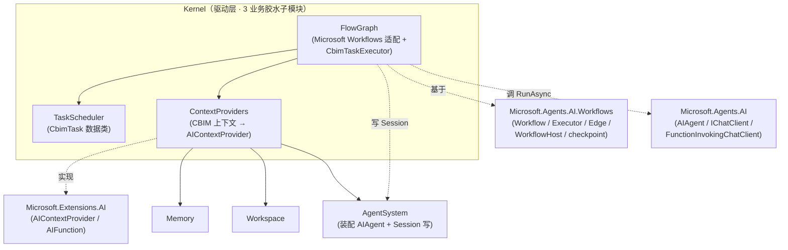

## Positioning

Kernel 是 CBIM Agent OS 的**驱动层总名**——上接入口层（Channel）与能力系统（AgentSystem），下调记忆系统（Memory）、业务模块系统（Workspace）。本模块本身**不承载任何执行细节**——只作为业务胶水子模块的组合项存在。

## 本轮重大精简：彻底贯穿「不造轮子」

上轮 Kernel 重构已将 LlmEngine / Pipeline / INode 等下沉到 Microsoft.Agents.AI。本轮**再进一步**：

| 已下沉到 Microsoft（不再有 CBIM 对应模块） | 由 Microsoft 哪个包 |
|---|---|
| LLM 调用抽象 | `Microsoft.Extensions.AI.IChatClient` |
| Agent 执行体 / thread / run | `Microsoft.Agents.AI.AIAgent` |
| 工具调用闭环 | `Microsoft.Agents.AI.FunctionInvokingChatClient` |
| 上下文 Provider 抽象 | `Microsoft.Extensions.AI.AIContextProvider` |
| 业务工作流引擎 / Executor / Edge / 路由 | `Microsoft.Agents.AI.Workflows.Workflow` |
| 暂停-恢复 / checkpoint | Microsoft Workflows 内建 |
| 会话压缩 | Microsoft Compaction 策略 |
| IO 工具（文件 / 搜索 / 网页） | `Microsoft.Extensions.AI.AIFunction` 生态（社区包） |

CBIM 在 Kernel 子树里**只写 3 样东西**：

| # | CBIM 子模块 | 一句话职责 |
|---|---|---|
| 1 | `TaskScheduler/` | CbimTask 不可变 record：who（AIAgent）+ where（模块列表）+ what（Requirement） |
| 2 | `FlowGraph/` | 以 Microsoft.Agents.AI.Workflows 为底层，CBIM 写 `CbimTaskExecutor` + 业务 Workflow 装配类 |
| 3 | `ContextProviders/` | 三个 `AIContextProvider` 实现，把 Workspace / Memory / Session 注入 AIAgent 调用 |

## 本轮废弃

- `ExecutionUnit/`（上轮已 deprecated，本轮物理删）
- `TaskRunner/`（**本轮新废弃**）——其「装 ContextProvider + 调 RunAsync + 写 Session」三步折入 `CbimTaskExecutor`；不走 Workflow 时调用者直接两行代码即可

## Children

| 子模块 | 一句话职责 | 状态 |
|--------|----------|------|
| `TaskScheduler/` | CbimTask 数据类定义家 | spec |
| `FlowGraph/` | Microsoft.Agents.AI.Workflows 业务拓扑装配 + CbimTaskExecutor | spec |
| `ContextProviders/` | CBIM 三大上下文 → Microsoft AIContextProvider 桥 | spec |
| ~~`TaskRunner/`~~ | 本轮废弃，胶水折入 CbimTaskExecutor | deprecated |
| ~~`ExecutionUnit/`~~ | 上轮废弃 | deprecated |

## Child Relationships

**依赖单调**：`FlowGraph → {TaskScheduler, ContextProviders, AgentSystem}`；`ContextProviders → {Memory, Workspace, AgentSystem, TaskScheduler}`。反向严禁。

## Origin Context

「不造轮子」是 CBIM 顶层裁决——所有能用 Microsoft Agent Framework 生态替代的都替代，CBIM 只保留业务独有的业务胶水。上一轮 Kernel 已下沉 LLM 引擎 / 节点抽象 / 工具闭环；本轮发现 Microsoft.Agents.AI.Workflows 已提供完整业务工作流引擎，于是：

1. **FlowGraph 重写**：从「CBIM 自建 IFlowGraph + Next 路由」改为「Microsoft Workflows 适配 + CbimTaskExecutor」。
2. **TaskRunner 砍掉**：其 ~30 行胶水折入 CbimTaskExecutor（本就是 Microsoft Executor 标准形态）。
3. **SystemTools 砍掉**：所有 IO 工具交给 Microsoft.Extensions.AI AIFunction 生态（社区包覆盖文件 / 搜索 / 网页等）；Shell 因 net8-only 暂搁置。

剩下的 3 件 CBIM 真正不可替代的事：
- **CbimTask 数据形态**（who/where/what 三元组——CBIM 业务词汇）
- **业务工作流装配**（ChatWorkflow / DispatchWorkflow 等业务拓扑——CBIM 业务知识）
- **CBIM 上下文注入桥**（Workspace / Memory / Session 三个 Provider 实现——CBIM 服务层独有）

## Emergent Insights

1. **CbimTaskExecutor 是 CBIM 与 Microsoft 的唯一胶水点**——所有 `AIAgent.RunAsync` 调用与 Session 写入都汇集于此。这是 C5（共同重用）的极致落点：未来升级 Microsoft 包 / 接新 Provider / 加 telemetry 只动一处。
2. **CBIM 在 Kernel 层不再发明任何抽象**——`IChatClient` / `AIAgent` / `Workflow` / `Executor` / `AIContextProvider` / `AIFunction` 全部直接采用 Microsoft 接口。CBIM 仅在「业务词汇」（CbimTask）、「业务拓扑」（业务 Workflow）、「业务上下文桥」（三 Provider）三件事上写代码。
3. **「业务工作流引擎」也下沉了**——原本认为是 CBIM 独有的「FlowGraph 路由」，本轮裁决与 LLM 调用抽象同命：本质上是公共抽象，已有成熟实现。CBIM 保留的仅是「业务拓扑装配的具体内容」，不是「装配机制」。
4. **`status: spec` 子模块仍是少数民族**——本轮 Kernel 三子模块均 spec 阶段，代码切片才进入 implemented。

## Dependencies（作为父模块）

Kernel 本模块本身不依赖任何同级模块——依赖下沉到子模块。**不提供父级门面**——不存在 `Kernel.Engine` 这样的总门面类型。上层 import 路径仅能指向 3 个子模块。

## Non-Goals

- **不提供 Kernel 级公共抽象**。
- **不重新引入 LlmEngine / Pipeline / INode / IFlowGraph / IKernelEngine / ITaskRunner 任何抽象**。
- **不自写业务工作流引擎**——Microsoft.Agents.AI.Workflows 是唯一执行底层。
- **不自写工具调用闭环**——`FunctionInvokingChatClient` 已统一。
- **不自写会话压缩**——Microsoft Compaction 策略。
- **不自写 IO 工具层**——SystemTools 已整体废弃，交给 Microsoft.Extensions.AI AIFunction 生态。
- **不描述 Microsoft Agent Framework 本身的抽象词汇**——这些是下游技术，不进入 .dna/。
