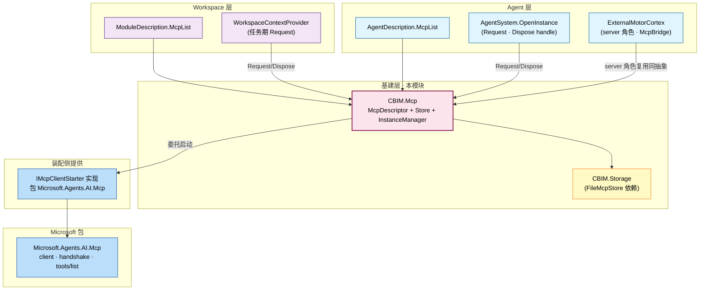
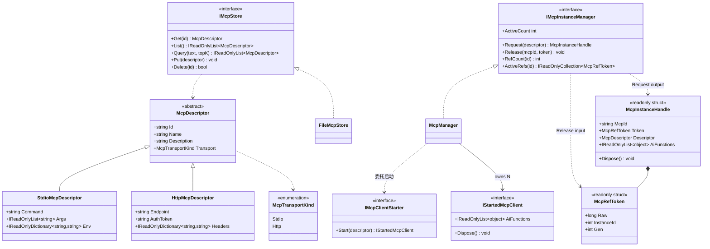
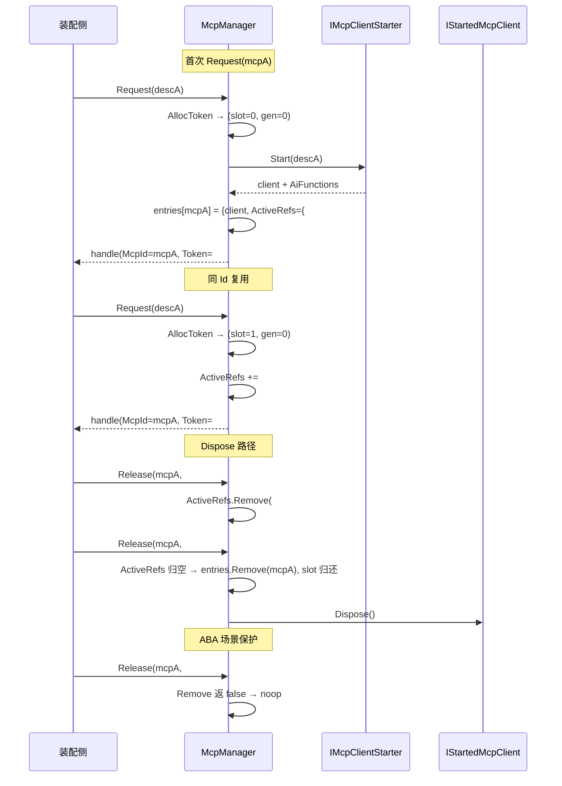

## Positioning

- **基建层四件套之一**——与 `Tools/` / `Skills/` / `Memory/` 平级。
- 出 **三类抽象**：描述符（`McpDescriptor` + Stdio/Http 两子类）、配置仓储（`IMcpStore` + `FileMcpStore`）、实例管理器（`IMcpInstanceManager` + `McpManager` + `IMcpClientStarter` SPI）。
- **不引 `Microsoft.Agents.AI.Mcp` NuGet**——协议接入走 SPI，装配侧注入。
- **跨维度共享**：`AgentDescription.McpList` 与 `ModuleDescription.McpList` 同抽象同类型。
- **唯一需显式释放的基建抽象**——持有外部进程（stdio）或连接（http）。

## 架构图（三层模型 + 跨维度共享）



**依赖方向**：调用侧 → `CBIM.Mcp` → `CBIM.Storage`（仅默认实现）。本模块不反向引用任何调用方。

## 类图（描述符 + Store + Manager + Token）



**三类抽象正交**：Store 管描述符仓储、Manager 管运行期实例、Starter 是装配侧填充的「怎么启」插口。

## Request/Release 序列（slot + gen 机制）



**语义保证**：幂等是集合语义的副产品；ABA 被generation 跳动杀死于数据结构层。

## Contract Surface

```csharp
namespace CBIM.Mcp;

public enum McpTransportKind { Stdio, Http }

public abstract class McpDescriptor
{
    public string Id { get; }
    public string Name { get; }
    public string Description { get; }
    public abstract McpTransportKind Transport { get; }
    protected McpDescriptor(string id, string name, string description);
}

public sealed class StdioMcpDescriptor : McpDescriptor
{
    public string Command { get; }
    public IReadOnlyList<string> Args { get; }
    public IReadOnlyDictionary<string, string> Env { get; }
}

public sealed class HttpMcpDescriptor : McpDescriptor
{
    public string Endpoint { get; }
    public string AuthToken { get; }
    public IReadOnlyDictionary<string, string> Headers { get; }
}

public interface IMcpStore
{
    McpDescriptor? Get(string id);
    IReadOnlyList<McpDescriptor> List();
    IReadOnlyList<McpDescriptor> Query(string text, int topK);
    void Put(McpDescriptor descriptor);
    bool Delete(string id);
}

public sealed class FileMcpStore : IMcpStore
{
    public FileMcpStore(FileBackend backend, string subdir = "mcps");
}

public interface IMcpInstanceManager
{
    McpInstanceHandle Request(McpDescriptor descriptor);
    void Release(string mcpId, McpRefToken token);
    int ActiveCount { get; }
    int RefCount(string mcpId);
    IReadOnlyCollection<McpRefToken> ActiveRefs(string mcpId);
}

public interface IMcpClientStarter
{
    IStartedMcpClient Start(McpDescriptor descriptor);
}

public interface IStartedMcpClient : IDisposable
{
    IReadOnlyList<object> AiFunctions { get; }
}

public readonly struct McpRefToken : IEquatable<McpRefToken>
{
    public long Raw { get; }
    public int InstanceId { get; }   // 高 32 位 · slot
    public int Gen { get; }          // 低 32 位 · generation
    public McpRefToken(int instanceId, int gen);
    public override string ToString();   // "#{InstanceId}.{Gen}"
}

public readonly struct McpInstanceHandle : IDisposable
{
    public string McpId { get; }
    public McpRefToken Token { get; }
    public McpDescriptor Descriptor { get; }
    public IReadOnlyList<object> AiFunctions { get; }
    public void Dispose();   // _manager?.Release(_mcpId, _token)
}
```

**Token 编码**：`Raw = ((long)InstanceId << 32) | (uint)Gen`。8 字节，与 `long` 同大小。

**handle = readonly struct**：零 GC；禁止经接口引用（会装箱，抑消零分配优势）。

## 使用示例（装配侧调用形态）

```csharp
var handles = new List<McpInstanceHandle>();
foreach (var desc in agent.McpList.Concat(module.McpList).DistinctBy(d => d.Id))
{
    try { handles.Add(mcpInstanceManager.Request(desc)); }
    catch (Exception e) { log.Warn($"MCP start failed: {desc.Id}", e); }
}
chatOptions.Tools.AddRange(handles.SelectMany(h => h.AiFunctions));

// CloseInstance
foreach (var h in handles) h.Dispose();

// 调试：谁还在持 git-mcp
foreach (var tk in mcpInstanceManager.ActiveRefs("git-mcp"))
    log.Debug($"  ref: {tk}");   // 例：#1.0 / #2.0 / #1.3
```

## Dependencies

- **描述符 + Store/Manager 接口**：纯 POCO + 接口，无外部依赖。
- **`FileMcpStore`**：依赖 `CBIM.Storage.FileBackend` + `StorageJson`。
- **`McpManager`**：依赖 `IMcpClientStarter` 接口（注入式）。
- **不依赖** `Tools` / `Skills` / `AgentSystem` / `Workspace` / `Microsoft.Agents.AI.Mcp`。

依赖方向：调用侧 → `CBIM.Mcp` → `CBIM.Storage`。不反向。

## 铁律

- **C1 · 本模块出三类抽象（描述符 / Store / InstanceManager）**——Microsoft client 不入本模块；SPI 注入。
- **C2 · 跨维度共享不引入反向依赖**——`Workspace → CBIM.Mcp` 是合法单向边。
- **C3 · 不实现 MCP 协议本身**——交 `Microsoft.Agents.AI.Mcp`。
- **C4 · `McpDescriptor` 不可变**——构造时校验，之后只读。
- **C5 · MCP server 连接目标必须 = `task.Where`**——workspaceRoot 由调用方传入，不由描述符指定。
- **C6 · 实例生命周期走 typed `McpRefToken` set + slot 复用 + gen 防 ABA**——已注销 / 未知 / ABA 旧 token 的 Release 必 noop。
- **C7 · handle = readonly struct，禁止经接口引用**——装箱会抹掉零 GC 优势。
- **C8 · 全局单一 Manager**——一个 CBIM 进程内单例│组合根提供；本模块不强制、靠装配纪律。
- **C9 · 并发安全**——`Request` / `Release` 可多线程，Manager 内部同一锁。
- **C10 · 启动失败优雅降级**——`Request` 可抛异常，装配侧接住转 warning。
- **C11 · 本模块抽象两向健壮**——既能描述外向连接（client 角色）也能被 `ExternalMotorCortex` 复用为「自起 MCP server 」描述（server 角色）；`McpDescriptor` 不持角色字段。
- **C12 · Store / Manager 职责不混淆**——Store 仅增删查描述符；Manager 仅管运行期实例。
- **C13 · Token 由 Manager 独家颁发**——外部不得构造 `McpRefToken` 传给 `Release`。

## Non-Goals

- 不实现 MCP 协议本身。
- 不在本模块引 `Microsoft.Agents.AI.Mcp` NuGet。
- 不抽象 `IMcpAdapter` / `IMcpRuntime`——`IMcpClientStarter` 是唯一胶水接口。
- 不持工具发现缓存 / endpoint 健康检查。
- 不提供「force-close all」 API——ActiveRefs 归空是唯一生命周期控制点。
- `IMcpInstanceManager` 不从 Store 拉描述符——调用方负责拉。

