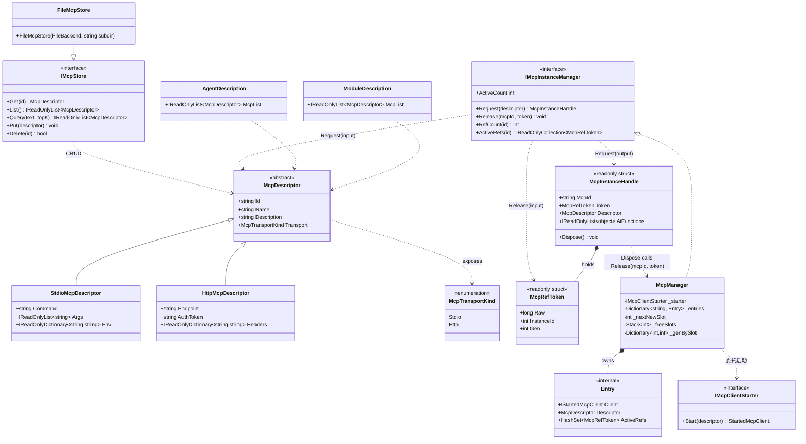

## Positioning

**Mcp 是 CBIM 基建层四件套抽象之一**（v2 三层模型）——与 `Tools/` / `Skills/` / `Memory/` 平级，同为顶层模块、同为「类型契约 / 抽象接口」。

**本轮重定位**：MCP 重新明确为「外部 server 接入点描述的协议级类型契约」——具体 MCP 实例集合由 Agent 与 Workspace 各自独立持有（per-Agent McpList、per-Module McpList）。

本模块只承载**「MCP 服务」这个协议级抽象本身**：

- `McpDescriptor`——抽象基类，描述「一个 MCP server 接入点」。
- `StdioMcpDescriptor`——子类，描述「本地进程通过 stdio 通信的 MCP server」（command + args + env）。
- `HttpMcpDescriptor`——子类，描述「远端通过 HTTP/SSE 通信的 MCP server」（endpoint + authToken + 可选 headers）。
- `McpTransportKind`——枚举：`Stdio` / `Http`。

本模块**只出抽象**，不实现 MCP 协议本身——协议层交给 `Microsoft.Agents.AI.Mcp` client；启 server / 握手 / `tools/list` / 包 `AIFunction` 的胶水代码在装配侧（`AgentSystem.OpenInstance` 或业务 Workflow）直接调 Microsoft client。

## 在三大基础能力中的位置

```
CBIM 三大基础能力（顶层平级）：
  Tools/   ← 最小单位（AIFunction 直装）
  Skills/  ← 语义级（Content 描述 · Skill 内可指引调 Tool）
  Mcp/     ← 这里：协议级（外部 server 进程 / 远端 endpoint，发现的工具最终也包成 AIFunction）
```

**Mcp 与 Tool / Skill 的关系**：

- Mcp 描述「外部接入点」——指向一个独立进程（stdio）或一个远端 endpoint（http）。
- 装配期连接该接入点后调 `tools/list` 拿到的每个 tool 都会被 Microsoft 客户端包成一个 `Microsoft.Extensions.AI.AIFunction`——所以**运行期 Mcp 最终回到 Tool 形态**。
- 但 `McpDescriptor` 与 `ToolDescriptor` 是**两个独立的描述抽象**——前者是「协议接入点」，后者是「家族名引用」；二者不能互替。AgentDescription / ModuleDescription 三字段（Tools / Skills / Mcp）并列引用。

## 跨维度共享（CBIM 最显式的共享点）

`McpDescriptor` 是 CBIM 内**最早、最显式**的跨维度共享抽象：

| 使用侧 | 字段 | 语义 | 装配点 | 装配生命周期 |
|--------|------|------|--------|-------------|
| 能力维度 | `AgentDescription.McpList: IReadOnlyList<McpDescriptor>` | agent 自带的 MCP server（跟人走） | `AgentSystem.OpenInstance` | 绑 AIAgent 实例 |
| 业务维度 | `ModuleDescription.McpList: IReadOnlyList<McpDescriptor>` | 业务 module 暴露的外部端点（跟业务走） | 业务 Workflow / `Kernel.ContextProviders` | 绑 task 上下文 |

**同抽象、同类型、同符号、同两子类（`Stdio` / `Http`）**——语义归属不同。同一个 MCP server（如 `git-mcp`）既可以挂在 agent 侧（这个 agent 会用 git）也可以挂在 module 侧（这个业务自带 git 接入点），形态完全相同，由调用方决定挂哪侧。

**为什么共享是合理的而非耦合**：MCP server 本质是「一个可调工具集的外部端点」——无论谁来用，端点的形态（command/args/env 或 endpoint/auth）完全一致。如果两侧各定义一份独立抽象，会重复表达同一件事，且未来协议变更要改两处。共享同一份描述符是抽象复用，不是跨维度耦合（依赖方向严格单向：`Workspace → CBIM.Mcp` + `AgentSystem → CBIM.Mcp`，本模块不反向引用任何调用方）。

## Class Diagram



两子类的形态识别从「字段是否存在」升为「类型判别」——调用方走 `descriptor is StdioMcpDescriptor stdio` / `descriptor is HttpMcpDescriptor http` 模式匹配，不再靠 nullable 字段。本轮新增的 `IMcpStore` / `IMcpInstanceManager` / `IMcpClientStarter` 三个接口与描述符体系正交：Store 管描述符仓储，Manager 管运行期实例，Starter 是 Manager 发包给装配侧填充的「怎么启」插口。

**Handle 形态注**：`McpInstanceHandle` 是 **readonly struct**（值类型）——零 GC 分配。`IMcpInstanceHandle` 接口被删除（struct 实现接口会装箱，抵消 GC 优势）。每个 handle 内含一个 manager 颁发的 `McpRefToken`——typed readonly struct 包装一个 `long Raw`，高 32 位是 slot（可复用 ID 空间），低 32 位是 generation（防 ABA）。Dispose 时按 (mcpId, token) 注销；不存在的 token 直接 noop（天然幂等，无需 _disposed CAS）。

**为什么 refId 升级为 `McpRefToken` 而非裸 `long`**（本轮第三次细化）：裸 `long` 三个不足——（1）**类型不安全**：调用方可凭空造一个 long 调 `Release(mcpId, 42)`，绕过 manager 颁发；改 typed struct 后非 manager 颁发的 token 几乎不可能构造（公开构造函数仍允许但语义清晰为「重组测试 token」）。（2）**ID 空间无界增长**：单调 `_nextRefId` 永不复用，长寿进程下 slot 号会变成大整数，调试时 `#123456789.0` 远不如 `#3.7` 直观；slot 复用让活跃集合小时 slot 号永远是小整数。（3）**ABA 风险只是侥幸**：单调 long 在应用生命周期内不 wrap 是真，但只要任何形式的 slot 复用（哪怕未来内存压力下加 GC 回收）出现，旧 handle 残留就会误注销新 entry。把 generation 编进 token 让「即使 slot 复用，旧 token 也不匹配」成为数据结构层面的保证——同集合语义把幂等做成数据天然属性（呼应涌现性洞见 7）的延伸：把 ABA 安全也做成数据天然属性。

**Token 编码格式**：`Raw = ((long)InstanceId << 32) | (uint)Gen`。`InstanceId` 是 slot 号（int，可复用），`Gen` 是该 slot 当前的 generation 计数（int，slot 每次被复用 +1，单调）。`ToString = "#{InstanceId}.{Gen}"`——日志 `#3.7` 一眼看出「这是 slot 3 被复用第 7 次」。8 字节，与 long 同；`HashSet<McpRefToken>` 性能与 `HashSet<long>` 同（哈希直接转发到 Raw.GetHashCode）。

## Contract Surface

### 描述符（协议级抽象 · 已落地）

```csharp
namespace CBIM.Mcp;

public enum McpTransportKind { Stdio, Http }

public abstract class McpDescriptor
{
    public string Id { get; }              // kebab-case，全局唯一
    public string Name { get; }            // 人类可读
    public string Description { get; }     // 一句话：这个 server 提供什么能力
    public abstract McpTransportKind Transport { get; }

    protected McpDescriptor(string id, string name, string description);
}

public sealed class StdioMcpDescriptor : McpDescriptor
{
    public string Command { get; }
    public IReadOnlyList<string> Args { get; }
    public IReadOnlyDictionary<string, string> Env { get; }
    public override McpTransportKind Transport => McpTransportKind.Stdio;
}

public sealed class HttpMcpDescriptor : McpDescriptor
{
    public string Endpoint { get; }
    public string AuthToken { get; }
    public IReadOnlyDictionary<string, string> Headers { get; }
    public override McpTransportKind Transport => McpTransportKind.Http;
}
```

所有描述符不可变 POCO——构造时校验、之后只读。装配侧从不修改描述符内容。

### 配置管理器（IMcpStore）

与 Skills 对称——McpDescriptor 作为配置资产可本地维护 / 云上集中管理。本模块提供配置仓储抽象：

```csharp
namespace CBIM.Mcp;

public interface IMcpStore
{
    // 查
    McpDescriptor Get(string id);                       // 找不到返回 null
    IReadOnlyList<McpDescriptor> List();
    IReadOnlyList<McpDescriptor> Query(string text, int topK);

    // 增 / 改（按 Id upsert）
    void Put(McpDescriptor descriptor);

    // 删
    bool Delete(string id);
}
```

**与 ISkillStore 接口形态对称**——同步、不可变 upsert、Query 可选。两个 Store 接口不该抽为同一个「通用 Store〈T〉」：后续进化方向（例 Mcp 加「模板变量」 / Skills 加「Content 全文检索」）可能发散，强行合同会产生反耦合。同形状不同语义是抽象复用的「临界」。

### 默认实现：FileMcpStore

```csharp
namespace CBIM.Mcp;

using CBIM.Storage;

public sealed class FileMcpStore : IMcpStore
{
    public FileMcpStore(FileBackend backend, string subdir = "mcps");
    // 落盘形态：<root>/mcps/<id>.json
    // 启动时全量扫一次进内存索引
    // JSON 需处理多态 McpDescriptor（stdio / http）：使用 "transport" 鉴别字段，设计时为后补抽象子类预留。
}
```

云后端预留位与 Skills 同形（`S3McpStore` / `HttpMcpStore` / `CompositeMcpStore`）——本轮不发。

### McpRefToken（本轮新增 · typed slot+gen 凭证）

```csharp
namespace CBIM.Mcp;

/// <summary>
/// Manager 颁发的不透明注销凭证——readonly struct，零 GC。
///
/// Raw 编码：((long)InstanceId << 32) | (uint)Gen
///   - InstanceId (高 32 位) = slot 号，Manager 内可复用
///   - Gen        (低 32 位) = 该 slot 当前的 generation，复用时 +1
///
/// 语义保证：
///   - 同 slot 复用后，gen 単调递增——旧 token 的 (slot, oldGen) 在新 entry 的 ActiveRefs
///     集合中不存在，旧 handle 重复 Dispose 成 noop（ABA 被数据结构杀死）。
///   - default(McpRefToken) = (Raw=0, slot=0, gen=0)——与 Manager 颁发的任何 token 不冲突（颁发起点 slot >= 0 但 gen 从 0 起手时 default 合法冲突风险只在 default(handle).Dispose 路径，已被 _manager null 检查上游拦住）。
///
/// 8 字节——与 long 同大小；HashSet 哈希转发到 Raw.GetHashCode，性能与 HashSet<long> 同。
/// </summary>
public readonly struct McpRefToken : IEquatable<McpRefToken>
{
    public long Raw { get; }
    public int InstanceId => (int)(Raw >> 32);
    public int Gen => (int)Raw;

    public McpRefToken(int instanceId, int gen);
    internal McpRefToken(long raw);   // 仅供 Manager 高效重建

    public bool Equals(McpRefToken other);
    public override bool Equals(object obj);
    public override int GetHashCode();
    public override string ToString();              // "#{InstanceId}.{Gen}"

    public static bool operator ==(McpRefToken a, McpRefToken b);
    public static bool operator !=(McpRefToken a, McpRefToken b);
}
```

**为什么 typed struct 而非裸 `long`**：

1. **类型安全**——`Release(string, long)` 接口接受任何 long，调用方完全可伪造；`Release(string, McpRefToken)` 要求传入必须是 token 类型值，项目内唯一出口是 Manager 的 Request，伪造路径被语义封闭。
2. **slot 复用 + bounded ID 空间**——不同于裸 long 的単调递增，本方案用 `Stack<int> _freeSlots` 回收 entry 被清空后释放的 slot，活跃集合小时 slot 号永远是小整数（调试友好、可观测心智负担低）。
3. **generation 防 ABA**——同一 slot 被复用后 gen +1，旧 token 不可能与新颁发的 token 相等（`Equals` 比 Raw、Raw 含 gen）。旧 handle 调 Dispose，Manager `ActiveRefs.Remove(oldToken)` 返 false，新 entry 不受任何影响——幂等是集合语义的天然属性。
4. **内存零开销**——仍 8 字节（`long Raw` 唯一字段）；`HashSet<McpRefToken>` 与 `HashSet<long>` 性能同（`GetHashCode` 直转 `Raw.GetHashCode`）。
5. **调试友好**——`ToString = "#3.7"` （slot 3，复用第 7 次）。日志 `ActiveRefs = [#1.0, #2.0, #3.4]` 一眼看出「这三个听众含 3 号 slot 被复用第 5 次」。

### 实例管理器（IMcpInstanceManager + McpInstanceHandle struct）

**驱动原因**：同一个 MCP server（例 `git-mcp`）可能被**多个 Agent 同时使用**——能力侧装配 Agent A 时启一次、装配 Agent B 又启一次是资源浪费；业务侧两个 Module 包含同 Id MCP 同时进入 task 上下文时同理。唯一能跨使用方去重的点是跨 Agent / 跨 Module 的全局唯一所有者——该职责落在本模块。

**生命周期机制：McpRefToken set + slot+gen 复用**（本轮第三次细化、取代之前的 long refId set）。每次 Request 由 manager 颁发一个 typed `McpRefToken`（slot 优先从 `_freeSlots` Pop、空则 `_nextNewSlot++`；gen 从 `_genBySlot[slot]` 取、复用时 +1）加入该 Id 的 ActiveRefs 集合；Dispose 时按 token 移除。这一选择带来四个性质：

1. **天然幂等** —— `HashSet.Remove(token)` 已注销 → 返回 false → noop；handle 自身不需 `_disposed` 字段 + Interlocked CAS。
2. **ABA 保护** —— slot 复用后 gen 已变，旧 token 与新 token 在集合中互不相等，旧 handle 重复 Dispose 不会误杀新 entry。
3. **可观测** —— `ActiveRefs(mcpId)` 所有持有者的 token 集合快照（`#3.7` 格式可人读）。
4. **零 GC handle** —— handle 变 readonly struct，每次 Request 在栈上构造。

```csharp
namespace CBIM.Mcp;

public interface IMcpInstanceManager
{
    /// <summary>
    /// 申请一个 MCP 实例。
    ///   - 首次按 Id 申请：调 IMcpClientStarter.Start 启动 + 握手 + tools/list，
    ///     登记进 Entry，新颁发的 token 加入 ActiveRefs。
    ///   - 同 Id 后续申请：复用 Entry.Client，新颁发的 token 加入 ActiveRefs。
    /// 返回的 handle 是 readonly struct——零 GC 分配。
    /// </summary>
    McpInstanceHandle Request(McpDescriptor descriptor);

    /// <summary>
    /// 注销一个 token（由 handle.Dispose 内部调用 · 业务代码不应直接调）。
    /// 已注销 / 未知 token 直接 noop——天然幂等 + ABA 防护。
    /// ActiveRefs 归空时在锁外 Dispose client 并移除 Entry；slot 归还 _freeSlots、gen 保留。
    /// </summary>
    void Release(string mcpId, McpRefToken token);

    /// <summary>当前被持有的不同 Id 实例数量（诊断）。</summary>
    int ActiveCount { get; }

    /// <summary>某 Id 当前的持有者数量（= ActiveRefs.Count，未启动返回 0）。</summary>
    int RefCount(string mcpId);

    /// <summary>
    /// 某 Id 当前所有持有者的 token 快照（不存在返回空集合）。
    /// 用于调试「谁还在持」——返回不可变快照（拷贝，不暴露内部 HashSet）。
    /// </summary>
    IReadOnlyCollection<McpRefToken> ActiveRefs(string mcpId);
}

/// <summary>
/// 一次 Request 申请到的 MCP 实例句柄——readonly struct，零 GC 分配。
///
/// 字段（全部 readonly，内部字段使用 _ 前缀，公开为不带前缀的属性）：
///   - _manager: 颁发本 handle 的 McpManager（Release 路由对象）
///   - _mcpId  : 对应的 McpDescriptor.Id
///   - _token  : manager 颁发的 typed McpRefToken（注销凭证，含 slot+gen）
///   - _descriptor / _aiFunctions: 快照字段（同 Id 兄弟 handle 共享同一引用）
///
/// Dispose 语义：_manager.Release(_mcpId, _token)——
///   - 未知 token / 已注销 token → noop（HashSet.Remove false，天然幂等 + ABA 防护）
///   - ActiveRefs 归空 → 锁内移除 Entry、slot 归还 _freeSlots，锁外 client.Dispose
///
/// 注意：`default(McpInstanceHandle)` 是无效 handle（_manager == null），
/// Dispose 必须先校验 _manager 非空——否则 NRE。
/// </summary>
public readonly struct McpInstanceHandle : IDisposable
{
    public string McpId { get; }                       // 对应 Descriptor.Id
    public McpRefToken Token { get; }                  // manager 颁发的注销凭证
    public McpDescriptor Descriptor { get; }           // 申请时传入的描述符（不可变）
    public IReadOnlyList<object> AiFunctions { get; }  // 同 Id 兄弟共享同一引用

    // 内部构造——只供 McpManager 调用。
    internal McpInstanceHandle(
        McpManager manager,
        string mcpId,
        McpRefToken token,
        McpDescriptor descriptor,
        IReadOnlyList<object> aiFunctions);

    public void Dispose();   // _manager?.Release(_mcpId, _token)
}
```

**为什么 `Release` 上接口** —— handle 是 struct，必须通过 `_manager` 字段路由 Dispose。如果 handle 只能依赖 `McpManager` 具体类，则「换 manager 实现」不再可能；handle 能持任何实现的必要条件是「定 Release 为接口成员」。业务代码**不应直接调 `Release`**——由 handle.Dispose 代劳；`Release` 主要服务于测试桩 / 自定义实现。

**为什么删 `IMcpInstanceHandle` 接口** —— C# struct 实现接口时，通过接口引用调用会发生**装箱**（把 struct 拷贝到堆上对象里）。一旦装箱，「零 GC」初衷就破产了。所以接口与 struct 二选一：选 struct + 零 GC，放弃 handle 接口多态。Manager 接口仍保留（可换实现）；handle 类型固定为唯一的 struct。

**默认实现 `McpManager` 内部数据**（本轮第三次细化 · slot pool + gen 字典）：

```csharp
internal sealed class Entry
{
    public IStartedMcpClient Client;
    public McpDescriptor Descriptor;
    public HashSet<McpRefToken> ActiveRefs;   // 全部当前持有者 token
}

// Manager 字段：
private readonly Dictionary<string /*mcpId*/, Entry> _entries
    = new(StringComparer.Ordinal);
private readonly object _gate = new();

// Token 颁发状态——全部被 _gate 守护：
private int _nextNewSlot;                     // 未复用过的下个 slot。首个拿 0。
private readonly Stack<int> _freeSlots = new();        // 已释放待复用的 slot
private readonly Dictionary<int, int> _genBySlot = new();   // slot → 当前 gen（单调递增）
```

AllocToken（锁内调用）：
  - slot = `_freeSlots.Count > 0 ? _freeSlots.Pop() : _nextNewSlot++;`
  - gen = `_genBySlot.TryGetValue(slot, out var g) ? g + 1 : 0;`
  - `_genBySlot[slot] = gen;`
  - 返 `new McpRefToken(slot, gen)`

Request 路径（锁内）：
  - `var token = AllocToken();`
  - Entry 命中 → `entry.ActiveRefs.Add(token)`；返 struct(this, mcpId, token, entry.Descriptor, entry.Client.AiFunctions)
  - Entry 缺失 → 锁内调 `_starter.Start(descriptor)`，新建 Entry，`entry.ActiveRefs = new() { token }`，登记返回 handle；starter 抛异常则不入字典原样上抛（但 token 已 alloc——设计上有两种选择：锁内同步在 starter 抛后把 slot 归还 _freeSlots 以避免「启动失败环境下 slot 号被汛染」；或取取消变更让 gen 跳 1，同一 slot 下次颁发拿下个 gen——后者更简单且不需额外代码，推荐后者）

Release 路径：
  - 锁内 `if (!_entries.TryGetValue(mcpId, out var entry)) return;`（完全未知 mcpId → noop）
  - 锁内 `if (!entry.ActiveRefs.Remove(token)) return;`（已注销 / 旧 ABA token → noop）
  - 锁内 `if (entry.ActiveRefs.Count == 0) { _entries.Remove(mcpId); toDispose = entry.Client; FreeSlotsFor(entry); }`
  - 锁外 `toDispose?.Dispose()`（kill 子进程 / 关 socket 可能阻塞，不应卡其他 Id 的请求）

FreeSlotsFor（锁内，entry 被移除时调用，现场其实已空集）：
  - **误区提醒**：本走到这里时 ActiveRefs 已空（最后一个 token 刚被 Remove），FreeSlotsFor 需要在 Remove 之**前**拿到被移除的 token。
  - 正确顺序：`Remove` 后拿到的 token 并非被移除的那个——另一种实现是 Release 路径上直接拿参数的 `token` Push 进 _freeSlots（其 InstanceId 即为释放的 slot）；但这只在 entry 清空后才做，避免同 slot 同时在 ActiveRefs 中有多个 gen 的「多个 token」（这在 slot 复用语义下不会发生，但代码需加注释防后人误解）。
  - 实际推荐实现：Release 路径锁内“ActiveRefs.Count == 0 且 _entries.Remove”分支中 `_freeSlots.Push(token.InstanceId);`，同一分支里（同 slot 不可能跨不同 Mcp Id 复用这个事实是全局的——slot 是 Manager 全局唯一的，不按 mcpId 分桶）。

**slot 是 Manager 全局单调资源，不按 mcpId 分桶**：跨 mcpId 也会复用 slot 号，这是预期的（mcpId + slot 联同唯一定位 entry，同 slot 不同 gen 已足以区别新旧 token；同 slot 不同 mcpId 也不冲突因为 Release 首先按 mcpId 查 entry，再按 token 查 set）。

### IMcpClientStarter（实现侧 SPI · 本模块内部抽象）

默认实现 `McpManager` 不直接依赖 `Microsoft.Agents.AI.Mcp`——通过一个 SPI 接口注入启动能力：

```csharp
namespace CBIM.Mcp;

public interface IMcpClientStarter
{
    /// <summary>
    /// 按 descriptor 启动 MCP client（stdio: 拉起子进程；http: 建连），完成握手 + tools/list，
    /// 返回一个可释放的启动产物（AIFunction 列表 + DisposeAsync）。
    /// </summary>
    IStartedMcpClient Start(McpDescriptor descriptor);
}

public interface IStartedMcpClient : IDisposable
{
    IReadOnlyList<object> AiFunctions { get; }   // 后续收紧为 Microsoft.Extensions.AI.AIFunction
}
```

**为何设 SPI**：

- 本模块**仍不引入** `Microsoft.Agents.AI.Mcp` NuGet 依赖——保持基建层最稳定。
- token set / 生命周期 / 并发保护在本模块；Microsoft client 接入代码在装配侧（AgentSystem / 业务 Workflow）提供 `IMcpClientStarter` 实现 + 注入。
- 单测可注入 fake starter，不依赖外部进程。

### 使用示例（装配侧调用形态）

```csharp
// 启动期（例 AgentSystem.OpenInstance）
var handles = new List<McpInstanceHandle>();   // 注意：struct 装进 List——列表本身是 class，元素在列表内部按值存储
foreach (var desc in agent.McpList.Concat(module.McpList).DistinctBy(d => d.Id))
{
    try { handles.Add(mcpInstanceManager.Request(desc)); }
    catch (Exception e) { log.Warn($"MCP start failed: {desc.Id}", e); }   // 优雅降级
}
chatOptions.Tools.AddRange(handles.SelectMany(h => h.AiFunctions));

// 释放期（例 AgentSystem.CloseInstance）
foreach (var h in handles)
    h.Dispose();   // 按 token 注销，ActiveRefs 归空时 Manager 关 server、slot 归还、gen 保留

// 调试：查看谁还在持 git-mcp
foreach (var token in mcpInstanceManager.ActiveRefs("git-mcp"))
    log.Debug($"  ref: {token}");   // 输出例：  ref: #1.0 ; ref: #2.0 ; ref: #1.3（slot 1 被复用第 4 次）
```

同一个 Manager 被不同装配侧（Agent A / Agent B / Module M / Module N）共享，Manager 负责去重 / token 跟踪 / 零引用关机。

## 装配模型（任务期生命周期）

MCP 是三大基础能力中**唯一需要显式释放**的源——因为持有外部 server 进程（stdio）或远端连接（http）。装配 / 释放配对必须严格执行，否则资源泄漏。

### 启动序列（能力侧示例 · 在 `AgentSystem.OpenInstance` 内）

```
foreach descriptor in desc.McpList:
    try:
        var client = descriptor switch {
            StdioMcpDescriptor s => await McpClientFactory.CreateStdioAsync(s.Command, s.Args, s.Env),
            HttpMcpDescriptor  h => await McpClientFactory.CreateHttpAsync(h.Endpoint, h.AuthToken, h.Headers),
        };
        await client.HandshakeAsync();             // MCP 协议握手
        var tools = await client.ListToolsAsync(); // tools/list
        var fns   = tools.Select(t => t.AsAIFunction()).ToList();
        instance.McpHandles.Add(new McpHandle(client, fns));
        allFns.AddRange(fns);
    catch (Exception e):
        log.warn($"MCP start failed: {descriptor.Id}", e);   // 优雅降级
```

注：`McpClientFactory` / `client.HandshakeAsync` / `client.ListToolsAsync` 等为 `Microsoft.Agents.AI.Mcp` 客户端 API 的示意——具体方法签名以 NuGet 包为准。

### 释放序列（`AgentSystem.CloseInstance` 内）

```
foreach handle in instance.McpHandles:
    await handle.DisposeAsync();    // 断 IPC + Kill server 进程（Stdio） / 断 HTTP session（Http）
```

**铁律：异常路径也必走 Dispose**——使用 try/finally 或 `IAsyncDisposable` + `await using` 模式。任何「失败就忘了关」的代码都是泄漏。

### 业务侧装配（在业务 Workflow 内）

业务侧的 `ModuleDescription.McpList` 装配位置由 `Kernel.FlowGraph` / `Kernel.ContextProviders` 切片决定——可能在 `WorkspaceContextProvider` 内启动、绑 task 生命周期、task 结束后 dispose。装配机制完全对称于能力侧，只是触发点不同（不在 OpenInstance，在 task 上下文构造期）。

## 铁律

1. **本模块出三类抽象**（本轮修订，原「只出抽象」裁定被取代）——描述符（`McpDescriptor` + 两子类）、配置仓储（`IMcpStore` + `FileMcpStore`）、实例管理器（`IMcpInstanceManager` + `McpManager`）。Microsoft client 接入代码仍不入本模块——通过 `IMcpClientStarter` SPI 由装配侧注入。
2. **跨维度共享不引入反向依赖**——`Mcp` 模块自身不依赖 `AgentSystem` / `Workspace` / `Kernel`；是后三者依赖 `Mcp`。`Workspace → CBIM.Mcp` 是合法的单向边。
3. **不实现 MCP 协议本身**——交 `Microsoft.Agents.AI.Mcp`。本模块只描述「一个 MCP server 接入点是什么形态」 + 「该实例的 McpRefToken-set 生命周期」。
4. **`McpDescriptor` 不可变**——构造时校验完整性（id 非空 / endpoint 合法等），之后只读。
5. **MCP server 连接目标必须 = task.Where**（与父模块铁律一致）——workspaceRoot 由调用方（OpenInstance.options.TaskWhere 或业务 Workflow 上下文）传入，不由描述符本身指定。
6. **实例生命周期走 typed `McpRefToken` set + slot 复用 + generation 防 ABA**（本轮第三次修订 · 取代上轮裸 long refId set）——同 Id 多个 Request 返回独立 handle，各持唯一 `McpRefToken`（readonly struct：Raw = (long)slot << 32 | (uint)gen，高 32 位 slot 可复用、低 32 位 gen 复用时 +1）加入 Manager 内的 `HashSet<McpRefToken> ActiveRefs`。Dispose 按 (mcpId, token) 注销；ActiveRefs 归空时 Manager 才关进程 / 连接、slot 归还 `_freeSlots` 池、gen 在 `_genBySlot` 中保留（下次复用该 slot 时 +1）。**已注销 / 未知 / ABA 旧 token 的 Release 必须 noop**（HashSet.Remove 天然幂等 + generation 不匹配双重保护，无需 _disposed CAS）。**handle 是 readonly struct，禁止经由接口引用**（会装箱、抹掉零 GC 优势）。**refId 类型从 `long` 升级为 typed `McpRefToken` struct**——唯一性仍是「单 Manager 内」而非「全局」，仍 8 字节；提升的是类型安全（不可伪造） / bounded ID 空间（slot 复用，调试友好） / ABA 防护（gen 让旧 token 自动失效）。**ABA 场景保证**：T1 Request(mcpA)→token(slot=1,gen=0)→T2 Dispose→slot=1 归池；T3 Request(mcpA)→token(slot=1,gen=1)；T4 T1 旧 token Dispose → set.Remove(slot=1,gen=0) 返 false → noop，T3 不受影响。
7. **全局单一 Manager**——一个 CBIM 进程内 `IMcpInstanceManager` 需为单例（由组合根提供）；否则多实例不能跨使用方共享 token 集合 / 去重。本模块不强制单例实现 / 不提供 static 入口——约束靠装配时纪律。另，slot pool / gen 字典仅在单个 Manager 实例内唯一；多个 Manager 实例之间 token 发生重复不是问题，因为 token 总是与 (Manager, mcpId) 三元组一起使用。
8. **并发安全**——`Request` / `Release` 可多线程调用；Manager 内部需按 Id 锁（实例启动 / 释放不可重入）。同一 Id 启动竞况里 Manager 负责合并 Request——不启两个同名 server。Token 颁发 / slot pool / gen 字典都在同一锁下操作，不需额外 Interlocked。
9. **未授 / 启失败优雅降级**——`Request` 可抛异常。装配侧接住后转为 warning，其他 MCP 照常装配。本模块不隐部吞异常。
10. **不为 stdio / http 之外的传输扩展抽象**——MCP 协议本身可能未来扩展（如 named pipe / websocket），但本模块当前仅识别 stdio / http 两子类。如新传输形态出现，加一个子类即可，不改基类形状。
11. **CBIM.Mcp 必须双向健壮**（涌现性洞见对应铁律）——本模块抽象将同时被两类使用方依赖：内置 AIAgent 装配时本模块抽象用于「描述一个 client 要去连接的 server」（client 角色）；ExternalAdapter 策略 B 让本模块抽象用于「描述一个 CBIM 自起 server 暴露给外部引擎拉取」（server 角色）。基类必须既能描述外向连接也能描述自起暴露——这是 `McpDescriptor` 仅持「形态 + 接入信息」、不持「角色（client/server）」字段的本质原因。【`IMcpInstanceManager` 同理仅面向 client 角色；server 角色由 ExternalAdapter 自行管理。】
12. **`IMcpStore` 与 `IMcpInstanceManager` 职责不混淆**——Store 仅管描述符的增删查（纯配置），不启进程；Manager 仅管运行期实例（进程 / 连接 + ActiveRefs），不持久化描述符。调用方从 Store 拉描述符后交给 Manager Request；两者不直接交互。
13. **Token 由 Manager 独家颁发**（本轮新增）——外部不得构造 `McpRefToken` 传给 `Release`。公开构造函数仅供「重组测试场景」（与预期 Manager 颁发的 token 表示重同）使用。运行期唯一合法的 token 来源是 Manager 的 Request 路径。

## Origin Context

- **第一阶段**：MCP 概念在 CBIM 内最初以 `AgentSystem.AgentDescription.mcp_servers: List<string>` + `IMcpRegistry` 二级查表的形式表达——名字串引用 + 中心注册表。问题：Unity 项目内 cfg 与 agent 共存，二级表反增同步成本。
- **第二阶段**：`McpDescriptor` 出现，最初是 record 形态（一个类含 `Command` / `Endpoint` 等所有字段，按字段是否非空判别 stdio / http）。位于 `AgentSystem/McpAdapter/` 子模块。问题：「字段判别」语义不清晰；命名「Adapter」与 Tools / Skills 命名不对齐（后者是「能力的家」，前者像「胶水的家」）。
- **第三阶段**（上上轮）：`McpAdapter/` 重命名为 `AgentSystem/Mcp/`；`McpDescriptor` 升为 abstract 基类 + `StdioMcpDescriptor` / `HttpMcpDescriptor` 两子类 + `McpTransportKind` 枚举；命名空间 `CBIM.Mcp`。问题：物理位置仍在 `AgentSystem/` 下，业务侧（Workspace）需要同抽象时只能跨维度反向引用能力侧子模块——语义错位。
- **第四阶段**（上轮 · 顶层化）：从 `AgentSystem/Mcp/` 提为顶层 `CBIM/Mcp/`，与 `Tools/` / `Skills/` 三足鼎立。理由与 Tools / Skills 顶层化完全一致：**跨维度共享抽象不属于任何单一维度，提升一层后能力侧 / 业务侧平等引用**。
- **第五阶段**（上个切片 · ExternalAdapter 接入）：ExternalAdapter 策略 B（McpBridge）让 CBIM 自起 MCP server 暴露给外部引擎——本模块抽象首次承担「server 角色」描述。这驱动铁律 11 显式化（McpDescriptor 不持角色字段，角色由调用方决定）。
- **第六阶段**（本轮 · 配置管理器 + 实例管理器）：面向「云上集中管理 MCP 配置」与「跨 Agent 复用同名 MCP server」两个需求，本轮增加两个独立资产：
  - **`IMcpStore` + `FileMcpStore`**：与 Skills 对称的配置仓储抽象，云后端预留位。不启进程、不接连接。
  - **`IMcpInstanceManager` + `DefaultMcpInstanceManager` + `IMcpClientStarter` SPI**：三大基建抽象中唯一需「运行期实例管理」的，原因是 Skill / Tool 实例化代价近零且不需复用，MCP 启进程 / 建连接贵且可被多 Agent / Module 同时使用。Ref-count + 全局单例管理是唯一能跨装配侧去重的处。**铁律 1 被修订**——原「只出抽象」变为「出三类抽象（描述符 / Store / InstanceManager）」。Microsoft client 代码仍不入本模块——通过 `IMcpClientStarter` SPI 由装配侧注入。
- **第七阶段**（本轮 · refId set + handle struct 化）：第六阶段的 ref-count 方案有三处不满意：
  - handle 是 class，每次 Request 都 `new` 一个走堆；MCP 装配在 Agent open / task 上下文构造的热路径上，GC 压力可观。
  - handle 自身要扌「重复 Dispose 幂等」——`int _disposed` 字段 + `Interlocked.Exchange` CAS，是为弥补 ref-count 不可恢复（减多一次就破账）而存在的辅助状态。
  - ref-count 是个聚合数字，丢失「谁还在持」的可观测性——只能知道「还剩几个」，不能知道「这几个分别是谁」。

  本轮改 refId set 方案根除三者：handle 改 `readonly struct`（栈构造、零分配）+ 删 `IMcpInstanceHandle` 接口（struct 经接口引用必装箱）；Manager 内 `int refCount` 改 `HashSet<long> ActiveRefs`，每次 Request 由 Manager 用 `Interlocked.Increment(ref _nextRefId)` 颁发 `long refId` 加入集合，Dispose 时 `ActiveRefs.Remove(refId)` 返回 false 即 noop（已注销 / 未知 refId 都走同一分支，**天然幂等**，handle 自身不再需要任何状态保护）；额外暴露 `ActiveRefIds(mcpId)` 查询给调试。`Release(string, long)` 上接口，因为 handle 是 struct 必须经 `_manager` 字段路由 Dispose，若 `_manager` 只是具体类则换 manager 实现就不可能。

  **为什么 refId 选 `long` 而不是 `Guid`**：唯一性需求是「单 Manager 实例内」而非「全局」——不需要 RNG 生成。`long` 是 8 字节（vs Guid 16）；`HashSet<long>` 哈希更快；`Interlocked.Increment(ref long)` 是 lockless x86 原子递增（比 `Guid.NewGuid()` RNG 调用廉价数量级）；调试日志里 `1, 2, 3` 远比 hex GUID 直观；且 `long.MaxValue` ≈9.2×10^18，应用生命周期内不会 wrap。**铁律 6 被修订**（refId set 替代 ref-count，refId 类型为 `long`）。

- **第八阶段**（本轮 · refId 由 long 升为 typed `McpRefToken` struct + slot 复用 + generation 防 ABA）：第七阶段的裸 `long refId set` 方案运行中发现三处不足：
  - **类型不安全**：`Release(string, long)` 接口接受任何 `long`，调用方可凭空造 `Release("foo", 42)`，绕过 Manager 颁发。类型系统本该拦住的错误留到运行期以 set.Remove false 隐形吞掉，父代码 bug 的信号完全丢失。
  - **ID 空间无界增长**：Interlocked.Increment 単调递增，长寿进程（例 Unity Editor 运行几小时）后 refId 会变成几万 / 几十万量级，调试日志 `ActiveRefs = [123456, 123458, 123461]` 不如 `[#3.0, #5.0, #8.0]` 直观；bounded ID 空间才能带来「小整数」可读性。
  - **ABA 风险依赖「不 wrap」侥幸**：裸 long 不 wrap 是真，但包含 ABA 场景的任何复用（未来有人加「回收释放得」代码、或多 Manager 实例发生 refId 同名冲突转发场景）下，旧 token 可能误杀新 entry。现在这不会发生，但「在不会发生上依赖」是脆弱合同。

  本轮改 typed `McpRefToken` struct + slot pool + gen 字典根除三者：
  - **typed struct 封闭伪造路径**：Manager 颁发是唯一合法源。外部虽仍可用公开构造函数重组 token（例重组测试），但语义上业务代码几乎不可能「不小心」造一个 McpRefToken。
  - **slot 复用使活跃集合小时 slot 号始终是小整数**：`Stack<int> _freeSlots` 回收 entry 被清空后释放的 slot，Request 优先从池中 Pop、空则从 `_nextNewSlot` 取。启动期 / 鲜少并发场景下 slot 0/1/2/3 反复被复用，调试 `#0.3` 一眼读出「0 号 slot 被复用第 4 次」。
  - **generation 让 ABA 成数据结构属性**：`Dictionary<int slot, int gen> _genBySlot` 记 slot 被复用过几次，复用时 gen +1、新颁发 token = (slot, newGen)。同 slot 新旧 token 的 Raw 不同——`HashSet<McpRefToken>` Hash 不匹配、Equals 也不匹配，旧 token 重复 Dispose 在新 entry 上是安全 noop。

  **铁律 6 被修订第三次**（refId 类型从 `long` 升为 typed `McpRefToken` struct；slot pool + gen 字典取代单调 `_nextRefId`）。**铁律 13 被新增**（token 由 Manager 独家颁发）。Manager API 变更：`Release(string, long)` → `Release(string, McpRefToken)`；`ActiveRefIds(string): IReadOnlyCollection<long>` → `ActiveRefs(string): IReadOnlyCollection<McpRefToken>`。Handle API 变更：`McpInstanceHandle.RefId: long` → `Token: McpRefToken`。

## Emergent Insights

1. **「描述符不持角色」是双向健壮的关键**——McpDescriptor 既能被「client 角色调用方」消费（去连接某个 server），也能被「server 角色调用方」消费（去暴露成 server 让外部拉）。如果描述符自陈角色，会切断这种双向复用——是 ExternalAdapter 策略 B 接入后才浮现的洞见。CBIM.Mcp 的双向健壮性是从单一角色（client）出发设计的抽象意外满足了第二角色（server）的复用需求，这是 C6 稳定抽象在生态层面的具象体现。
2. **「同抽象跨维度共享」与「单向依赖」可并存**——共享不是耦合的同义词。Mcp 模块自身不依赖任何调用方，所有引用边都是「调用方 → Mcp」单向，依赖图严格单调。共享与单向依赖在描述抽象层完全可共存。
3. **「Adapter」命名是隐式胶水承诺**——上上轮的 `McpAdapter/` 命名暗示「这里有适配/胶水代码」，反而成为 misnomer：模块里其实只放抽象。上轮改名 `Mcp/` 与 `Tools/` / `Skills/` 一致，命名表达「该抽象的家」而非「该抽象的胶水家」——命名即语义边界。
4. **「MCP 是唯一需显式释放的源」是基础能力三件套唯一的非对称性**——Tools 装配开销近零（AIFunction 实例化即可），Skills 装配只是字符串注入；唯独 Mcp 持有进程 / 网络连接。这驱动了「能力侧三源合并时 Mcp 单独维护 handles 列表 + CloseInstance 显式释放」的非对称装配模型——是抽象本质决定的，不是设计取舍。
5. **「配置仓储 vs 实例管理」是同一抽象的两面**（本轮新增）——McpDescriptor 同时需要两个同伴者：`IMcpStore` 是在「运行期之前」管理描述符集合（购买 / 升级 / 云同步），`IMcpInstanceManager` 是在「运行期之中」管理运行实例（启进程 / ref-count / 关机）。Skills 不需 InstanceManager 是因为它「运行期中」与「配置」是同一物（文本内容），Tool 同理（实例化开销 ≈ 0）。这个不对称反映抽象背后「资源是否有进程 / 连接」的本质区别：「需 InstanceManager」不是设计选择，是资源本性决定的。
6. **SPI 是「保护基建层零外部依赖」的描述器**（本轮新增）——`IMcpClientStarter` 是本模块唯一的 SPI。不是为了「允许多种启动实现」（现阶段只一个 Microsoft client），是为了「让本模块不引 NuGet」——与装配侧实现隔开。这是与「插件点」设计意图不同的：插件点面向多实现趋同，SPI 面向依赖隔离。
7. **「refId set 取代 refCount」让幂等从代码改为数据天然属性**（本轮新增）——ref-count 的 `int` 是聚合数字，减多了会破账；handle 不得不靠 `_disposed` 字段 + Interlocked CAS 把「我已经报告过 -1 了」记下来，是「为了对账加状态」。refId set 把每个持有者作为独立成员存进集合，注销 = `Remove(refId)`：天然集合语义里「移除不存在的元素」是 false / noop，没有任何对账压力。**幂等不再需要代码逻辑，幂等是数据结构选型的副产品**——这是用对数据结构消灭代码的样本。
8. **「struct vs 接口」的选择不是性能权衡，是「零分配承诺能否兑现」的硬约束**（本轮新增）——`McpInstanceHandle` 想要零 GC，就必须是 struct；struct 一旦经接口引用（`IMcpInstanceHandle h = handle;`）就被装箱，零 GC 承诺当场作废。这把「handle 类型可换」与「零 GC」推到二选一：本模块选后者，删 `IMcpInstanceHandle` 接口，handle 类型固化为唯一的 struct。**装箱不是性能优化对象，是抽象层选型的硬边界**——C# 里 struct 不能在保留接口多态的前提下保留零分配，这是语言本身的几何约束。

9. **「原始类型使接口变成可伪造的凭证」是库设计推荐用 typed wrapper 的本质原因**（本轮新增）——`Release(string, long)` 在语义上应当「只能接受 Manager 颁发过的 refId」，但类型系统的描述能力只能说「接受任何 long」——语义与类型之间出现 gap，bug 被允许“可表达”。Typed wrapper struct 的价值不是「给 long 加名字」，是「让类型系统只能表达『合法源』这个语义」——代价是接口变改，收益是「伪造 token 路径几乎不可能」。同样的方法论适用于任何「凭证 / handle / opaque ID」抽象。
10. **「bounded ID + slot 复用」与「单调递增」是揊你「可观测性」与「唯一性」的不同选择**（本轮新增）——单调递增拼「唯一性不重复」上极限，代价是 ID 无界增长与调试不友好。Bounded ID + 复用拼「调试易读」，代价是复用语义必须额外保护（本例加 generation）。二者不是优劣关系，是面向不同场景的选型：需要「贯穿多系统追踪」选单调（跨进程也唯一）；仅需「单进程内本地唯一 + 调试友好」选 bounded。理解这个选型维度后，「为什么对象池 / 连接池 / FreeList 设计都选 slot 复用」不再是偶然。
11. **「generation 是在数据结构层面安装 ABA 探测仪」——让错误变得不可表达而不是「检测后报错」**（本轮新增）——传统 ABA 防御是「检测到后 raise / log」，依赖代码逻辑。Generation 方案把 ABA 检测融进集合的 Hash / Equals 语义：旧 token 与新 entry 的集合压根不是同一个元素，`Remove` 取 false 是集合语义本身的「不存在则 noop」，不需任何特殊代码路径。这与涌现性洞见 7（refId set 代 refCount 让幂等成数据天然属性）是同一方法论的延伸：**能用数据结构表达的保护不要用代码表达**。这是 C# / .NET 里 Span / ref struct / readonly struct 越来越受重视的动机：让类型系统多拼一点，让程序逻辑少拼一点。

## Dependencies

- `McpDescriptor` + 两子类：纯 POCO，无外部依赖。
- `IMcpStore` + `IMcpInstanceManager` + `IMcpClientStarter` 接口：仅依赖自身 + `McpDescriptor`。
- `FileMcpStore` 默认实现：依赖 `CBIM.Storage.FileBackend` + `CBIM.Storage.StorageJson`。
- `DefaultMcpInstanceManager` 默认实现：依赖 `IMcpClientStarter` 接口（以注入方式）。**仍不依赖** `Microsoft.Agents.AI.Mcp`——这个包的接入在装配侧（AgentSystem / 业务 Workflow）提供 `IMcpClientStarter` 具体实现。
- **不依赖** `Tools` / `Skills` / `AgentSystem` / `Workspace` / `Microsoft.Agents.AI.Mcp`——本抽象层不引用 Microsoft 包（描述符、Store、生命周期都不需协议运行时）。

依赖方向：调用侧（AgentSystem / Workspace / Kernel 运行期） → `CBIM.Mcp` → `CBIM.Storage`（默认实现侧）。不反向。

## Non-Goals

- **不实现 MCP 协议本身**——交 `Microsoft.Agents.AI.Mcp`。
- **不在本模块引入 `Microsoft.Agents.AI.Mcp` NuGet 依赖**——通过 `IMcpClientStarter` SPI 由装配侧注入，本模块接口层保持零外部依赖。
- **不抽象 `IMcpAdapter` / `IMcpRuntime`** 等胶水接口——`IMcpClientStarter` 是唯一胶水接口，仅面向 starter 同质化。
- **不持工具发现缓存**——每次 `Request` 的首调重 `tools/list`，后续同 Id Request 复用 Entry 内的 client（共享 AiFunctions 引用），不设「跨进程会话缓存」复杂度。
- **不持远端 endpoint 健康检查**——健康监测是装配侧 / ops 层职责，不在描述符抽象层。
- **不为不同 LLM 提供商优化**——MCP 协议本身与 LLM 提供商解耦，Microsoft 客户端已处理。
- **`IMcpInstanceManager` 不提供「force-close all」类 API**——ActiveRefs 集合归空是唯一的生命周期控制点。装配侧谁调 Request 谁负责 Dispose handle——这是不能打破的类 RAII 纪律。`ActiveRefIds` 仅供查询、不允许据此「替别人注销」。
- **`IMcpInstanceManager` 不负责从 Store 拉描述符**——调用方负责从 Store 拉 + 交给 Manager Request（职责分离，见铁律 12）。

