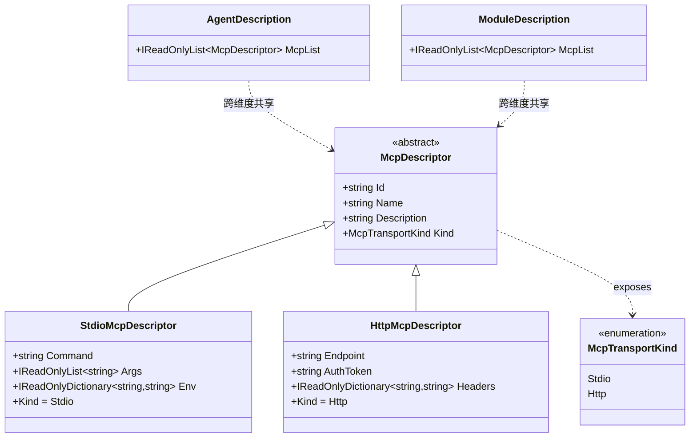

## Positioning

**Mcp 是 CBIM 三大基础能力抽象之一**——与 `Tools/` / `Skills/` 平级，同为顶层模块、同为跨维度共享抽象。

本模块只承载**「MCP 服务」这个协议级抽象本身**：

- `McpDescriptor`——抽象基类，描述「一个 MCP server 接入点」。
- `StdioMcpDescriptor`——子类，描述「本地进程通过 stdio 通信的 MCP server」（command + args + env）。
- `HttpMcpDescriptor`——子类，描述「远端通过 HTTP/SSE 通信的 MCP server」（endpoint + authToken + 可选 headers）。
- `McpTransportKind`——枚举：`Stdio` / `Http`。

本模块**只出抽象**，不实现 MCP 协议本身——协议层交给 `Microsoft.Agents.AI.Mcp` client；启 server / 握手 / `tools/list` / 包 `AIFunction` 的胶水代码在装配侧（`AgentSystem.OpenInstance` 或业务 Workflow）直接调 Microsoft client。

## 在三大基础能力中的位置

```
CBIM 三大基础能力（顶层平级）：
  Tools/   ← 最小单位（AIFunction 直装）
  Skills/  ← 语义级（Content 描述 · Skill 内可指引调 Tool）
  Mcp/     ← 这里：协议级（外部 server 进程 / 远端 endpoint，发现的工具最终也包成 AIFunction）
```

**Mcp 与 Tool / Skill 的关系**：

- Mcp 描述「外部接入点」——指向一个独立进程（stdio）或一个远端 endpoint（http）。
- 装配期连接该接入点后调 `tools/list` 拿到的每个 tool 都会被 Microsoft 客户端包成一个 `Microsoft.Extensions.AI.AIFunction`——所以**运行期 Mcp 最终回到 Tool 形态**。
- 但 `McpDescriptor` 与 `ToolDescriptor` 是**两个独立的描述抽象**——前者是「协议接入点」，后者是「家族名引用」；二者不能互替。AgentDescription / ModuleDescription 三字段（Tools / Skills / Mcp）并列引用。

## 跨维度共享（CBIM 最显式的共享点）

`McpDescriptor` 是 CBIM 内**最早、最显式**的跨维度共享抽象：

| 使用侧 | 字段 | 语义 | 装配点 | 装配生命周期 |
|--------|------|------|--------|-------------|
| 能力维度 | `AgentDescription.McpList: IReadOnlyList<McpDescriptor>` | agent 自带的 MCP server（跟人走） | `AgentSystem.OpenInstance` | 绑 AIAgent 实例 |
| 业务维度 | `ModuleDescription.McpList: IReadOnlyList<McpDescriptor>` | 业务 module 暴露的外部端点（跟业务走） | 业务 Workflow / `Kernel.ContextProviders` | 绑 task 上下文 |

**同抽象、同类型、同符号、同两子类（`Stdio` / `Http`）**——语义归属不同。同一个 MCP server（如 `git-mcp`）既可以挂在 agent 侧（这个 agent 会用 git）也可以挂在 module 侧（这个业务自带 git 接入点），形态完全相同，由调用方决定挂哪侧。

**为什么共享是合理的而非耦合**：MCP server 本质是「一个可调工具集的外部端点」——无论谁来用，端点的形态（command/args/env 或 endpoint/auth）完全一致。如果两侧各定义一份独立抽象，会重复表达同一件事，且未来协议变更要改两处。共享同一份描述符是抽象复用，不是跨维度耦合（依赖方向严格单向：`Workspace → CBIM.Mcp` + `AgentSystem → CBIM.Mcp`，本模块不反向引用任何调用方）。

## Class Diagram



两子类的形态识别从「字段是否存在」升为「类型判别」——调用方走 `descriptor is StdioMcpDescriptor stdio` / `descriptor is HttpMcpDescriptor http` 模式匹配，不再靠 nullable 字段。

## Contract Surface

```csharp
namespace CBIM.Mcp;

public enum McpTransportKind { Stdio, Http }

public abstract class McpDescriptor
{
    public string Id { get; }              // kebab-case，全局唯一
    public string Name { get; }            // 人类可读
    public string Description { get; }     // 一句话：这个 server 提供什么能力
    public abstract McpTransportKind Kind { get; }

    protected McpDescriptor(string id, string name, string description);
}

public sealed class StdioMcpDescriptor : McpDescriptor
{
    public string Command { get; }
    public IReadOnlyList<string> Args { get; }
    public IReadOnlyDictionary<string, string> Env { get; }
    public override McpTransportKind Kind => McpTransportKind.Stdio;

    public StdioMcpDescriptor(
        string id, string name, string description,
        string command,
        IEnumerable<string> args = null,
        IDictionary<string, string> env = null);
}

public sealed class HttpMcpDescriptor : McpDescriptor
{
    public string Endpoint { get; }
    public string AuthToken { get; }
    public IReadOnlyDictionary<string, string> Headers { get; }
    public override McpTransportKind Kind => McpTransportKind.Http;

    public HttpMcpDescriptor(
        string id, string name, string description,
        string endpoint,
        string authToken = null,
        IDictionary<string, string> headers = null);
}
```

所有描述符**不可变 POCO**——构造时校验、之后只读。装配侧从不修改描述符内容。

## 装配模型（任务期生命周期）

MCP 是三大基础能力中**唯一需要显式释放**的源——因为持有外部 server 进程（stdio）或远端连接（http）。装配 / 释放配对必须严格执行，否则资源泄漏。

### 启动序列（能力侧示例 · 在 `AgentSystem.OpenInstance` 内）

```
foreach descriptor in desc.McpList:
    try:
        var client = descriptor switch {
            StdioMcpDescriptor s => await McpClientFactory.CreateStdioAsync(s.Command, s.Args, s.Env),
            HttpMcpDescriptor  h => await McpClientFactory.CreateHttpAsync(h.Endpoint, h.AuthToken, h.Headers),
        };
        await client.HandshakeAsync();             // MCP 协议握手
        var tools = await client.ListToolsAsync(); // tools/list
        var fns   = tools.Select(t => t.AsAIFunction()).ToList();
        instance.McpHandles.Add(new McpHandle(client, fns));
        allFns.AddRange(fns);
    catch (Exception e):
        log.warn($"MCP start failed: {descriptor.Id}", e);   // 优雅降级
```

注：`McpClientFactory` / `client.HandshakeAsync` / `client.ListToolsAsync` 等为 `Microsoft.Agents.AI.Mcp` 客户端 API 的示意——具体方法签名以 NuGet 包为准。

### 释放序列（`AgentSystem.CloseInstance` 内）

```
foreach handle in instance.McpHandles:
    await handle.DisposeAsync();    // 断 IPC + Kill server 进程（Stdio） / 断 HTTP session（Http）
```

**铁律：异常路径也必走 Dispose**——使用 try/finally 或 `IAsyncDisposable` + `await using` 模式。任何「失败就忘了关」的代码都是泄漏。

### 业务侧装配（在业务 Workflow 内）

业务侧的 `ModuleDescription.McpList` 装配位置由 `Kernel.FlowGraph` / `Kernel.ContextProviders` 切片决定——可能在 `WorkspaceContextProvider` 内启动、绑 task 生命周期、task 结束后 dispose。装配机制完全对称于能力侧，只是触发点不同（不在 OpenInstance，在 task 上下文构造期）。

## 铁律

1. **本模块只出抽象，不出胶水**——`McpDescriptor` 及两子类是纯 POCO 描述符；启 server / 握手 / tools/list / 包 AIFunction 的胶水代码在装配侧（AgentSystem.OpenInstance / 业务 Workflow）直接调 `Microsoft.Agents.AI.Mcp` client。本模块不抽象 `IMcpAdapter` / `IMcpRuntime` 等接口。
2. **跨维度共享不引入反向依赖**——`Mcp` 模块自身不依赖 `AgentSystem` / `Workspace` / `Kernel`；是后三者依赖 `Mcp`。`Workspace → CBIM.Mcp` 是合法的单向边（业务层依赖更稳定的基础能力抽象）。
3. **不实现 MCP 协议本身**——交 `Microsoft.Agents.AI.Mcp`。本模块只描述「一个 MCP server 接入点是什么形态」。
4. **`McpDescriptor` 不可变**——构造时校验完整性（id 非空 / endpoint 合法等），之后只读。
5. **MCP server 连接目标必须 = task.Where**（与父模块铁律一致）——workspaceRoot 由调用方（OpenInstance.options.TaskWhere 或业务 Workflow 上下文）传入，不由描述符本身指定。Descriptor 只描述「这个 server 是什么 / 怎么启」，不描述「在哪个工作区启」。
6. **MCP server 生命周期严格绑装配作用域**——能力侧绑 AIAgent 实例（OpenInstance → CloseInstance），业务侧绑 task 上下文。装配 / 释放配对必走 try/finally，异常路径也释放。
7. **同名描述符以 Id 去重**——能力侧 + 业务侧合并 McpList 时，按 `McpDescriptor.Id` 去重，能力侧优先（agent 自带的覆盖业务侧的同 Id 描述符），冲突时记 Debug 警告。
8. **未授 / 启失败优雅降级**——某个 MCP server 启动失败不应阻塞整个 OpenInstance；记 warning 后继续，剩余源照常装配。
9. **不为 stdio / http 之外的传输扩展抽象**——MCP 协议本身可能未来扩展（如 named pipe / websocket），但本模块当前仅识别 stdio / http 两子类。如新传输形态出现，加一个子类即可，不改基类形状。
10. **CBIM.Mcp 必须双向健壮**（涌现性洞见对应铁律）——本模块抽象将同时被两类使用方依赖：内置 AIAgent 装配时本模块抽象用于「描述一个 client 要去连接的 server」（client 角色）；ExternalAdapter 策略 B 让本模块抽象用于「描述一个 CBIM 自起 server 暴露给外部引擎拉取」（server 角色）。基类必须既能描述外向连接也能描述自起暴露——这是 `McpDescriptor` 仅持「形态 + 接入信息」、不持「角色（client/server）」字段的本质原因。角色由调用方决定，不由描述符自陈。

## Origin Context

- **第一阶段**：MCP 概念在 CBIM 内最初以 `AgentSystem.AgentDescription.mcp_servers: List<string>` + `IMcpRegistry` 二级查表的形式表达——名字串引用 + 中心注册表。问题：Unity 项目内 cfg 与 agent 共存，二级表反增同步成本。
- **第二阶段**：`McpDescriptor` 出现，最初是 record 形态（一个类含 `Command` / `Endpoint` 等所有字段，按字段是否非空判别 stdio / http）。位于 `AgentSystem/McpAdapter/` 子模块。问题：「字段判别」语义不清晰；命名「Adapter」与 Tools / Skills 命名不对齐（后者是「能力的家」，前者像「胶水的家」）。
- **第三阶段**（上轮）：`McpAdapter/` 重命名为 `AgentSystem/Mcp/`；`McpDescriptor` 升为 abstract 基类 + `StdioMcpDescriptor` / `HttpMcpDescriptor` 两子类 + `McpTransportKind` 枚举；命名空间 `CBIM.Mcp`。问题：物理位置仍在 `AgentSystem/` 下，业务侧（Workspace）需要同抽象时只能跨维度反向引用能力侧子模块——语义错位。
- **第四阶段**（本轮 · 顶层化）：从 `AgentSystem/Mcp/` 提为顶层 `CBIM/Mcp/`，与 `Tools/` / `Skills/` 三足鼎立。理由与 Tools / Skills 顶层化完全一致：**跨维度共享抽象不属于任何单一维度，提升一层后能力侧 / 业务侧平等引用**。
- **第五阶段**（本轮本次 · ExternalAdapter 接入）：ExternalAdapter 策略 B（McpBridge）让 CBIM 自起 MCP server 暴露给外部引擎——本模块抽象首次承担「server 角色」描述。这驱动铁律 10 显式化（McpDescriptor 不持角色字段，角色由调用方决定）。

## Emergent Insights

1. **「描述符不持角色」是双向健壮的关键**——McpDescriptor 既能被「client 角色调用方」消费（去连接某个 server），也能被「server 角色调用方」消费（去暴露成 server 让外部拉）。如果描述符自陈角色，会切断这种双向复用——是 ExternalAdapter 策略 B 接入后才浮现的洞见。CBIM.Mcp 的双向健壮性是从单一角色（client）出发设计的抽象意外满足了第二角色（server）的复用需求，这是 C6 稳定抽象在生态层面的具象体现。
2. **「同抽象跨维度共享」与「单向依赖」可并存**——共享不是耦合的同义词。Mcp 模块自身不依赖任何调用方，所有引用边都是「调用方 → Mcp」单向，依赖图严格单调。共享与单向依赖在描述抽象层完全可共存。
3. **「Adapter」命名是隐式胶水承诺**——上轮的 `McpAdapter/` 命名暗示「这里有适配/胶水代码」，反而成为 misnomer：模块里其实只放抽象。本轮改名 `Mcp/` 与 `Tools/` / `Skills/` 一致，命名表达「该抽象的家」而非「该抽象的胶水家」——命名即语义边界。
4. **「MCP 是唯一需显式释放的源」是基础能力三件套唯一的非对称性**——Tools 装配开销近零（AIFunction 实例化即可），Skills 装配只是字符串注入；唯独 Mcp 持有进程 / 网络连接。这驱动了「能力侧三源合并时 Mcp 单独维护 handles 列表 + CloseInstance 显式释放」的非对称装配模型——是抽象本质决定的，不是设计取舍。

## Dependencies

- **仅依赖自身**——`McpDescriptor` 与两子类是纯 POCO，无外部依赖。
- **不依赖** `Tools` / `Skills` / `AgentSystem` / `Workspace` / `Storage` / `Microsoft.Agents.AI.Mcp`——本抽象层不引用 Microsoft 包（描述符无需协议运行时）。
- 装配侧（`AgentSystem.OpenInstance` / 业务 Workflow）依赖 `Microsoft.Agents.AI.Mcp` 不影响本抽象层。

## Non-Goals

- **不实现 MCP 协议本身**——交 `Microsoft.Agents.AI.Mcp`。
- **不写 client / server 启动 / 握手胶水**——在装配侧（OpenInstance / 业务 Workflow）直接调 Microsoft client。
- **不抽象 `IMcpAdapter` / `IMcpRuntime` / `McpHandle`** 等胶水接口——若未来胶水代码在能力侧 / 业务侧出现明显重复，再抽取，不预先设计。
- **不持工具发现缓存**——每次 `OpenInstance` 重启 server 重 `tools/list`，简单可预测；不引入「缓存 + 失效」复杂度。
- **不持远端 endpoint 健康检查**——健康监测是装配侧 / ops 层职责，不在描述符抽象层。
- **不为不同 LLM 提供商优化**——MCP 协议本身与 LLM 提供商解耦，Microsoft 客户端已处理。
