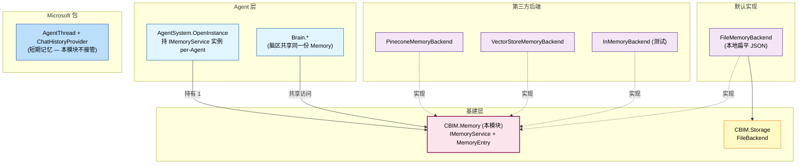
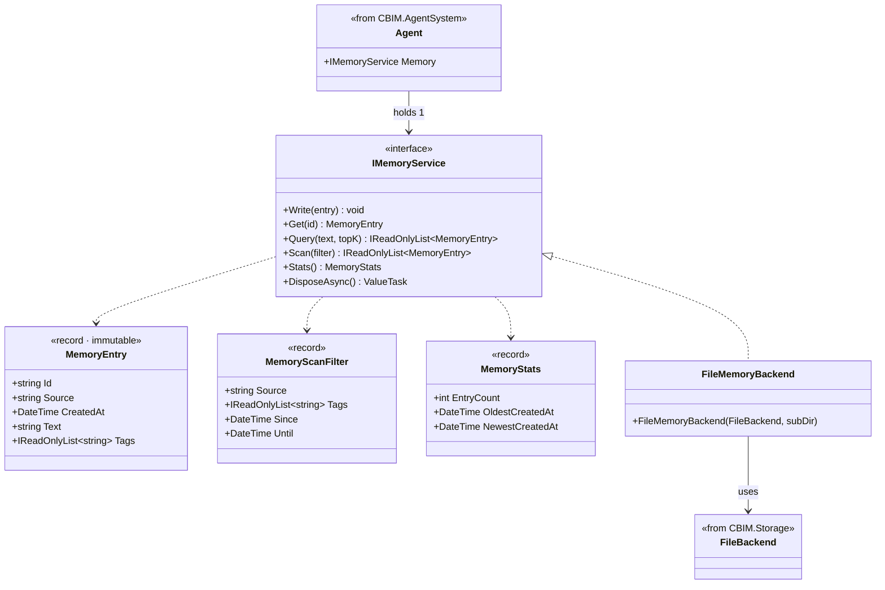
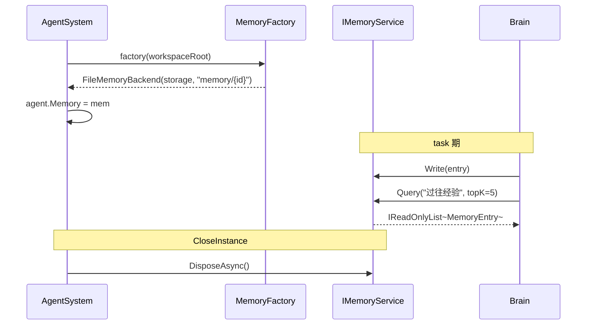

## Positioning

- **基建层四件套之一**——与 `Tools/` / `Skills/` / `Mcp/` 平级。
- 出 **`IMemoryService` 接口 + `MemoryEntry` 类型 + 默认 `FileMemoryBackend` 实现**。
- **per-Agent 实例化**：每个 Agent 装配时绑定一个 `IMemoryService` 实例；Workspace 层不持 Memory。
- **第三方后端可派生**：Pinecone / Weaviate / Microsoft VectorStore 通过实现 `IMemoryService` 接入，不改 Agent 层代码。
- **认知模型对齐**：「Agent = 一个虚拟人」→ 每个人有自己的记忆。

## 架构图（v2 三层模型中的位置）



**依赖方向**：`AgentSystem → IMemoryService → ⊥`；`FileMemoryBackend → IMemoryService + FileBackend → ⊥`。无反向。

## 类图（核心类型关系）



**关键关系**：接口出五方法（Write / Get / Query / Scan / Stats）+ `DisposeAsync`；`MemoryEntry` 不可变；后端通过实现接口接入，不修改本模块。

## Write/Query 序列（per-Agent 装配 + task 期）



## Contract Surface

```csharp
namespace CBIM.Memory;

public interface IMemoryService : IAsyncDisposable
{
    void Write(MemoryEntry entry);
    MemoryEntry? Get(string id);
    IReadOnlyList<MemoryEntry> Query(string text, int topK);    // 关键词 / 向量由实现决定
    IReadOnlyList<MemoryEntry> Scan(MemoryScanFilter filter);
    MemoryStats Stats();
}

public sealed record MemoryEntry(
    string Id,
    string Source,
    DateTime CreatedAt,
    string Text,
    IReadOnlyList<string> Tags);

public sealed record MemoryScanFilter(
    string? Source = null,
    IReadOnlyList<string>? Tags = null,
    DateTime? Since = null,
    DateTime? Until = null);

public sealed record MemoryStats(
    int EntryCount,
    DateTime? OldestCreatedAt,
    DateTime? NewestCreatedAt);

public sealed class FileMemoryBackend : IMemoryService
{
    public FileMemoryBackend(FileBackend storage, string subDir = "memory/medium");
}
```

**接口设计**：
- 同步方法 + `IAsyncDisposable`——本地 IO 不强加 async 开销；Dispose 留给第三方实现做异步关闭。
- `Query` 语义由实现决定——契约仅承诺「返回 topK 相关条目」，不规定算法。
- `MemoryEntry` / `MemoryScanFilter` / `MemoryStats` 全部不可变 record。

## Storage Layout（默认实现）

```
<storageRoot>/memory/<agentInstanceId>/<entryId>.json    # per-Agent 默认
<storageRoot>/memory/medium/<entryId>.json               # 兼容旧布局（FileMemoryBackend 默认 ctor）
<storageRoot>/memory/shared/<entryId>.json               # 多 Agent 共享同目录
```

**实例隔离 ≠ 数据隔离**——多 Agent 持指向同一 `subDir` 的实例即共享数据。

## Dependencies

- **接口部分**：无外部依赖（纯 POCO + 接口）。
- **`FileMemoryBackend`**：依赖 `CBIM.Storage.FileBackend`。
- **不依赖** Kernel / AgentSystem / Workspace——基建层不引用任何上层。
- **第三方实现**：自行依赖各 SDK；不影响本模块抽象层。

## 铁律

- **C1 · 接口稳定优于完整**——`IMemoryService` 暴露最小必要五方法 + `DisposeAsync`；扩展走「实现内部」而非「接口本身」。
- **C2 · Agent 持 IMemoryService 实例**——不再有全局 Memory 单例；与 Agent 实例同生命周期。
- **C3 · Workspace 不持 Memory**——模块没有「自己的记忆」。
- **C4 · 默认实现 = `FileMemoryBackend`**——基于 Storage 的本地扁平 JSON；零运维、零依赖。
- **C5 · 第三方实现通过派生 `IMemoryService` 接入**——不修改本模块接口。
- **C6 · 不持短期记忆**——`AgentThread` / `ChatHistoryProvider` 是 Microsoft 职责。
- **C7 · MemoryFactory 注入点唯一**——`OpenInstanceOptions.MemoryFactory`；其他位置不准 new。

## Non-Goals

- 不实现 Compaction / Sweep / RebuildIndex（Microsoft 接管）。
- 不实现向量检索本身——通过派生接口接 `Microsoft.Extensions.VectorData` / Pinecone 等。
- 不抽象 `IMemoryBackend`——`IMemoryService` 本身已是接口，再叠一层是过度设计。
- 不持 agent / module 图谱（归 `AgentSystem` / `Workspace`）。
- 不暴露 token 预算 / 上下文窗口管理（归 `AIContextProvider`）。

