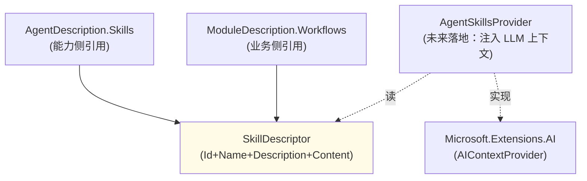

## Positioning

**Skills 是 CBIM 三大基础能力抽象之一**——与 `Tools/` / `Mcp/` 平级，同为顶层模块、同为跨维度共享抽象。

本模块只承载**「技能」这个语义级抽象本身**：

- `SkillDescriptor`——技能描述符（Id / Name / Description / Content）。`Content` 是 SKILL.md 风格的使用指引 / 示例 / 注意事项，会被装配时注入 LLM 上下文。
- **能力侧与业务侧同抽象复用**：
  - `AgentDescription.Skills: IReadOnlyList<SkillDescriptor>`——agent 会的手艺
  - `ModuleDescription.Workflows: IReadOnlyList<SkillDescriptor>`——同抽象在业务语境下叫「工作流」

## 为什么「工作流 = 技能」

这是本轮重要裁决：**业务侧的 Workflow 与能力侧的 Skill 是同一抽象的业务别名**——不是两个独立抽象。

| 维度 | 语义 | 例 |
|------|------|------|
| Agent.Skills | 这个 agent 会什么手艺 | `code-review`、`pr-write`、`mermaid-diagram` |
| Module.Workflows | 这个业务 module 能走什么流程 | `cdn-upload`、`cdn-purge`、`cdn-stats-query` |

两者在**描述形态**上一致：都是「Id + 一句话用途 + SKILL.md 风格的详细描述」；LLM 看到描述都是「何时调 / 怎么调 / 有什么注意点」。语义区别仅在「归属不同」。

拒绝发明 `Workflow` 为独立类型——同抽象不应为了语义位置不同而重复描述。

## 在三大基础能力中的位置

```
CBIM 三大基础能力（顶层平级）：
  Tools/   ← 最小单位（AIFunction 直装）
  Skills/  ← 这里：语义级（Content 描述 · Skill 内可指引调 Tool）
  Mcp/     ← 协议级（外部 server / 远端 endpoint）
```

**Skill 与 Tool / Mcp 的关系**：

- Skill 本身**不直接挂 AIFunction**——Skill 是语义描述，含使用指引。
- Skill 描述里可以**语义上指引 LLM 何时调哪些 Tool / Mcp**（例：「pr-write 技能：请用 git-mcp 查看 diff，用 read_text 读 CHANGELOG」）。
- 运行期 LLM 看到 Skill 描述 + 可用 Tool / Mcp 列表后，自行决定调哪个。

所以 Skill **在语义上比 Tool / Mcp 高一级**，但在**描述抽象层**三者平级（AgentDescription 三字段并列引用）。

## 跨维度共享

`SkillDescriptor` 是 CBIM 的**跨维度共享抽象**之一：

| 使用侧 | 字段 | 语义 |
|--------|------|------|
| 能力维度 | `AgentDescription.Skills` | agent 会的手艺（跟人走） |
| 业务维度 | `ModuleDescription.Workflows` | 业务能走的流程（跟业务走） |

同抽象、同类型、同符号、同装配点（OpenInstance 合并 agent.Skills 与 module.Workflows 后一并注入 LLM 上下文），语义归属不同。

## Children

本模块**无下级**（leaf）。现阶段只有一个 `SkillDescriptor.cs`。

后续可能出现的子模块（本轮不发）：

- `Standard/`——CBIM 官方背书的标准技能集（如 `code-review` / `mermaid-diagram` / `commit-message` 等通用技能）。中期设计点不设计。
- `Loader/`——从某个目录加载 SKILL.md 转为 `SkillDescriptor` 实例的加载器。现阶段装配侧直读。

## Child Relationships



依赖单向：`AgentDescription` / `ModuleDescription` → `Skills.SkillDescriptor`。本模块不依赖 CBIM 其他模块。

## Contract Surface

```csharp
namespace CBIM.Skills;

public sealed class SkillDescriptor
{
    public string Id { get; }            // kebab-case，全局唯一
    public string Name { get; }          // 人类可读
    public string Description { get; }   // 一句话：这个技能做什么
    public string Content { get; }       // SKILL.md 风格正文（可空）

    public SkillDescriptor(string id, string name, string description, string content = null);
}
```

装配侧（未来 `AgentSkillsProvider`）读。其本身不同调 LLM / 不启进程 / 不启调用。

## 装配模型（后续落地）

```
OpenInstance:
  skills = desc.Skills ∪ module.Workflows  // 合并去重 by Id
  systemPromptAppend = Skills.Render(skills)
  // 或 chatOptions.AdditionalProperties["skills"] = skills
  agent = AIAgentBuilder.Create(...)
      .UseSkills(skills)   // 未来 extension
      .Build()
```

`Skills.Render` 可能的实现：拼接所有 Skill.Content 为一段（附列头）插入 system prompt；或者以 AIContextProvider 形式每次 turn 重新注入。具体选型后续设计。

## 铁律

1. **Skill 本身不挂 AIFunction**——不是 Tool。需要调用能力请另声明 Tool / Mcp。
2. **同一 SkillDescriptor 跨维度调用不重复表达**——agent.Skills 中 与 module.Workflows 中出现同 Id 的 Skill 是同一抽象实例，装配时去重。
3. **`Content` 可空但不可为孩子护魔包装形式**——设计上 Content 是 Markdown 纯文本，不期望 LLM 反复解析 frontmatter / yaml / xml。
4. **不持 hash / 版本**——现阶段代码 实例化即 source of truth。后续如从磁盘加载 SKILL.md才设计版本调识。

## Origin Context

- **上轮状态**：`Skill.cs` 裸露在 `AgentSystem/`，namespace `CBIM.AgentSystem.Skills`。业务侧以 `Workflow.cs`（独立类型）在 Workspace 下描述业务流程。
- **本轮裁决**：提到顶层 + 同抽象复用。理由：
  1. **同抽象**——Workflow 与 Skill 描述形态与语义用途几乎一致（都是「该如何走这项难题」的描述 + 例子），不应双抽象并存。
  2. **跨维度共享**——提到顶层后能力侧 / 业务侧平等引用，不引入跨维度反向依赖。
  3. **与 Tool / Mcp 对称**——三大基础能力全部顶层。
- **代码同步**：原 `AgentSystem/Skills/Skill.cs` 文件已物理删除；新 `Skills/SkillDescriptor.cs` 主类名从原的 `Skill` 改名为 `SkillDescriptor`，与 `ToolDescriptor` / `McpDescriptor` 命名风格对齐。

## Emergent Insights

1. **「同抽象业务别名」是抽象复用的高阶形式**——不是「两者类似所以复用」，是「两者本质是同一件事，不同维度叫不同名」。识别这种同抽象需要看「描述形态 + 装配方式 + LLM 看到的体验」是否一致。
2. **Skill 不接管 Tool 调用，只提供「使用指引」**——这使 Skill 与 Tool 解耦：同一 Skill 可以被不同工具集实现（例：「code-review」技能在某 agent 上调 git-mcp，在另一个 agent 上调 svn-mcp）。这是 LLM 能力描述与能力实现的必要隔离。
3. **`Workflow` 独立类型被废弃是「抽象心智收敛」的体现**——“这个业务能走什么流程”与“这个 agent 会什么手艺”本质是同件事——“这件事能不能被走”。拍三个抽象（Skill / Workflow / Capability）、三个类型、三个语义是低阶设计。

## Dependencies

- **仅依赖自身**——`SkillDescriptor` 是纯 POCO，无外部依赖。
- **不依赖** Tools / Mcp / AgentSystem / Workspace / Storage。
- AgentSkillsProvider（未来）落地时才会依赖 `Microsoft.Extensions.AI.AIContextProvider`——不影响本抽象层。

## Non-Goals

- **不实现 AgentSkillsProvider**——后续切片，本轮仅抽象。
- **不从磁盘加载 SKILL.md**——现阶段代码实例化即可；Loader 后续设计。
- **不实现技能补颁 / 推荐**——LLM 看到 Skill 描述后自行决定是否调。
- **不处理技能依赖**——Skill 之间不设依赖语义；agent 怎么组合由 LLM 决定。
- **不会变成「另一个工作流引擎」**——Skills 只是语义描述，执行在 Kernel.FlowGraph。

