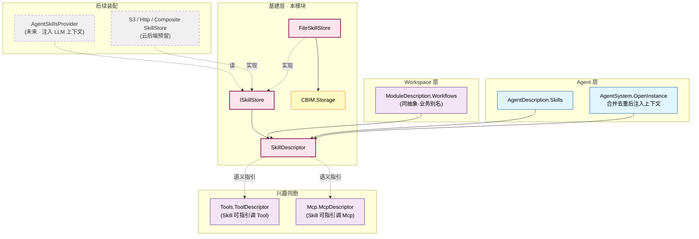
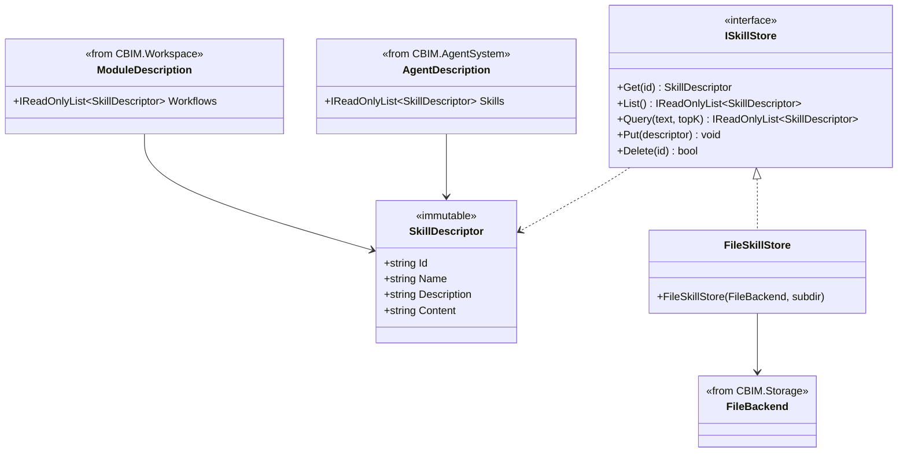

## Positioning

- **基建层四件套之一**——与 `Tools/` / `Mcp/` / `Memory/` 平级。
- 出 **两类抽象**：描述符（`SkillDescriptor`：Id/Name/Description/Content）+ 配置仓储（`ISkillStore` + `FileSkillStore`）。
- **同抽象业务别名**：`AgentDescription.Skills` = 手艺；`ModuleDescription.Workflows` = 业务流程。拒绝发明独立 `Workflow` 类型。
- **不出 InstanceManager**——Skill 是配置类资产（纯文本），「运行期实例」与「配置」同一物。
- **语义层高于 Tool/Mcp**——描述中可指引 LLM 何时调哪些 Tool / Mcp，但不直接挂 AIFunction。

## 架构图（三层模型 + 跨维度别名）



**依赖方向**：`AgentDescription` / `ModuleDescription` → `CBIM.Skills`；`FileSkillStore` → `CBIM.Storage`。本模块不反向。

## 类图（描述符 + Store）



**关键关系**：两维度在类型层同抽象、同符号、同装配点；语义归属不同。

## Contract Surface

```csharp
namespace CBIM.Skills;

public sealed class SkillDescriptor
{
    public string Id { get; }            // kebab-case，全局唯一
    public string Name { get; }
    public string Description { get; }   // 一句话用途
    public string Content { get; }       // SKILL.md 风格正文（可空）
    public SkillDescriptor(string id, string name, string description, string content = null);
}

public interface ISkillStore
{
    SkillDescriptor? Get(string id);
    IReadOnlyList<SkillDescriptor> List();
    IReadOnlyList<SkillDescriptor> Query(string text, int topK);
    void Put(SkillDescriptor descriptor);
    bool Delete(string id);
}

public sealed class FileSkillStore : ISkillStore
{
    public FileSkillStore(FileBackend backend, string subdir = "skills");
    // 落盘形态：<root>/skills/<id>.json
}
```

**接口规约**：同步方法；`Put` 按 Id upsert（描述符不可变，替换整条记录）；`Query` 为可选能力（本地后端 可仅做子串匹配）。

## 与 Tool/Mcp 的協作

```
OpenInstance:
  skills = desc.Skills ∪ module.Workflows  // 合并去重 by Id
  systemPromptAppend = Skills.Render(skills)  // 拼接 Content 插 system prompt
  // 或者后续以 AIContextProvider 形式每 turn 注入
```

**运行期**：LLM 看到 Skill 描述 + 可用 Tool / Mcp 列表后自行决定调哪个；同一 Skill 可被不同工具集实现。

## Dependencies

- `SkillDescriptor` POCO：仅依赖自身（无外部依赖）。
- `ISkillStore` 接口：仅依赖自身 + `SkillDescriptor`。
- `FileSkillStore`：依赖 `CBIM.Storage.FileBackend` + `StorageJson`。
- **不依赖** Tools / Mcp / AgentSystem / Workspace / `Microsoft.Extensions.AI`。

依赖方向：调用侧 → `CBIM.Skills` → `CBIM.Storage`。不反向。

## 铁律

- **C1 · Skill 本身不挂 AIFunction**——不是 Tool；需要调用能力另声明 Tool / Mcp。
- **C2 · 同一 SkillDescriptor 跨维度调用不重复表达**——合并时按 Id 去重。
- **C3 · `Content` 是 Markdown 纯文本**——不期望 LLM 反复解析 frontmatter / yaml / xml 嵌套。
- **C4 · 不持 hash / 版本**——代码实例化即 source of truth；后续如从 SKILL.md 加载才设计版本识别。
- **C5 · `ISkillStore` 不处理运行期实例生命周期**——Skill 是配置资产；装配侧读取后即丢引用。

## Non-Goals

- 不实现 AgentSkillsProvider（后续切片）。
- 不从磁盘加载 SKILL.md（SKILL.md 加载器后续设计）。
- 不实现技能推荐 / 补颁——LLM 看描述自行决定。
- 不处理技能间依赖——组合由 LLM 决定。
- 不会变成另一个工作流引擎——执行在 `Kernel.FlowGraph`。

