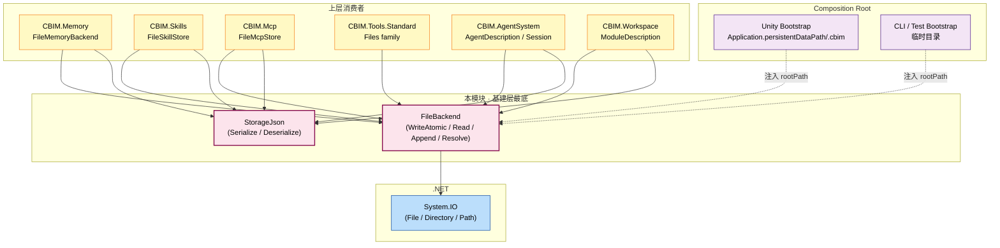
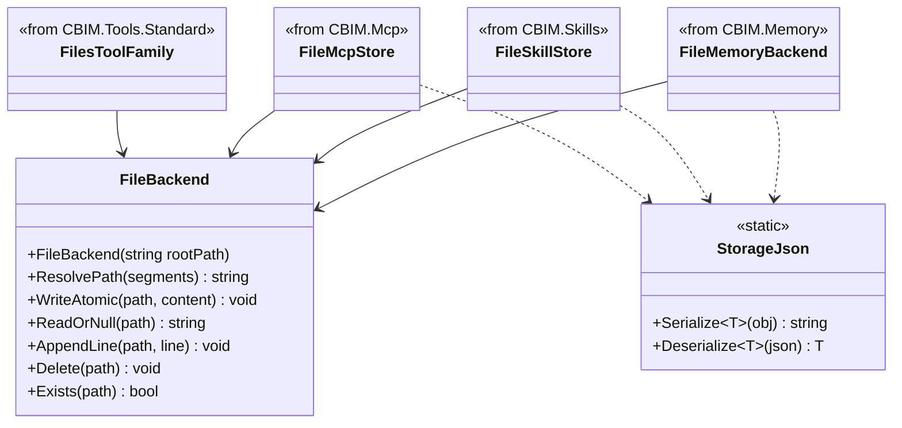
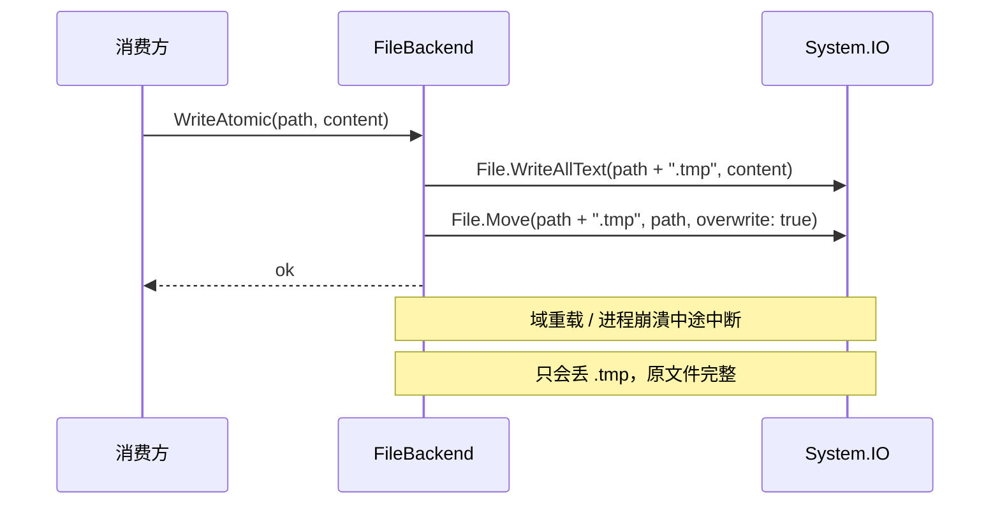

## Positioning

- **依赖图最底层 IO 原语**——CBIM 唯一调用 `System.IO` 的模块。
- 三件能力：**原子写** + **JSON 序列化** + **append-only trace**。
- **root path 由调用方注入**——Unity 侧、纯 C# 测试、CLI 各自注入，不硬编码 `Application.persistentDataPath`。
- **不引用 `UnityEngine`**——`CBIM.Storage.asmdef` 依赖永远为空。
- **不持 schema / agent / module 概念**——只提供平台中立的 IO 表面。

## 架构图（依赖图最底层）



**依赖方向**：所有上层 → `CBIM.Storage` → `System.IO`。本模块不反向引用任何 CBIM 同级模块。

## 类图



**关键关系**：FileBackend 提供平安 IO；StorageJson 提供统一序列化——避免消费方各引一次 Newtonsoft / System.Text.Json。

## 原子写序列



## Contract Surface

```csharp
namespace CBIM.Storage;

public sealed class FileBackend
{
    public FileBackend(string rootPath);    // 调用方注入根路径

    public string ResolvePath(params string[] segments);  // 拼到 root 之下，确保父目录存在
    public void WriteAtomic(string path, string content); // 先写 .tmp 后 rename
    public string? ReadOrNull(string path);
    public void AppendLine(string path, string line);
    public void Delete(string path);
    public bool Exists(string path);
}

public static class StorageJson
{
    public static string Serialize<T>(T obj);
    public static T Deserialize<T>(string json);
}
```

## Dependencies

无。本模块是依赖图最底层。`CBIM.Storage.asmdef` 的 `references: []` 永远为空，不引用 `UnityEngine`。

## 铁律

- **C1 · 原子写 = 先写 `.tmp` 然后 rename**——扶 Unity Editor 域重载 / 进程崩潰下不丢原文件。
- **C2 · JSON 助手内置**——避免每个消费方各引一次 Newtonsoft / System.Text.Json。
- **C3 · root path 注入构造器**——不硬编码 Unity 路径；测试 / 主线 / CLI 可各自指定。
- **C4 · 不引用 `UnityEngine`**——`Application.persistentDataPath` 由 Unity 侧 Composition Root 读取后注入。
- **C5 · 不持任何上层概念**——没有 session / agent / 流程图 / schema。

## Non-Goals

- 不处理记忆条目 schema（归 `Memory/`）。
- 不处理模块 / Agent 描述 schema（归 `AgentSystem/` / `Workspace/`）。
- 不提供 session / agent / 流程图 概念。
- 不提供 IO 工具（过去的 `SystemTools/` 已废除，由 Microsoft AIFunction 生态接管）。

