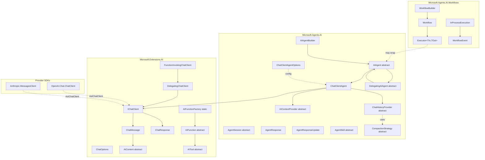
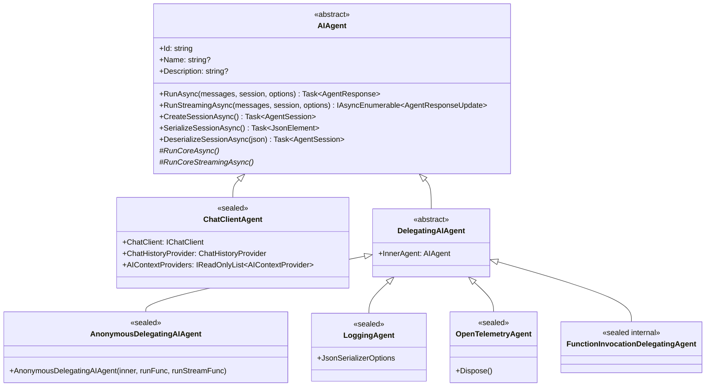
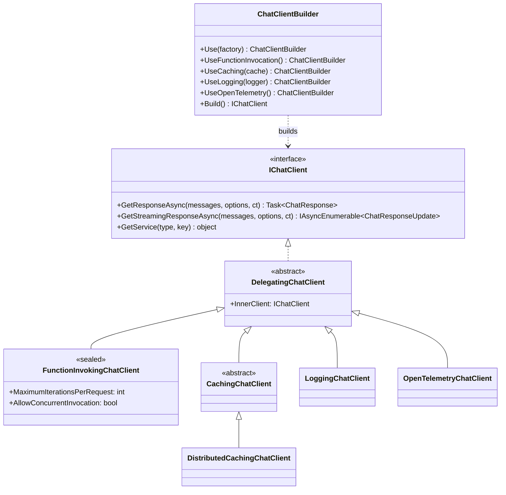
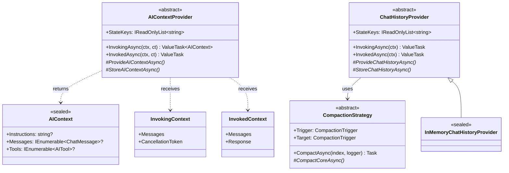
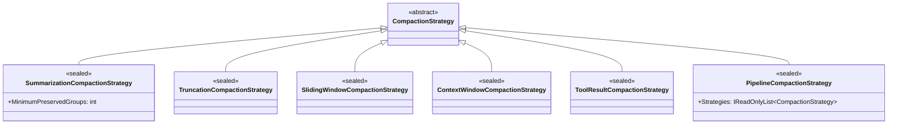
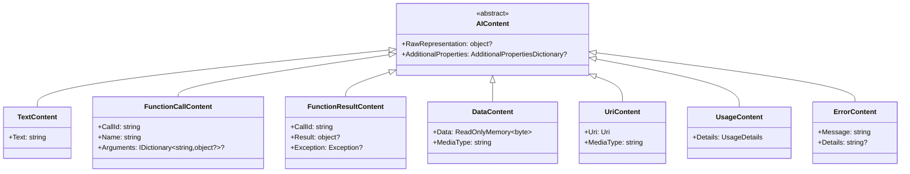
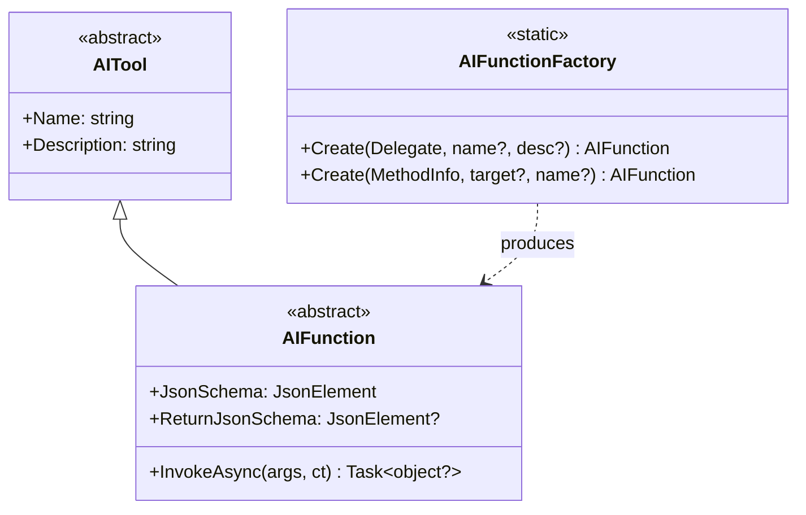
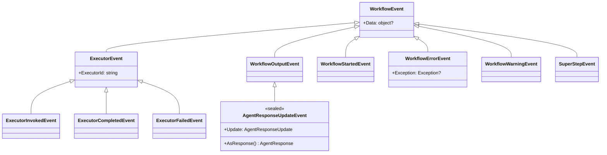
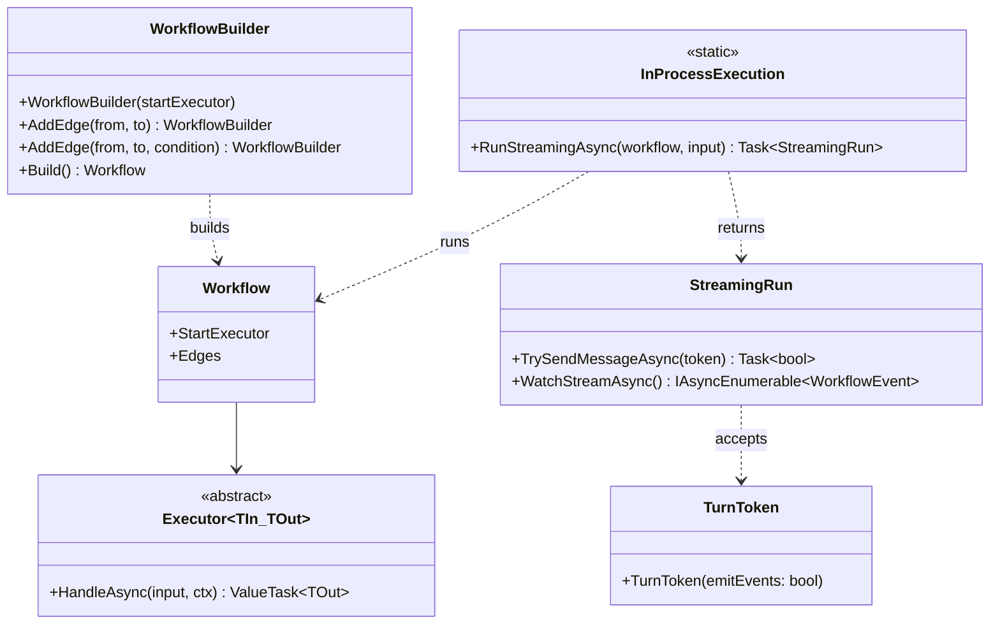
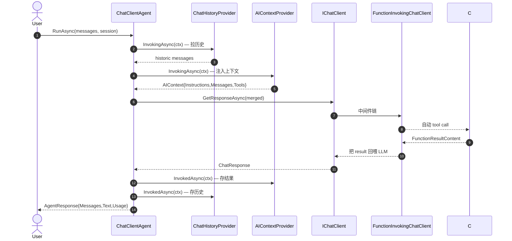

# Microsoft Agent Framework — 架构类图

C# 范围。覆盖 `Microsoft.Agents.AI*` + `Microsoft.Extensions.AI*` + `Microsoft.Agents.AI.Workflows` 的核心类拓扑与扩展点。

类的详细说明见 [`MSAI_ClassReference.md`](./MSAI_ClassReference.md)。

---

## 一、整体分层

---

## 二、AIAgent 继承树

---

## 三、IChatClient 装饰器链

---

## 四、Provider 体系（CBIM 扩展核心）

---

## 五、CompactionStrategy 子类

---

## 六、AIContent 层级（Microsoft.Extensions.AI）

---

## 七、工具与函数

---

## 八、Workflow 事件树

---

## 九、Workflow 装配

---

## 十、`AIAgent.RunAsync()` 数据流时序

---

## 十一、CBIM 扩展点定位

| 层 | CBIM 扩展方式 | 写多少代码 |
|----|-------------|----------|
| AgentDescription → AIAgent | 调 `IChatClient.AsAIAgent(opts)` | 工厂方法 ~30 行 |
| Workspace / Memory / Session 注入 | 实现 `AIContextProvider` × 3 | 每个 ~30 行 |
| C# 方法 → 工具 | `AIFunctionFactory.Create((Func<...>)Method)` | 1 行 |
| 每次调用前后日志 | 子类化 `DelegatingAIAgent` | ~20 行 |
| 跨 session 对话历史 | 实现 `ChatHistoryProvider` | ~50 行 |
| 中期记忆 distill 策略 | 子类化 `CompactionStrategy` | ~50 行 |
| 业务流程图 | 实现 `Executor<TIn,TOut>` | 每节点 ~30 行 |

---

## 包到 namespace 速查

| NuGet 包 | namespace |
|---------|-----------|
| `Microsoft.Agents.AI.Abstractions` | `Microsoft.Agents.AI` |
| `Microsoft.Agents.AI` | `Microsoft.Agents.AI` + `Microsoft.Agents.AI.Compaction` |
| `Microsoft.Agents.AI.Workflows` | `Microsoft.Agents.AI.Workflows` |
| `Microsoft.Agents.AI.OpenAI` | `Microsoft.Agents.AI` (扩展) + `OpenAI.Chat` (扩展) |
| `Microsoft.Agents.AI.Anthropic` | `Microsoft.Agents.AI` (扩展) |
| `Microsoft.Extensions.AI.Abstractions` | `Microsoft.Extensions.AI` |
| `Microsoft.Extensions.AI` | `Microsoft.Extensions.AI` |
| `Microsoft.Extensions.AI.OpenAI` | `Microsoft.Extensions.AI` + `OpenAI.Chat` (扩展) |
