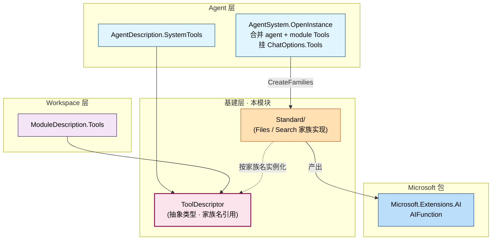
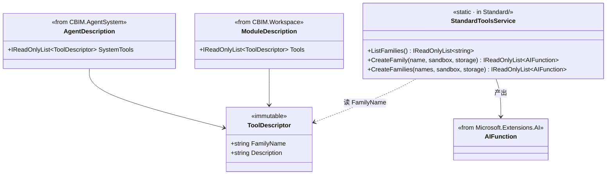

## Positioning

- **基建层四件套之一**——与 `Skills/` / `Mcp/` / `Memory/` 平级。
- 出 **`ToolDescriptor` 抽象**——家族名引用。具体实现下沉到子模块 `Standard/`。
- **跨维度共享**：`AgentDescription.SystemTools` 与 `ModuleDescription.Tools` 同抽象同类型。
- **Tool 是 Skill / Mcp 的更基础形态**——三者运行期都回到 `Microsoft.Extensions.AI.AIFunction`，抽象层并列。
- **装配开销 ≈ 0**——声明即注册即可用，三源中唯一不需生命周期管理的。

## 架构图（三层模型 + 跨维度共享）



**依赖方向**：`AgentDescription` / `ModuleDescription` → `CBIM.Tools.ToolDescriptor`；`Tools.Standard` → `Microsoft.Extensions.AI` + `CBIM.Storage`。父模块自身不依赖任何 CBIM 同级模块。

## 类图



**关键关系**：`ToolDescriptor` 只持家族名 + 描述；沙盒、实例、AIFunction 都是装配侧在 `Standard/` 实现。

## Children

| 子模块 | 一句话职责 | 状态 |
|--------|----------|------|
| `Standard/` | CBIM 内置标准工具家族实现（Files / Search） | spec |

**子模块关系**：父模块出抽象类型；子模块出具体家族。开 / 闭原则的具体落地：抽象稳定（很少变）、具体可扩（家族表内增）。

## Contract Surface

```csharp
namespace CBIM.Tools;

public sealed class ToolDescriptor
{
    public string FamilyName { get; }      // 必须匹配 Standard/StandardToolsService.ListFamilies()
    public string Description { get; }     // 该家族在本上下文中的用途（可空）
    public ToolDescriptor(string familyName, string description = null);
}
```

沙盒路径不在描述符里——由 `AgentSystem.OpenInstance` 按 task 上下文动态生成 `ToolSandbox`，然后调 `StandardToolsService.CreateFamily(familyName, sandbox)`。

## 与 Skill/Mcp 的協作

```
OpenInstance:
  allFns = []
  allFns += Skills 相关 AIFunction（如有）             // Skills/
  allFns += StandardToolsService.CreateFamilies(           // Tools/Standard/
               agent.SystemTools ∪ module.Tools, sandbox, storage)
  allFns += MCP servers tools/list 包成 AIFunction        // Mcp/
  ChatOptions.Tools = allFns
```

**Tools 是装配开销最低 / 最确定的一源**——声明即注册即可用；不需持有进程 / 连接。

## Dependencies

父模块自身不依赖任何 CBIM 同级模块——只持抽象类型 `ToolDescriptor`，无 IO。子模块依赖见各自 `.dna/module.md`。

## 铁律

- **C1 · ToolDescriptor 仅持家族名引用**——不持沙盒 / 实例。沙盒是装配上下文，由调用方注入。
- **C2 · 家族表硬编码**——`Standard/` 内的工厂数组就是全部家族；不开放 IoC 插件点。要加新家族改源码加一项。
- **C3 · 跨维度共享不引入反向依赖**——`Tools` 不依赖 `AgentSystem` / `Workspace`；是后两者依赖 `Tools`。
- **C4 · Tool 是 Skill / Mcp 的运行期基础**——但抽象层并列，`ToolDescriptor` / `SkillDescriptor` / `McpDescriptor` 三字段在 AgentDescription / ModuleDescription 并列引用。

## Non-Goals

- 不实现具体工具家族——下沉到 `Standard/`。
- 不发明工具协议——`Microsoft.Extensions.AI` 已有 `AIFunction` / `AIFunctionFactory`，CBIM 仅薄包装。
- 不开放家族插件点——见铁律 C2。
- 不持工具沙盒——是装配上下文，由调用方在 OpenInstance 内动态构造。

