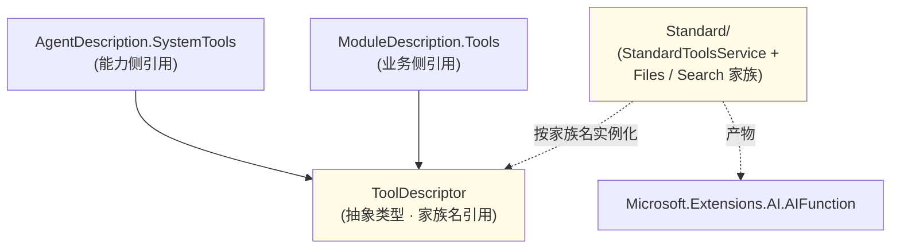

## Positioning

**Tools 是 CBIM 三大基础能力抽象之一**——与 `Skills/` / `Mcp/` 平级，同为顶层模块、同为跨维度共享抽象。

本模块只承载**「工具」这个基础抽象本身**：

- `ToolDescriptor`——工具家族声明（家族名 + 一句话用途）。能力侧 `AgentDescription.SystemTools` 与业务侧 `ModuleDescription.Tools` 都以 `IReadOnlyList<ToolDescriptor>` 引用此抽象。
- 子模块 `Standard/`——CBIM 内置的具体工具家族实现（Files / Search / …）。

## 在三大基础能力中的位置

```
CBIM 三大基础能力（顶层平级）：
  Tools/   ← 这里：最小单位（直接落到 Microsoft.Extensions.AI.AIFunction）
  Skills/  ← 语义级（含 Content；语义上 Skill 内部可指引调用 Tool）
  Mcp/     ← 协议级（外部 server 进程 / 远端 endpoint，发现的工具最终也包成 AIFunction）

Tool 是 Skill 与 Mcp 的更基础形态——
  Skill 描述「会什么手艺」，手艺最终常落到「调某个 Tool」；
  Mcp  描述「外部接入点」，接入点 tools/list 出来的也都是 AIFunction。
所以三者都最终回到「AIFunction 是 LLM 唯一可调形态」，但抽象层级与生命周期不同。
```

## 跨维度共享

`ToolDescriptor` 是 CBIM 的**跨维度共享抽象**之一：

| 使用侧 | 字段 | 语义 |
|--------|------|------|
| 能力维度 | `AgentDescription.SystemTools: IReadOnlyList<ToolDescriptor>` | 该 agent 装配时挂哪些工具家族（agent 自带的本事） |
| 业务维度 | `ModuleDescription.Tools: IReadOnlyList<ToolDescriptor>` | 该 module 装配时挂哪些业务专属工具家族（业务自带的本事） |

同抽象、同类型、同符号、同装配点（`AgentSystem.OpenInstance` 合并 agent + module 的 Tools 列表去重后挂 `ChatOptions.Tools`），语义归属不同（agent 自带 vs module 自带）。

## Children

| 子模块 | 一句话职责 | 状态 |
|--------|----------|------|
| `Standard/` | CBIM 内置标准工具家族实现（Files / Search） | spec |

父模块本身只放 `ToolDescriptor` 抽象类型；具体家族实现下沉到 `Standard/` 子模块——开/闭原则的具象落地：抽象稳定（很少变）、具体可扩（家族表内增）。

## Child Relationships



依赖单向：`AgentDescription`/`ModuleDescription` → `Tools.ToolDescriptor`；`Tools.Standard` → `Microsoft.Extensions.AI` + `CBIM.Storage`（Sandbox / FileBackend）。父模块自身不依赖任何 CBIM 同级模块。

## Contract Surface

```csharp
namespace CBIM.Tools;

public sealed class ToolDescriptor
{
    public string FamilyName { get; }      // 必须匹配 Standard/StandardToolsService.ListFamilies() 中一项
    public string Description { get; }     // 该家族在本上下文中的用途简述（可空）

    public ToolDescriptor(string familyName, string description = null);
}
```

沙盒路径不在描述符里——由 `AgentSystem.OpenInstance` 在装配时按 task 上下文动态生成 `ToolSandbox`，然后调 `StandardToolsService.CreateFamily(familyName, sandbox)`。

## 与其他基础能力的协作

`OpenInstance` 装配阶段三源并行：

```
allFns = []
allFns += Skills 相关 AIFunction（如有）         ← Skills/
allFns += StandardToolsService.CreateFamilies(   ← Tools/Standard/
             agent.SystemTools ∪ module.Tools,
             sandbox, storage)                   去重
allFns += MCP servers 启动后 tools/list 包成 AIFunction  ← Mcp/
ChatOptions.Tools = allFns
```

Tools 是装配开销最低、最确定的一源——声明即注册即可用。

## 铁律

1. **ToolDescriptor 仅持家族名引用**——不持沙盒、不持实例。沙盒是装配时上下文，由调用方注入。
2. **家族表硬编码**——`Standard/` 内的工厂数组就是全部家族；不开放 IoC 插件点。要加新家族就改源码加一项。
3. **跨维度共享不引入反向依赖**——`Tools` 模块自身不依赖 `AgentSystem` / `Workspace`；是后两者依赖 `Tools`。
4. **Tool 是 Skill / Mcp 的基础**——三者关系不是平级互替，是「Tool 最小、Skill 语义包装、Mcp 协议包装」。但 `ToolDescriptor` / `SkillDescriptor` / `McpDescriptor` 三个**描述抽象**在 CBIM 数据层平级——AgentDescription / ModuleDescription 都以三字段并列引用。

## Origin Context

CBIM v2 顶层重构第二轮（三大基础能力顶层化）：

- 上轮：StandardTools 位于 `AgentSystem/StandardTools/`、Mcp 位于 `AgentSystem/Mcp/`、Skill 类裸露于 `AgentSystem/Skill.cs`——三者绑死在能力维度命名空间下。
- 业务维度需要同类抽象时（ModuleDescription.McpList），只能跨维度反向引用 `AgentSystem.Mcp`——勉强可接受但语义错位（Mcp 的家是 AgentSystem？业务侧也用为什么要叫 AgentSystem 下的子模块？）。
- **本轮裁决**：Tool / Skill / Mcp 提为顶层平级模块。理由：
  1. 三者本质都是「基础能力描述抽象」——不属于任何单一维度；
  2. 提到顶层后，能力侧 / 业务侧都「平等引用顶层」而非「跨维度引用对方维度的子模块」——依赖图更对称；
  3. 命名空间从 `CBIM.AgentSystem.X` 改为 `CBIM.X`——以「这是什么」命名而非「它在哪」命名。

## Emergent Insights

1. **「顶层化」即「去维度化」**——一个抽象一旦被多个维度共享，就不该躺在某个维度子模块下；提升一层是对称性最自然的体现。
2. **基础能力三件套是 CBIM 数据模型的支柱**——AgentDescription 与 ModuleDescription 都以「Tools + Skills + Mcp」三字段并列描述「我有哪些可调」，差别仅在「这些可调归我（agent）还是归业务（module）」。三件套顶层化让这种对称在源码组织上一眼可见。
3. **Tool 是最小单位，但描述层平级**——运行期 Skill 内部可调 Tool、Mcp 接入点 tools/list 拿到的也是 Tool 形态；但 `ToolDescriptor` / `SkillDescriptor` / `McpDescriptor` 是三个独立的描述抽象，AgentDescription 三字段并列引用——不要把「运行期 Tool 是基础」误读成「数据描述层 Tool 也是基础」。

## Dependencies（作为父模块）

父模块自身不依赖任何 CBIM 同级模块——只持抽象类型 `ToolDescriptor`，无 IO。子模块依赖见各自 `.dna/module.md`。

## Non-Goals

- **不实现具体工具家族**——具体下沉到 `Standard/`。
- **不发明工具协议**——Microsoft.Extensions.AI 已有 `AIFunction` / `AIFunctionFactory`，CBIM 仅薄包装（用 `[Description]` attribute 生成 schema）。
- **不开放家族插件点**——见铁律 2。家族变化频率低于代码 review 频率，不需要 IoC。
- **不持工具沙盒**——沙盒是装配上下文，由调用方在 OpenInstance 内动态构造。

