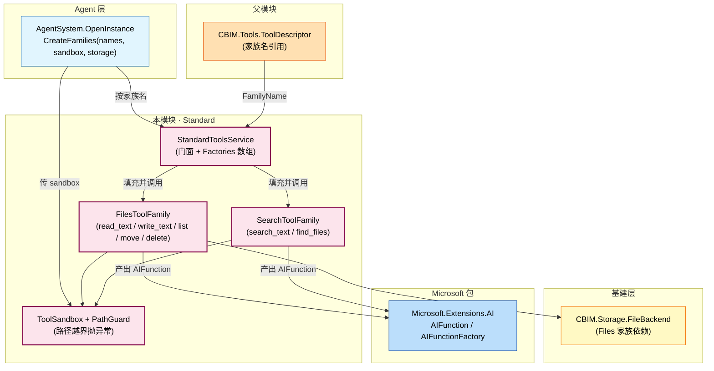
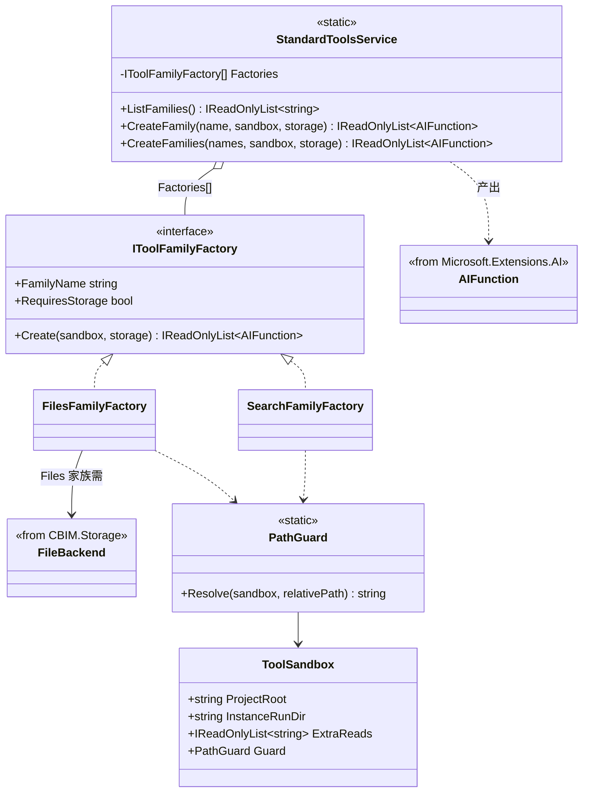

## Positioning

- **CBIM 内置标准工具家族的唯一实现处**——Files / Search（未来可扩 Web / Bash）。
- 无状态门面 **`StandardToolsService`**——按家族名 + `ToolSandbox` 实例化为扁平 `IReadOnlyList<AIFunction>`。
- **家族表硬编码**——`IToolFamilyFactory[]` 数组即全部；不开放 IoC。
- **装配开销 ≈ 0**——无 IPC 无握手；调用方直接挂 `ChatClientAgentOptions.ChatOptions.Tools`。
- **沙盒外置**——不感知 Unity / .NET 宿主，可被其他 host 直接复用。

## 架构图（在三层模型中的位置）



**依赖方向**：调用方 → `Tools/Standard` → `Microsoft.Extensions.AI` + `CBIM.Storage`。本模块对 CBIM 其他模块只读不写。

## 类图



**关键关系**：Service 是门面；Factory 是家族启动口；Sandbox + PathGuard 是跨家族共享的安全边界。

## 家族表

```csharp
new IToolFamilyFactory[]
{
    new FilesFamilyFactory(),
    new SearchFamilyFactory(),
    // 未来：new WebFamilyFactory(), new BashFamilyFactory() ...
}
```

**不开放插件点**——家族变更频率（季度级）低于代码 review 频率（PR 级）；插件点反增维护成本。

## Files 家族

五只 AIFunction，全部 `PathGuard` 守护：

- `read_text`——按相对路径读，含二进制守门拒读图片 / 压缩包。
- `write_text`——仅写文本，含 max bytes 限制 + atomic write 经 `FileBackend`。
- `list_directory`——跳隐藏 + 限项数。
- `move_file` / `delete_file`——仍受 `PathGuard`。

依赖 `FileBackend`（`CBIM.Storage`），调用方在 OpenInstance 时注入。

## Search 家族

- `search_text`——按 query 在沙盒目录下 grep，限项数 + max bytes。
- `find_files`——按 glob 在沙盒下找文件路径。

不依赖 `FileBackend`——只用 `ToolSandbox` 路径 + `System.IO` 直读。

## Contract Surface

```csharp
namespace CBIM.Tools.Standard;

using Microsoft.Extensions.AI;
using CBIM.Storage;

public static class StandardToolsService
{
    public static IReadOnlyList<string> ListFamilies();

    public static IReadOnlyList<AIFunction> CreateFamily(
        string familyName,
        ToolSandbox sandbox,
        FileBackend storage = null);   // RequiresStorage 家族必传

    public static IReadOnlyList<AIFunction> CreateFamilies(
        IEnumerable<string> familyNames,
        ToolSandbox sandbox,
        FileBackend storage = null);    // 去重 by AIFunction.Name
}

public sealed class ToolSandbox
{
    public string ProjectRoot { get; }
    public string InstanceRunDir { get; }
    public IReadOnlyList<string> ExtraReads { get; }
    public PathGuard Guard { get; }
}

public static class PathGuard
{
    public static string Resolve(ToolSandbox sandbox, string relativePath); // 越界抛 IOException
}
```

所有方法同步 · 无可变静态状态——任意线程并发可安全调用。

## Children

本子模块 leaf，无下级。物理目录：

```
Tools/Standard/
├── StandardToolsService.cs     # 门面 + 家族注册表
├── Families/
│   ├── IToolFamilyFactory.cs
│   ├── FilesToolFamily.cs
│   ├── SearchToolFamily.cs
│   └── BinaryDetector.cs
└── Sandbox/
    ├── ToolSandbox.cs
    └── PathGuard.cs
```

`Families/` / `Sandbox/` 只是内部组织目录——不独立成模块（演化频率一致，无必要边界）。

## Dependencies

- `Microsoft.Extensions.AI`——`AIFunction` / `AIFunctionFactory` / `[Description]` attribute。
- `CBIM.Storage`——`FileBackend`（Files 家族用）。
- `CBIM.Tools`（父模块）——`ToolDescriptor` 类型。
- **不依赖** `AgentSystem` / `Workspace` / `Skills` / `Mcp`。

依赖方向：调用方 → `Tools/Standard` → `Microsoft.Extensions.AI` + `Storage`。

## 铁律

- **C1 · 无可变静态状态**——任意线程并发安全。加 family-level 缓存前必审计。
- **C2 · 家族表硬编码，不开放插件点**——父模块铁律重申。
- **C3 · PathGuard 越界必抛异常**——绝不静默修正路径。任何 family 工具方法第一行：`var p = PathGuard.Resolve(sandbox, relativePath);`
- **C4 · 同名 AIFunction 取首出**——`CreateFamilies` 按 `AIFunction.Name` 去重，第一家族优先；冲突时 Debug.WriteLine 警告。
- **C5 · 空家族名 / 未知家族名静默跳过**——`CreateFamilies` 不抛异常；try/catch 转 Debug 警告（不阻塞装配）。
- **C6 · 不感知 agent / module 概念**——本模块只看 `FamilyName + ToolSandbox + FileBackend`。

## Non-Goals

- 不实现 Web / Bash 等额外家族——Web 等 Microsoft.Extensions.AI 社区包逐步补齐；Bash 因 Shell 安全模型未定本轮不发。
- 不写远程工具调用——归 `Mcp/`。
- 不持工具调用历史——归 `AgentSystem.Session` 写侧。
- 不实现工具搜索 / 推荐——LLM 自读 AIFunction 描述决定调用。

