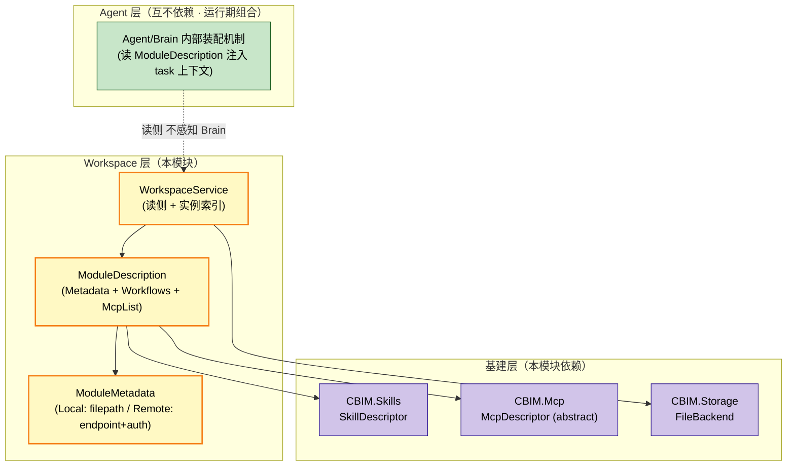
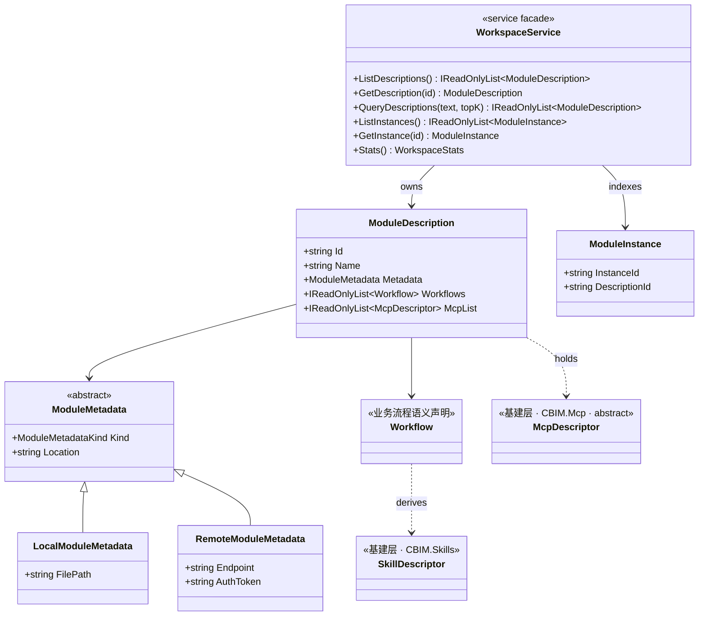

## Positioning

**Workspace 是 CBIM 的 Workspace 层**（v2 三层模型中三层之一）——管理模块树 + 模块对象。

- **与 Agent 层互不依赖** —— 上下文装配走 Agent/Brain 内部机制。
- **三段式** —— Metadata + Workflows[SkillDescriptor] + McpList[McpDescriptor]。
- **不持 Memory** —— 记忆是 Agent 的；模块只有规章 / 流程 / 接入点。
- **不持 Owners** —— CBIM = 单虚拟人 + 一个 Workspace；任何脑区都可在任何模块工作。
- **业务 Skill / 业务 MCP 挂载点** —— 类型来自基建层（CBIM.Skills / CBIM.Mcp），实例 per-Module 独立持有。

## 架构图（三层模型中的位置）



**依赖方向**：Workspace → 基建层（Skills / Mcp / Storage）；不反向、不依赖 Agent 层。

## 类图（核心类型关系）



**关键关系**：`ModuleDescription` 跨维度引用 `McpDescriptor` / `SkillDescriptor`（基建抽象，同抽象、不同实例于 Agent.McpList / Agent.Skills）。

## ModuleDescription 三段式语义

| 段 | 字段 | 类型来源 | 职责 |
|-----|------|---------|------|
| **Metadata** | `Metadata: ModuleMetadata` | Local (filepath) / Remote (endpoint+auth) | 纯知识载体：是什么 / 规则 / SLA |
| **Workflows**（业务 Skill） | `Workflows: IReadOnlyList<SkillDescriptor>` | `CBIM.Skills` | 业务流程声明——贴在墙上的 SOP |
| **McpList**（业务 MCP） | `McpList: IReadOnlyList<McpDescriptor>` | `CBIM.Mcp` | 业务操作接入点——接 ERP / CDN / Jira |

**与能力主 AgentDescription 三段式的类比**：

| 维度 | Schema | 文档 / 能力声明 | 业务流程 | 接入点 |
|------|--------|---------------------|----------|---------|
| AgentDescription（能力） | Soul + Identity | Skills | — | SystemTools + McpList |
| ModuleDescription（业务） | Metadata | — | Workflows | McpList |

## ModuleMetadata 两支对偶（Local / Remote）

```csharp
public enum ModuleMetadataKind { Local, Remote }

public abstract class ModuleMetadata
{
    public abstract ModuleMetadataKind Kind { get; }
    public abstract string Location { get; }   // Local: filepath · Remote: endpoint URL
}

public sealed class LocalModuleMetadata : ModuleMetadata    // 本地 .dna/module.md 文档
{
    public string FilePath { get; }
    public override ModuleMetadataKind Kind => ModuleMetadataKind.Local;
    public override string Location => FilePath;
}

public sealed class RemoteModuleMetadata : ModuleMetadata   // 远端文档 endpoint（云工作区）
{
    public string Endpoint { get; }
    public string AuthToken { get; }
    public override ModuleMetadataKind Kind => ModuleMetadataKind.Remote;
    public override string Location => Endpoint;
}
```

| 子类 | 形态 | 知识载体位置 | 用户对应概念 |
|------|------|---------------|----------------|
| `LocalModuleMetadata` | 本地文件夹 | 项目仓库内 `.dna/` 树 | 本地工作区 |
| `RemoteModuleMetadata` | 云端空间（虚拟网关模块） | 远端 wiki / spec registry / OpenAPI 文档服务 | 云端空间 |

**责任分离（二支均遵严格遵守）**：

| 关注点 | 走哪条 |
|--------|--------|
| 「这块业务知识的源头在哪、怎么读取文档」 | `ModuleMetadata.Location`（Local: filepath / Remote: doc endpoint） |
| 「这块业务怎么被操作、调用方怎么发请求」 | `ModuleDescription.McpList`（HttpMcpDescriptor / StdioMcpDescriptor） |

## McpDescriptor 跨维度共享

`AgentDescription.McpList` 与 `ModuleDescription.McpList` 是同一份抽象（`CBIM.Mcp.McpDescriptor`）。

| 使用侧 | 语义 | 典型例 |
|--------|------|--------|
| `AgentDescription.McpList`（能力维度） | 跟人走：agent 自带的 MCP | unity-programmer 要 unity-mcp |
| `ModuleDescription.McpList`（业务维度） | 跟业务走：业务模块本身的外部端点 | cdn-storage-prod 有 cdn-prod-mcp |

**装配位置不同**：
- `AgentDescription.McpList` → `AgentSystem.OpenInstance` 装配 AIAgent 时启动 + 挂 AIAgent.Tools。
- `ModuleDescription.McpList` → Agent/Brain 内部装配机制按需启动 + 挂当前 task 上下文。

## CDN 业务示例（完整三段式）

```csharp
new ModuleDescription(
    id: "cdn-storage-prod",
    name: "生产 CDN 存储",
    metadata: new LocalModuleMetadata(".dna/module.md"),   // 是什么 + 规则 + SLA
    workflows: [upload, download, query],                  // 业务流程语义
    mcpList: [
        new HttpMcpDescriptor("cdn-mcp", "CDN MCP", "操作 CDN",
            endpoint: "https://cdn.example.com/mcp",
            authToken: "...")                              // 操作接入点
    ]);
```

## Contract Surface

```csharp
namespace CBIM.Workspace;

using CBIM.Mcp;
using CBIM.Skills;

public sealed class WorkspaceService
{
    IReadOnlyList<ModuleDescription> ListDescriptions();
    ModuleDescription? GetDescription(string id);
    IReadOnlyList<ModuleDescription> QueryDescriptions(string text, int topK);

    IReadOnlyList<ModuleInstance> ListInstances();
    ModuleInstance? GetInstance(string instanceId);

    WorkspaceStats Stats();
}

public sealed class ModuleDescription
{
    public string Id { get; }
    public string Name { get; }
    public ModuleMetadata Metadata { get; }                          // 纯知识载体
    public IReadOnlyList<Workflow> Workflows { get; }                // 业务流程语义声明
    public IReadOnlyList<McpDescriptor> McpList { get; }             // 业务操作接入点·跨维度共享
}
```

写侧（`SaveDescription` / `CreateModule` / `SplitModule` / `DeprecateModule`）本轮不发——Unity 侧暂走 Python `dna_*` MCP 工具，本服务定期 reindex 拉最新快照。

## Storage Layout

```
<project>/<module-path>/.dna/
  module.md          ← ModuleMetadata=Local 时的文档（业务流程 + 领域知识）
  contract.md        ← 可选

Application.persistentDataPath/.cbim/workspace/
  descriptions-index.json
  instances/<id>.json
  instances-index.json
```

## ModuleDescription Schema（文档侧）

```yaml
---
name: my-module
owner: architect
description: ...
keywords: [...]
dependencies: [...]
status: spec
---

## Positioning
...

## 工作流程（业务维度核心内容）
上游如何发起 / 本 module 如何处理 / 下游如何交接。

## 领域知识（业务维度核心内容）
该业务块独有的术语 / 规则 / 常识。
```

**禁止字段**：`standard_tools`（工具归能力维度）、`external_mcp_servers`（走 C# 层 `ModuleDescription.McpList`）、`protocol: mcp`（Remote 仅为文档载体，不是操作载体）。

## Children

无子模块。基本能力三抽象（Tool / Skill / Mcp）已顶层化为 `CBIM/Tools/` / `CBIM/Skills/` / `CBIM/Mcp/` 三个顶层基建模块。

## Dependencies

- `CBIM.Storage` —— IO + frontmatter 解析。
- `CBIM.Mcp` —— `McpDescriptor` / `StdioMcpDescriptor` / `HttpMcpDescriptor` / `McpTransportKind`。业务 MCP 集合装载点。
- `CBIM.Skills` —— `SkillDescriptor`。业务 Skill 集合（`ModuleDescription.Workflows`）装载点。
- **不依赖** Agent 层任何模块（Agent / Channel）。Agent 层 ⊥ Workspace 层。
- **不依赖** Memory —— 记忆是 Agent 的，模块不持。

依赖方向：Workspace → 基建层（Skills / Mcp / Storage） → ⊥。反向严禁。

## 铁律

- **C1** · Service 同步方法，无 `Update()` / `StartCoroutine`。
- **C2** · ModuleDescription 与 ModuleInstance schema 互不混淆。
- **C3** · 不持工具声明 / 沙盒配置 —— 工具归能力维度。
- **C4** · MCP 接入点走 C# 层 `ModuleDescription.McpList` —— 不再在 `ModuleMetadata` 文档侧夾带。
- **C5** · 共用 `CBIM.Mcp.McpDescriptor` 但不反向依赖能力侧 —— 跨维度共享 = 抽象复用，不是耦合。
- **C6** · 模块不持「负责人」语义 —— CBIM = 单虚拟人 + 一个 Workspace；owner 由调度期 task.Who 决定。
- **C7** · 模块上下文装配由 Agent/Brain 内部装配机制负责 —— 读侧接口由 WorkspaceService 公开。
- **C8** · 写侧未落地 —— Python MCP 工具 + 本服务 reindex。

## Non-Goals

- 不实现 Unity 侧 `.dna/` 写侧（走 Python MCP）。
- 不持任务黑板（后续 `TaskWorkspace/` 话题）。
- 不持 Agent / 记忆数据。
- 不含 MCP 启 / 停 / 接连胶水 —— 装配胶水在能力侧（`AgentSystem.OpenInstance`）或 Agent/Brain 内部装配机制。

## Emergent Insights

1. **工具能力是 agent 业务属性，不是 module 业务属性** —— 「能不能读文件」与「谁」相关，不与「在哪」相关。
2. **业务维度核心价值 = 工作流程边界 + 领域知识封装 + 业务操作接入点** —— 是通用框架不提供的，是 Workspace 存在的唯一理由。
3. **跨维度共享抽象的边界控制** —— McpDescriptor 被两个维度共享，但依赖方向严格单向（二者 → 基建层 CBIM.Mcp）。
4. **维度错位是常见架构陷阱** —— 「看起来与哪个伴生」不等于「应在该对象的 schema 内」。Owners 是反面案例。
5. **本地文件夹 vs 云端空间是 Workspace 隐藏的第二维度** —— Local / Remote ModuleMetadata 是对偶两支，同一 `Location` 抽象接入，调用方透明。
6. **「知识源 endpoint」与「业务操作 endpoint」物理可同主机但语义严格分流** —— `RemoteModuleMetadata.Endpoint` 是文档读侧；`ModuleDescription.McpList` 是业务操作。
7. **「人」是调度维度不是模块 schema 维度** —— Owners 删除后的启示：凡「在 schema 里烘设备人」的设计，先问「多设备」这个前提是否成立。

