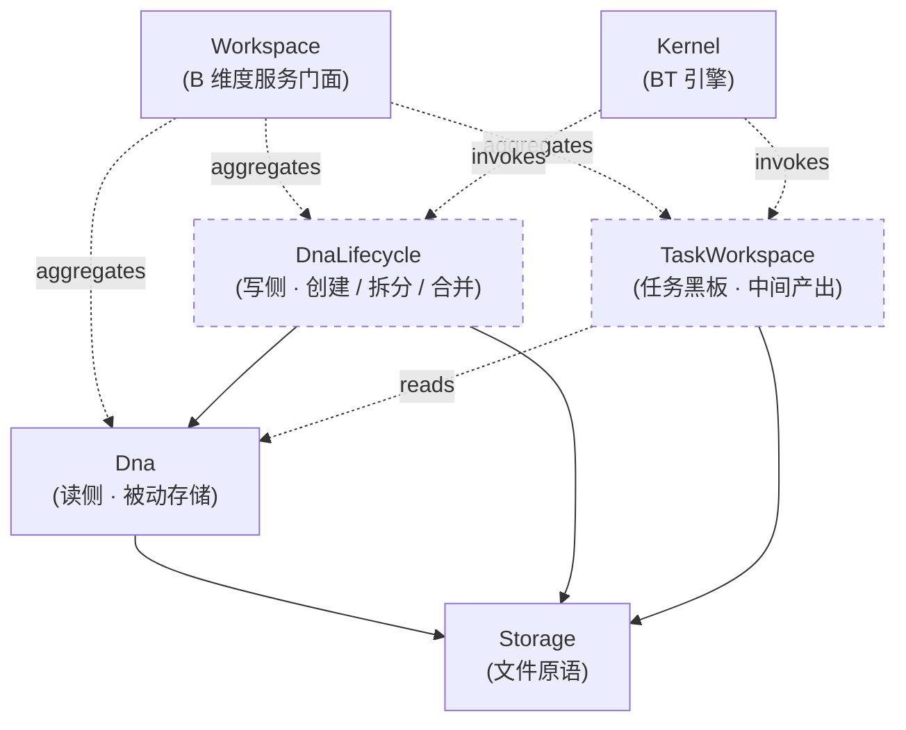

## Positioning

**业务模块系统是 CBIM 的服务层（B 维度）—— 与记忆系统、能力系统并列的三大核心系统之一。**

对应 CBIM 缩写里的 **B（Business）**。负责管理 **业务知识、模块图谱、任务工作空间**——即「**系统里有哪些业务模块、它们的依赖如何、当前进行到哪个任务**」这一整类问题。

名字为什么叫 `Workspace` 而不是 `Business`：CBIM 中「业务」这个词过于宽泛，本服务的本质是为 agent 在“业务仓库”上干活提供工作区——知识查询、模块图谱、任务黑板、交付产出，都是「工作空间」语义。`Workspace` 这个名字能同时装下「知识面」与「任务面」。

对外：暴露统一的 CRUD + 查询 + 任务门面——查询模块、查依赖、启动任务、记录任务状态、（未来）提交交付。所有调用方都只通过这一组接口看见业务模块系统。

对内：当前**仅落地读侧**——由 `Dna/` 子模块承担被动存储，把 `.dna/` 模块树映射到 Unity 的 `persistentDataPath/.cbim/dna/` 之下。写侧（在 Unity 内新建 / 拆分 / 合并模块）与任务工作空间（结合 Kernel BT 黑板记录 architect / work agent 的进展）都是后续切片，本模块以 spec 形态先把架构画清楚。

本模块当前 status = `spec`——只承载架构定义、不落代码。

## Children（规划 + 现状）

| 子模块 | 一句话职责 | 当前状态 | 物理路径 |
|--------|-----------|----------|----------|
| `Dna` | 长期记忆 · 业务维度被动存储——只读门面，对齐 `.dna/` 模块树 | **已落地（spec）** | `v2/cbim/Assets/CBIM/Dna/` |
| `DnaLifecycle`（规划） | 模块创建 / 拆分 / 合并 / 弃用工作流，按 architect agent 脚本调用 Dna 写侧 | 未落地 | 未来 `v2/cbim/Assets/CBIM/Workspace/Lifecycle/` |
| `TaskWorkspace`（规划） | 任务黑板——记录当前任务的上下文、中间产出、交付验收状态；agent 跨 tick 传递状态靠它 | 未落地 | 未来 `v2/cbim/Assets/CBIM/Workspace/Tasks/` |

> **物理布局说明**：与 AgentSystem / AgentRegistry 的关系同构——`Dna/` 现阶段与 `Workspace/` 并列于 `Assets/CBIM/` 下，合并与否由后续切片决定。不锁死。

## Child Relationships（规划）

虚线 = 规划中未落地；实线 = 已存在。依赖方向铁律：

- **Dna 只依赖 Storage**——已有铁律，不变。
- **DnaLifecycle 依赖 Dna**——写侧调读侧接口，单向。
- **TaskWorkspace 只读 Dna**，不写 Dna——任务记录不修改模块图谱。这两是两份独立的持久数据。
- **Kernel 调 DnaLifecycle（治理循环）与 TaskWorkspace（执行循环）**，不反过来。**Workspace 不依赖 Kernel**。

## Origin Context

用户提出的「CBIM 三大核心系统」框架要求把业务维度提到与记忆系统、能力系统平级。在此之前，v2 子树里只有 `Dna/` 这一个扁平模块，定位是「长期记忆 · 业务维度被动存储」——它只承担「读」这一个面，不管「任务」这一面。

但「业务模块系统」远不止读模块文档：它还要管**模块生命周期**（architect agent 的创建 / 拆分 / 合并 / 弃用）和**任务工作空间**（work agent 跨 tick 传递 ContextPack、中间产出、交付验收）。这些职责在 Python 内核里散落在 `v1/kernel/cbi/_primitives/dna/` + `v1/kernel/engine/execution/blackboard.py` + architect agent 的 skill 里，同样没有统一的服务门面。

本模块存在的根因：把「业务知识 + 任务上下文」收敛为一个服务门面，与能力系统、记忆系统同构。

## Service-Layer Extension Model（与 Memory / AgentSystem 同构）

业务模块系统门面 `WorkspaceService`（规划名）承诺对外暴露稳定的接口，内部可挂多种实现：

| 对外能力 | 当前实现 | 未来可扩展 |
|----------|----------|-----------|
| `ListModules() / GetModule(path)` | Dna 直读 | + 跨项目联邦查询 |
| `QueryModules(text, topK)` | Dna 关键词检索 | + 向量检索 + 语义模块推荐 |
| `Children(parentPath) / Dependencies(path)` | Dna 图查询 | + 环路检测缓存 |
| `CreateModule / SplitModule / DeprecateModule`（规划） | 未落地 | DnaLifecycle 写侧 |
| `StartTask / RecordIntermediate / SubmitDeliverable`（规划） | 未落地 | TaskWorkspace 任务黑板 |
| `Stats()` | Dna 计数 | + 任务统计 + 生命周期统计 |

**铁律**：扩展走「门面内部装配」。写侧 / 任务门面以独立的内部接口（例如 `IDnaMaintenance` / `ITaskWorkspaceController`）暴露给调度层，不污染查询表面——这是 C4。

## Dependencies

- **聚合关系**：`Dna/`、未来的 `DnaLifecycle/`、未来的 `TaskWorkspace/`。
- **不依赖 Kernel、不依赖 Memory、不依赖 AgentSystem、不依赖 AgentRegistry**——服务层互不依赖。
- `Storage` 是子模块依赖（Dna 已声明）。

## Emergent Insights（跨子模块视角）

1. **业务数据有「知识面」和「任务面」两个独立形态。** 知识面是长期记忆（模块文档），变动慢；任务面是中期状态（任务黑板），每个 tick 都可能变。两者交集仅在「任务带上模块上下文」这一点上——但 schema 、生命周期、查询形态都不同，不能装一个存储里。这是 Dna 与 TaskWorkspace 不能合并为一的原因。
2. **TaskWorkspace 与 Memory 中期记忆是不同物种。** 中期记忆是「会话跨会话沉淀后的事实」；TaskWorkspace 是「当前任务进行中的中间变量」。后者生命周期随任务交付而结束，前者被 distill 后長期保存。不能把任务上下文 distill 进 Memory——那是跨边界隐式多态。
3. **三大系统中只有 Workspace 同时接「治理」与「执行」两条循环。** Memory / AgentSystem 只接治理循环（CRUD 主要发生在治理阶段）；Workspace 的 DnaLifecycle 连治理循环，TaskWorkspace 连执行循环。这两条路径在 Workspace 内需要干净划开——不能让 TaskWorkspace 的黑板 schema 泄到 DnaLifecycle 里反之亦然。

## Non-Goals（本模块 spec 范围）

- **不落任何代码。** 架构 spec，代码落在子模块（Dna 已落、Lifecycle / TaskWorkspace 后续）。
- **不重新定义 `DnaModule` schema。** schema 归 Dna 拥有；本服务面只透传。
- **不接手 BT 黑板本身的实现。** BT 黑板是 Kernel 的事；TaskWorkspace 是黑板中「业务脸」那一部分的沉淀门面，两者是不同抽象层。
- **不持有 agent 能力数据。** 那是 AgentSystem 的事。

## Mirror in Python kernel

Python 侧同样没有显式的「Workspace 门面类」。`v1/kernel/cbi/_primitives/dna/` 接知识面；`v1/kernel/engine/execution/blackboard.py` 接任务面；architect agent skill 接生命周期。Unity 移植提出了比 Python 更明确的门面收敛——后续是否 Python 侧同步收敛为 `WorkspaceService`，交由 Python 侧 architect 决定。

