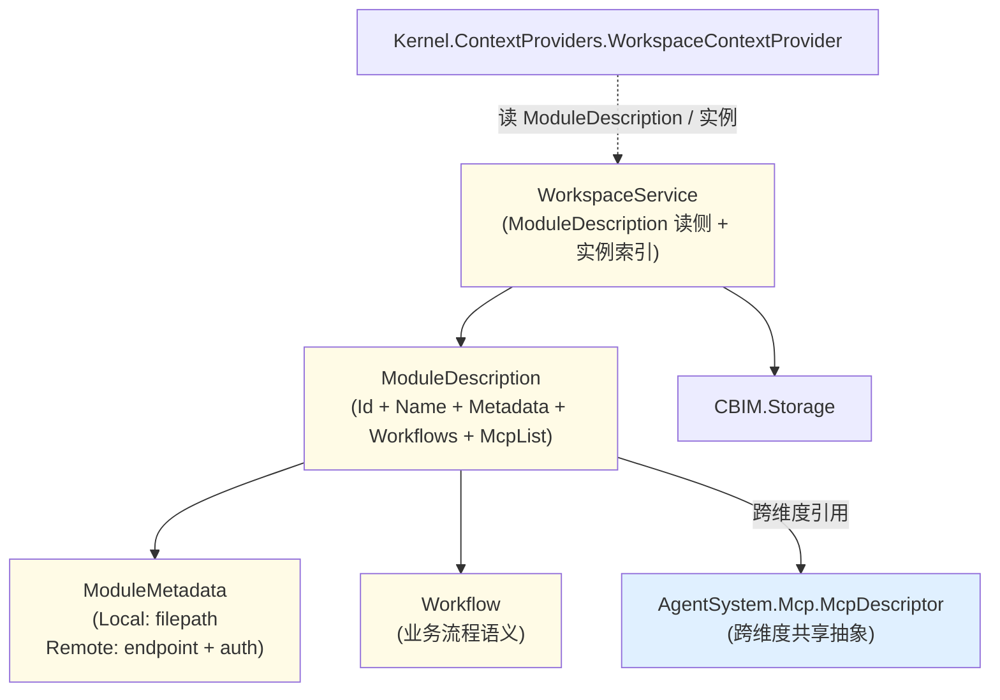

## Positioning

**Workspace 是 CBIM 的 Workspace 层**（v2 三层模型中的三层之一）——管理模块树 + 模块对象。该层与 Agent 层**互不依赖**——二者是 v2 三层中两个独立资产，在 task 期由 Kernel 以 ContextProvider 组合。

**业务维度的核心内容 = 工作流程 + 领域知识 + 业务操作接入点**。工具仍不在业务维度——工具是 Agent 层的责任。但业务维度可以有自己的 **MCP 接入点**与**业务 Skill 集合**——描述业务本身的外部端点（云服务 / SaaS 接入点）与业务标准作业流程清单。

## v2 三层模型中的位置

```
基建层（类型契约）：Tool / Skill / Mcp / IMemoryService / Storage
   ↑ 本模块依赖
Workspace 层（本模块）——与 Agent 层平级互不依赖
Agent 层：Agent / Kernel / Channel（含 Agent/Brain 多脑区 + ExternalMotorCortex 桥接外部 AI 引擎）
```

**本模块依赖**：`CBIM.Skills` + `CBIM.Mcp` + `CBIM.Storage`（三个基建层抽象）。
**本模块不依赖**：Agent 层任何模块（包括 Agent / Kernel / Channel）。**原 「ExternalAdapter」 顶层模块本轮废弃**，外部 AI 引擎接入不再为与本模块跨层依赖考量点。
**本模块不持**：IMemoryService——记忆是 Agent 的，不是模块的；模块只有规章 / 流程 / 接入点，没有「模块的记忆」。

## 与旧「能力 / 业务对偶」的表达表关系

旧「能力维度 vs 业务维度」表达（以 C/B 对偶开头）是 v2 三层模型下的**一个视角**，不被本轮推翻：

| 表达 | 本轮重表述 |
|------|------------|
| 能力维度（C）= AgentSystem | Agent 层服务门面 |
| 业务维度（B）= Workspace | Workspace 层 |
| 记忆维度（M）= Memory | 拆为「基建层 IMemoryService 接口 + Agent 层持实例」两个方面 |
| 跨维度共享 `McpDescriptor` | “类型契约由基建层提供一份，实例集合由 Agent 与 Workspace 各自独立持有” |

**v2 三层模型是顶层心智收敛**；能力/业务 对偶在三层下仍是有效描述（Agent 层 ⋬ 能力侧，Workspace 层 ⋬ 业务侧），但不再是顶层划分词汇。

## CBIM 核心对偶中的位置

Workspace 与 AgentSystem 是一对正交服务层：

| 维度 | 本服务层 | 对偶服务层 | 本维度的内容 |
|------|---------|----------|--------------|
| **业务（Business）** | **Workspace**——管理「业务工作区」 | — | **工作流程 + 领域知识 + 业务 MCP 接入点** |
| **能力（Capability）** | — | **AgentSystem**——管理「能力个体」 | **工具 + skill + 专精领域** |

二者**结构对称**：都以 `Description`（类型描述）+ `Instance`（实例运行态）二元结构组织；都直接依赖 Storage；都不互相依赖；跨维度协同由 Kernel.FlowGraph 在 Task 期组合。

**唯一跨维度共享抽象（本轮重点）**：`McpDescriptor`——业务维度 `ModuleDescription.McpList` 与能力维度 `AgentDescription.McpList` 同类型。Workspace 上向引用 `CBIM.Mcp.McpDescriptor`，依赖方向 `Workspace → AgentSystem.Mcp`（Workspace 是更易变的业务层，Mcp 是更稳定的能力扩展层，符合 C3 单向依赖）。

## ModuleDescription 三段式语义（本轮重要）

```csharp
public sealed class ModuleDescription
{
    public string Id { get; }
    public string Name { get; }

    // 是什么：业务知识 DNA（纯知识载体）
    public ModuleMetadata Metadata { get; }

    // 能做什么：业务流程语义声明
    public IReadOnlyList<Workflow> Workflows { get; }

    // 怎么做：业务操作接入点 MCP（跨维度共享抽象）
    public IReadOnlyList<McpDescriptor> McpList { get; }
}
```

**三段式语义**：

| 段 | 字段 | 语义 | 类比 |
|----|------|------|------|
| 是什么 | `Metadata` | 业务知识载体 | 项目说明书 |
| 能做什么 | `Workflows` | 业务流程语义声明 | 项目里能开哪些工单类型 |
| 怎么做 | `McpList` | 业务操作接入点 | 项目自带的工具 / API endpoint |

三段式对照 AgentDescription：

| 维度 | 是什么 | 能做什么 | 怎么做 |
|------|------|---------|------|
| AgentDescription（能力）| Soul + Identity | Skills | SystemTools + McpList |
| ModuleDescription（业务）| Metadata（文档）| Workflows（流程声明）| McpList（操作接入点）|

三者责任边界：

1. **`Metadata` 是纯知识载体**——只描述「是什么 / 规则 / SLA」，不夹带任何操作协议。
2. **`Workflows` 是业务流程语义声明**——执行实例由 Kernel/FlowGraph 装配。
3. **`McpList` 是业务操作接入点**——与 Agent.McpList 同抽象同类型，但**语义归属不同**（业务自带跟业务走；agent 自带跟人走）。

**为何无「谁来做」段（Owners 字段已删）**：CBIM 的认知模型是「单虚拟人 + 一个 Workspace」——所有 Agent 实例代表同一人的不同思维对象（Reasoner / Critic / Summarizer 等脑区），共享同一份 Memory 与 Workspace。模块不需要绑「项目负责人」，因为「人是同一个」；任何思维对象都可在任何模块上工作。Owners 是早期「多 Agent 组织模型」假设（不同 agent 拥有不同模块）的遗留，与单虚拟人模型不相容，本轮删除。

## 业务 Skill + 业务 MCP 挂载点（本轮明确）

v2 三层模型明确“模块对象持自身的 MCP 集合与 Skill 集合”。这两个集合在 `ModuleDescription` 中的映射如下：

| 术语（v2） | `ModuleDescription` 字段 | 类型来源 | 语义 |
|--------------|---------------------------|----------|------|
| **业务 Skill 集合** | `Workflows: IReadOnlyList<SkillDescriptor>` | `CBIM.Skills.SkillDescriptor`（基建层） | 该业务模块能走什么业务流程（贴在墙上的标准作业流程）。`Workflows` 是该集合的字段名，术语上 = 业务 Skill 集合。 |
| **业务 MCP 集合** | `McpList: IReadOnlyList<McpDescriptor>` | `CBIM.Mcp.McpDescriptor`（基建层） | 该业务模块接入哪些外部业务系统（企业 ERP / CDN 控制台 / Jira）。 |

**关键点**：

1. **实例独立**——每个 Module 持自己的 `Workflows` 列表和 `McpList` 列表。不同 Module 之间、Module 与 Agent 之间都不共享这些集合实例。
2. **类型共享**——仅 `SkillDescriptor` / `McpDescriptor` 两个抽象类型来自基建层，被 Agent.Skills / Agent.McpList 与 Module.Workflows / Module.McpList 同时引用。同抽象、不同实例。
3. **装配期合并**——task 期 Agent 进入某 Module。Agent 自带的 Skills/McpList 与 Module 自带的 Workflows/McpList 在装配点合并（按 Id 去重）。Module 离开后 Agent 不携带 Module 资源。
4. **业务 Skill 为什么不叫 `BusinessSkills` 字段**——历史原因：业务侧的 Skill 被叫作「工作流程」更贴近业务说法，所以字段名保留 `Workflows`。下切片如需重命名可议（例 `BusinessSkills`），不是本轮事。

**为什么 v2 三层模型明确这两个挂载点：**

之前表达为「跨维度共享 McpDescriptor」/ 「Workspace 上向引用 AgentSystem.Mcp」——含难以表达的「共享中包含实例共享」误解。v2 三层模型拆清吗：
- **类型契约** → 基建层一份（`SkillDescriptor` / `McpDescriptor`）。
- **实例集合** → Module 一份 + 每个 Agent 一份，独立。

表达上更准、读者不再需要「跨维度共享」这个烧脑术语。

## McpDescriptor 跨维度共享（本轮重点裁决）

**`AgentDescription.McpList: IReadOnlyList<McpDescriptor>` 与 `ModuleDescription.McpList: IReadOnlyList<McpDescriptor>` 是同一份抽象**：

- 同抽象类（`CBIM.Mcp.McpDescriptor`）。
- 同两子类实例类型（`StdioMcpDescriptor` / `HttpMcpDescriptor`）。
- 同 `McpTransportKind` 枚举。

**语义归属不同**：

| 使用侧 | 语义 | 典型例 |
|--------|------|--------|
| `AgentDescription.McpList`（能力维度）| **跟人走**——agent 自带的 MCP，装配 AIAgent 时启。例：git-mcp（agent 会用 git）。| `unity-programmer` agent 要 `unity-mcp` |
| `ModuleDescription.McpList`（业务维度）| **跟业务走**——业务模块本身的外部端点，同业务上下文生命周期。例：cdn-prod-mcp（这个具体 CDN 实例的接入点）。| `cdn-storage-prod` module 有 `cdn-prod-mcp` |

**为什么共享**：MCP server 本质是「一个可调工具集的外部端点」——无论 agent 自带还是 business 自带，server 本身的形态（command/args/env 或 endpoint/auth）完全一致。共享同一份描述类比双份定义更简洁。

**装配位置不同**（同 descriptor，不同上下文）：

- `AgentDescription.McpList` → `AgentSystem.OpenInstance` 装配 AIAgent 时启动 + 包 AIFunction → 挂 AIAgent.Tools。
- `ModuleDescription.McpList` → 业务 Workflow / Kernel.ContextProviders 装配时按需启动 + 包 AIFunction → 挂当前 task 上下文（具体装配点由 Kernel/ContextProviders 切片决定）。


## ModuleMetadata 是纯知识载体（本轮裁决）

**`ModuleMetadata` 退化为纯文档 / spec 载体**，不再夹带任何业务操作协议字段：

```csharp
public enum ModuleMetadataKind { Local, Remote }

public abstract class ModuleMetadata
{
    public abstract ModuleMetadataKind Kind { get; }
    public abstract string Location { get; }   // Local: filepath；Remote: endpoint URL
}

public sealed class LocalModuleMetadata : ModuleMetadata   // .dna/module.md 本地文档
{
    public string FilePath { get; }
    public override ModuleMetadataKind Kind => Local;
    public override string Location => FilePath;
}

public sealed class RemoteModuleMetadata : ModuleMetadata  // 远端 spec endpoint（云工作区的知识载体）
{
    public string Endpoint { get; }
    public string AuthToken { get; }
    public override ModuleMetadataKind Kind => Remote;
    public override string Location => Endpoint;
}
```

**上一轮 ModuleMetadata.Protocol 字段删除**——原「Remote 云模块的 MCP 协议声明」迁出到 `ModuleDescription.McpList`。RemoteModuleMetadata 只持远端文档 endpoint + AuthToken（不是操作 MCP，是文档 / spec 读侧服务表为例）。

**「云工作区」设计意图**：

- 一个 Module 在 CBIM 系统里可以只是一些「声明」（基本元信息 + 远端文档指针）。
- 真实业务知识在远端服务上托管（如内部 wiki / OpenAPI 文档服务 / spec registry）。
- CBIM 启动时不必本地保存所有 module 文档，按需远端拉取。
- **注意**：业务**操作**走 `ModuleDescription.McpList`，不走 Metadata。Metadata 只负责描述「什么业务 / 规则 / 领域知识」。

### 本地文件夹 vs 云端空间（对称叙述 · 本轮显式）

**`ModuleMetadata` 的两个子类是 Workspace 的两支对偶形态**——同一抽象（「业务知识从哪里来」）的两个落地点，调用方透过统一的 `metadata.Location` 接口透明消费。

| 子类 | 形态隐喻 | Location 语义 | 知识载体物理位置 | 用户图中对应概念 |
|------|---------|---------------|-------------------|--------------------|
| **`LocalModuleMetadata`** | **本地文件夹** | 文件系统路径（`<project>/<path>/.dna/module.md`）| 项目仓库内 `.dna/` 树 | 「本地工作区」——人在本地编辑 / git 管理的 module 知识 |
| **`RemoteModuleMetadata`** | **云端空间（虚拟网关模块）** | 远端文档服务 URL（`https://...`）+ `AuthToken` | 远端 wiki / spec registry / OpenAPI 文档服务 | 「云端空间 / 虚拟网关模块」——在 CBIM 里只是一份「指向云端的声明」，知识真身在云端托管 |

**对称性**：

- **同一 Workspace 服务层平等托管两支**——`WorkspaceService.ListDescriptions()` 返回的 `ModuleDescription` 不区分本地 / 云端，调用方对 metadata 形态透明。
- **同一 `Location` 抽象访问入口**——本地走文件路径，云端走 endpoint URL；读侧实现各自接入但调用方语义一致（「这块业务知识在哪里」）。
- **同一三段式语义结构**——无论 metadata 是 Local 还是 Remote，`ModuleDescription` 的其余两段（`Workflows` / `McpList`）均按相同方式存在；云端模块的「操作接入点」依然走 `ModuleDescription.McpList`，**不走 `RemoteModuleMetadata.Endpoint`**（后者纯为文档源 endpoint）。

**RemoteModuleMetadata = 虚拟网关模块**——「虚拟」体现在：

1. **本地无知识真身**——CBIM 启动时不必预先下载所有 module 的文档；按需远端拉取。
2. **对外透明**——agent / 派发器 / Workflow 调用 `metadata.Location` 时不感知本地 vs 云端的差别；远端拉取由读侧适配器统一封装。
3. **网关角色**——`Endpoint + AuthToken` 是「通往云端业务知识源」的入口，不是业务操作通道。业务操作通道是 `ModuleDescription.McpList`（同抽象不同语义归属，见 McpDescriptor 跨维度共享节）。

**两支的责任分离严格遵守**：

| 关注点 | 走哪条 |
|--------|--------|
| 「这块业务知识的源头在哪、怎么读取文档」 | `ModuleMetadata.Location`（Local: filepath / Remote: doc endpoint）|
| 「这块业务怎么被操作、调用方怎么发请求」 | `ModuleDescription.McpList`（HttpMcpDescriptor / StdioMcpDescriptor）|

知识源 endpoint 与操作 endpoint **物理上可同主机但语义上互不混淆**——这是「云端模块」对称设计的关键约束。

## CDN 业务示例（完整三段式）

```csharp
new ModuleDescription(
    id: "cdn-storage-prod",
    name: "生产 CDN 存储",
    metadata: new LocalModuleMetadata(".dna/module.md"),   // 这个 CDN 业务是什么、规则、SLA
    workflows: [upload, download, query],         // 业务流程语义
    mcpList: [
        new HttpMcpDescriptor("cdn-mcp", "CDN MCP", "操作 CDN",
            endpoint: "https://cdn.example.com/mcp",
            authToken: "...")                     // 实际操作接入点
    ]);
```

三者各只有一个职责，不交叉不覆盖。

## Children

本轮无子模块。基础能力三抽象（Tool / Skill / Mcp）已顶层化为 `CBIM/Tools/`、`CBIM/Skills/`、`CBIM/Mcp/` 三个顶层模块——Workspace 跨维度引用它们（与 AgentSystem 平等共享）。早先曾把 StandardTools 放在 Workspace/ 下（"工具属业务"误解），后纠正为放在 AgentSystem/ 下（"工具属能力"），最终本轮提为顶层（"工具属基础能力，跨维度共享"）。

## Child Relationships

无子模块。外部依赖关系：



依赖方向：Workspace → `CBIM.Mcp`（唯一反向跨服务层 C# 依赖——Mcp 不反向引 Workspace）。本轮删除 `Owners` 后，业务侧 → 能力侧的「字符串反向引用 AgentDescription.Id」也随之消失。

## 核心概念

| 概念 | 形态 | 存储 |
|------|------|------|
| **ModuleDescription** | 模块「类型」：Id / Name / Metadata / Workflows / McpList | 代码实例化；Metadata 为 Local 时点向 `<project>/<path>/.dna/module.md` |
| **ModuleMetadata** | 纯知识载体：Local（filepath）或 Remote（endpoint + AuthToken）| Local：.dna/module.md 文件；Remote：远端文档服务 |
| **Workflow** | 业务流程语义声明 | 代码实例 |
| **McpList**（跨维度共享）| `McpDescriptor` 列表——业务操作接入点 | 代码实例 |
| **Module 实例** | 某任务上下文激活后的运行态 | `persistentDataPath/.cbim/workspace/instances/` |

**不包含**：工具声明、沙盒配置——这些都是 AgentDescription 的责任；模块负责人编制（Owners）——本轮删除，CBIM = 单虚拟人 + 一个 Workspace，模块不存在「所有者」。

## Three-Layer Memory Context

本模块承担**长期记忆 · 业务维度**——`.dna/` 模块树 + Module 实例。其他三层归属见 `Memory/.dna/module.md`。

## ModuleDescription Schema（文档侧）

ModuleMetadata 为 Local 时指向 `<project>/<path>/.dna/module.md`，该文档纯为纯知识载体（不含工具 / 不含 MCP 启动参数）：

```yaml
---
name: my-module
owner: architect
description: ...
keywords: [...]
dependencies: [...]
status: spec
---

## Positioning
...

## 工作流程（业务维度核心内容）
上游如何发起 / 本 module 如何处理 / 下游如何交接。

## 领域知识（业务维度核心内容）
该业务块独有的术语 / 规则 / 常识。
```

**负面示例（本轮明确禁止）**：

- `standard_tools: [Files, Search]`——本轮**删除**。工具归属能力维度，请在 `AgentDescription.SystemTools` 声明。
- `external_mcp_servers: [...]`——本轮**删除 frontmatter 字段**。MCP 接入点是业务维度的责任不错，但存放在 **C# 层 `ModuleDescription.McpList`**（跨维度共享 `McpDescriptor` 抽象），不再放在 `ModuleMetadata` 文档侧 frontmatter。
- `protocol: mcp`（RemoteModuleMetadata）——本轮**删除**。Remote DNA 只是文档载体不是操作载体。

## Contract Surface

```csharp
namespace CBIM.Workspace;

using CBIM.Mcp;

public sealed class WorkspaceService
{
    // ModuleDescription（类型）
    IReadOnlyList<ModuleDescription> ListDescriptions();
    ModuleDescription? GetDescription(string id);
    IReadOnlyList<ModuleDescription> QueryDescriptions(string text, int topK);

    // Module 实例
    IReadOnlyList<ModuleInstance> ListInstances();
    ModuleInstance? GetInstance(string instanceId);

    WorkspaceStats Stats();
}

public sealed class ModuleDescription
{
    public string Id { get; }
    public string Name { get; }
    public ModuleMetadata Metadata { get; }                              // 纯知识载体
    public IReadOnlyList<Workflow> Workflows { get; }          // 业务流程声明
    public IReadOnlyList<McpDescriptor> McpList { get; }       // 业务操作接入点（跨维度共享）
}
```

本轮删除的字段：`ModuleDescription.Owners` + `ModuleOwners` 类。CBIM = 单虚拟人 + 一个 Workspace，模块不需要「项目负责人」语义；任何思维对象（AIAgent 脑区）都可在任何模块上工作。

写侧（`SaveDescription` / `CreateModule` / `SplitModule` / `DeprecateModule`）是后续切片——Unity 侧暂走 Python `dna_*` MCP 工具，本服务定期 reindex 拉最新快照。

## Storage Layout

```
<project>/<module-path>/.dna/
  module.md          ← ModuleMetadata 为 Local 时的文档（工作流程 + 领域知识）
  contract.md        ← 可选

Application.persistentDataPath/.cbim/workspace/
  descriptions-index.json
  instances/<id>.json
  instances-index.json
```

## Dependencies

- `CBIM.Storage`——IO + frontmatter 解析。
- **`CBIM.Mcp`**（基建层抽象）——`McpDescriptor` / `StdioMcpDescriptor` / `HttpMcpDescriptor` / `McpTransportKind`。业务 MCP 集合装载点。
- **`CBIM.Skills`**（基建层抽象 · 本轮明确）——`SkillDescriptor`。业务 Skill 集合（`ModuleDescription.Workflows`）装载点。
- **不依赖** Agent 层任何模块（Agent / Kernel / Channel）。Agent 层 ⊥ Workspace 层，仅由组合根 / Kernel 在 task 期组合。**原 「ExternalAdapter」 顶层模块本轮废弃**，外部 AI 引擎以 `Agent/Brain/ExternalMotorCortex` 子类形式存在于单个 Agent 内部，本模块同样不依赖。
- **不依赖** Memory ——记忆是 Agent 的，模块不持。
- **无子模块**。

依赖方向：Workspace → 基建层（Skills / Mcp / Storage） → ⊥。反向严禁。

**与旧描述的差别**：旧描述「Workspace → AgentSystem.Mcp」（因为 Tool/Skill/Mcp 曾是 AgentSystem 子模块）本轮修正为「Workspace → CBIM.Skills + CBIM.Mcp」——三大基建抽象顶层化之后，依赖方向看起来更顺（业务层 → 基建层，不是业务层 → Agent 层子模块）。

## 铁律

- Service 同步方法，无 `Update()` / `StartCoroutine`。
- ModuleDescription 与 ModuleInstance schema 互不混淆。
- 不持记忆条目 / AgentDescription——是 Memory / AgentSystem 的事。
- **不持工具声明 / 沙盒配置**——本轮铁律——工具归能力维度。
- **MCP 接入点走 C# 层 `ModuleDescription.McpList`**——不再在 `ModuleMetadata` 文档侧夹带。
- **共用 `AgentSystem.Mcp.McpDescriptor` 但不反向依赖能力侧**——跨维度共享是抽象复用，不是耦合。
- **模块不持「负责人」语义**（本轮新增铁律）——CBIM = 单虚拟人 + 一个 Workspace；Agent 实例只是同一人的不同思维对象（脑区），共享 Memory 与 Workspace。模块不需要 Owners / Primary / Secondary 字段；谁在哪个模块上工作由调度期 task.Who 决定，与模块 schema 无关。
- 写侧未落地——通过 Python MCP 工具 + 本服务 reindex。

## Origin Context

上轮已合并 `Dna/` 子模块进本模块。上一轮又新增 `StandardTools/` 子模块 + `standard_tools` / `external_mcp_servers` schema——那轮裁定该设计维度归属错位，全部退回。上一轮裁决：

1. 本模块继续保留——Microsoft 不提供「业务模块知识图谱」抽象。
2. 写侧仍走 Python MCP 工具 + reindex。
3. 删除 `StandardTools/` 在本下的在籍；UI、责任阁一般「工具能力是 module 业务属性」被覆反。
4. 删除 `standard_tools` / `external_mcp_servers` 两个 frontmatter 字段。
5. 重申业务维度的核心内容——工作流程 + 领域知识。

上轮增量（MCP 集成 · 业务维度偾面 · 代码已落地）：

1. **`ModuleDescription` 增 `McpList: IReadOnlyList<McpDescriptor>` 字段**——业务操作接入点走 C# 层，与 AgentDescription.McpList 同抽象同类型。
2. **跨维度共享依赖新增**：`CBIM.Mcp` 抽象被本服务层引用。这是 Workspace 唯一跨服务层的依赖。
3. **`ModuleMetadata` 退化为纯知识载体**——原隐含的「云模块走 MCP 协议」语义全部迁到 `ModuleDescription.McpList`。`ModuleMetadata.Protocol` 字段删除（代码已落地——`RemoteModuleMetadata` 只持 Endpoint + AuthToken）。
4. **`ModuleDescription` 调为 `class`（非 record）**——代码现状，以代码为准。上一轮描述里的 record 签名过时。
5. **Storage layout 中 `module.md` 不再包含** 工具 / MCP 协议 frontmatter——纯为工作流程 + 领域知识 文档。

上轮增量（`Owners` 人事编制 · 代码已落地）：

1. 增 `ModuleDescription.Owners: ModuleOwners` 字段（可空）+ 新增 `ModuleOwners` 类（Primary + Secondary，都是 `AgentDescription.Id` 字符串引用），三段式升为四段式。
2. 三级 fallback 警告设计（Owners null → ERROR-style；Primary null → WARNING；Secondary null → INFO）。
3. task.Who 明指可覆盖 owner。

**本轮（删除 Owners · 三段式回归）**：

1. **删 `ModuleDescription.Owners` 字段 + `ModuleOwners` 类（含 `Workspace/ModuleOwners.cs` 文件）**——四段式退为三段式（Metadata + Workflows + McpList）。
2. **动机**：Owners 是早期「多 Agent 组织模型」（不同 agent 各拥不同模块）的遗留。现在确立的认知模型是「CBIM = 单虚拟人 + 一个 Workspace」：一个 Agent 实例可同时挂载多个 AIAgent（思维对象 / 脑区），共享 Memory 与 Workspace——人是同一个，任何思维对象都可在任何模块上工作，模块不存在「所有者」语义。
3. **附带清理**：跨服务层「字符串反向引用 AgentDescription.Id」也随之消失；Mermaid 中 OWN 节点 + 虚线反向引用边都被拆除。业务侧 → 能力侧的反向跨层照照只剩 `Workspace → CBIM.Mcp` 一条。
4. **派发期 fallback 警告三级表作废**——原计划在 TaskRunner / DispatchWorkflow 层 emit 的 ERROR/WARNING/INFO 三级 owner-resolution 警告本轮一并废除；谁在哪个模块上工作由调度期 task.Who 直接决定，无 fallback 事件可报。

## Emergent Insights

1. **工具能力是 agent 业务属性，不是 module 业务属性**——「能不能读文件 / 能不能联网」与「谁」相关，不与「在哪」相关。同一 module 被不同 agent 处理时可能调用完全不同的工具集。
2. **业务维度核心价值 = 工作流程边界 + 领域知识封装 + 业务操作接入点**——这是 Microsoft / 任何通用框架不提供的，也是 CBIM Workspace 保留的唯一理由。本轮删除 Owners 后，业务维度核心回归三项，与「单虚拟人 + 一个 Workspace」认知模型对齐。
3. **跨维度共享抽象的边界控制**——McpDescriptor 被两个维度共享，但依赖方向严格单向（Workspace → AgentSystem.Mcp，不反向）。共享抽象不意味跨维度耦合，是同一类型被两个维度独立调用。
4. **维度错位是常见架构陷阱**——「看起来与哪个东西伴生」不等于「应在该东西的 schema 内」。谁拥有 schema 声明权 ≠ 谁与其一同出现。Owners 是反面案例：看似「模块与人绑定」，但「人是谁」是调度维度（task.Who）不是模块 schema 维度。
5. **本地文件夹 vs 云端空间的对称是 Workspace 的隐藏第二维度**——`LocalModuleMetadata` / `RemoteModuleMetadata` 不是「主流形态 + 边角扩展」，而是对偶的两支：本地 `.dna/` 树承载「人在本地编辑」的业务知识；`RemoteModuleMetadata` 作为「虚拟网关模块」承载「云端托管」的业务知识。同一 `Location` 抽象接入，同一三段式语义结构，调用方对 metadata 形态透明。
6. **「知识源 endpoint」与「业务操作 endpoint」物理可同主机但语义严格分流**——`RemoteModuleMetadata.Endpoint` 是文档读侧通道；`ModuleDescription.McpList` 是业务操作通道。同一云端服务可同时暴露 doc endpoint + mcp endpoint，但 CBIM 里这两条路径**抽象上彼此不知**——任何把「云端模块就走 RemoteMetadata.Endpoint 调 MCP」的简化都会重演上轮已纠正的「Metadata 夹带操作协议」错位。对称设计天然抗这类回退。
7. **「人」是调度维度不是模块 schema 维度**（本轮新增 · 反面教训转正面）——上一轮 Owners 试图把「默认负责人」烘入模块 schema，但该设计默认了「多个 Agent 各有业务划分」的组织模型。「单虚拟人 + 多思维对象」模型确立后，「谁」是调度期问题（task.Who 选哪个 AIAgent 脑区），不是模块静态属性问题。架构上的启示：凡「在 schema 里烘设备人」的设计，先问「多设备」这个前提是否成立。

## Non-Goals

- 不实现 Unity 侧 `.dna/` 写侧（走 Python MCP）。
- 不持有任务黑板（后续 `TaskWorkspace/` 子模块话题，本轮不发）。
- 不持有 Agent / 记忆数据。
- **不持有工具声明**——本轮裁决。
- **不含 MCP 启 / 停 / 接连胶水**——装配胶水在能力侧（AgentSystem.OpenInstance）或业务 Workflow（Kernel.FlowGraph / ContextProviders）中调 `Microsoft.Agents.AI.Mcp` client。

