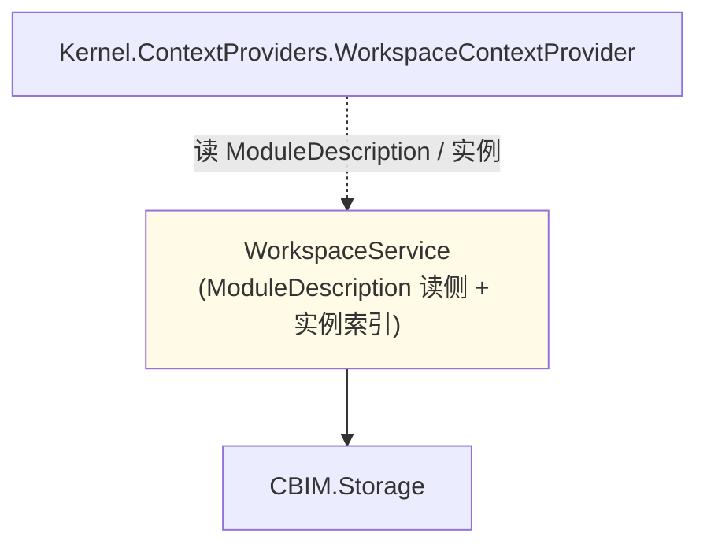

## Positioning

**业务模块系统是 CBIM 的服务层（B 维度）——本轮保留**：CBIM 的 `Module + ModuleDescription` 是项目独有业务知识，Microsoft 不提供等价物。

**业务维度的核心内容 = 工作流程 + 领域知识**。不包含工具声明——工具是能力维度（`AgentSystem`）的责任。

## CBIM 核心对偶中的位置

Workspace 与 AgentSystem 是一对正交服务层：

| 维度 | 本服务层 | 对偶服务层 | 本维度的内容 |
|------|---------|----------|--------------|
| **业务（Business）** | **Workspace**——管理「业务工作区」 | — | **工作流程 + 领域知识** |
| **能力（Capability）** | — | **AgentSystem**——管理「能力个体」 | **工具 + skill + 专精领域** |

二者**结构对称**：都以 `Description`（类型描述，落项目知识树）+ `Instance`（实例运行态，落 persistentDataPath）二元结构组织；都直接依赖 Storage；都不互相依赖；跨维度协同由 Kernel.FlowGraph 在 Task 期组合。

**关键约束（本轮修正）**：

- 上一轮设计把 `standard_tools` / `external_mcp_servers` 放在 `ModuleDescription`——**错。本轮全部删除**。
- 工具能力 / MCP 端点的声明权**属于能力维度**——`AgentDescription.tools` + `AgentDescription.agent_extension_clis`。
- 本服务层**只负责业务语义**：module 是什么业务、上下间有什么依赖 / 包含关系、该业务块上需要什么领域知识 / 走什么工作流程。「该 module 活动时装哪些工具」**不在本服务层描述**。

## Responsibility（一句话）

管理 `.dna/` 模块树（ModuleDescription）+ 业务侧 Module 实例运行态；为 `WorkspaceContextProvider` 提供数据；为 architect 治理工作流提供读侧 + 后续写侧。

## Children

本轮无子模块（上一轮新增的 `StandardTools/` 本轮迁出到 `AgentSystem/StandardTools/`——工具归能力维度）。

## Child Relationships

无子模块。外部依赖关系：



## 核心概念

| 概念 | 形态 | 存储 |
|------|------|------|
| **ModuleDescription** | 模块「类型」：职责 / 依赖 / 子模块 / 架构 body / **工作流程描述** / **领域知识描述** | `<project>/<path>/.dna/module.md` |
| **Module 实例** | 某任务上下文激活后的运行态 | `persistentDataPath/.cbim/workspace/instances/` |

**不包含**：工具声明、MCP 端点、沙盒配置——这些都是 AgentDescription 的责任。

## Three-Layer Memory Context

本模块承担**长期记忆 · 业务维度**——`.dna/` 模块树 + Module 实例。其他三层归属见 `Memory/.dna/module.md`。

## ModuleDescription Schema

```yaml
---
name: my-module
owner: architect
description: ...
keywords: [...]
dependencies: [...]
status: spec
---

## Positioning
...

## 工作流程（业务维度核心内容）
上游如何发起 / 本 module 如何处理 / 下游如何交接。

## 领域知识（业务维度核心内容）
该业务块独有的术语 / 规则 / 常识。
```

C# 端记录（本轮修正 —— 删除 `StandardTools` / `ExternalMcpServers` 字段）：

```csharp
public sealed record ModuleDescription(
    string Path,
    string Name,
    string Owner,
    string Kind,
    string Description,
    IReadOnlyList<ModuleDependency> Dependencies,
    string BodyExcerpt);
```

**上一轮错误字段的修正说明**：

- `standard_tools: [Files, Search]`——本轮**删除**。工具归属能力维度，请在 `AgentDescription.tools` 声明。
- `external_mcp_servers: [...]`——本轮**删除**。MCP / 外部进程能力同属能力维度，后续在 AgentDescription 体系下落地（首轮以 `agent_extension_clis` 带 CLI 白名单的形式出现）。

迁移说明：现有 `.dna/module.md` 中若仍含这两个 frontmatter 字段，下轮 reindex 时 warning 且忽略；architect 治理趋势上渐渐清除。

## Contract Surface

```csharp
namespace CBIM.Workspace;

public sealed class WorkspaceService
{
    // ModuleDescription（类型）
    IReadOnlyList<ModuleDescription> ListDescriptions();
    ModuleDescription? GetDescription(string path);
    IReadOnlyList<ModuleDescription> QueryDescriptions(string text, int topK);
    IReadOnlyList<ModuleDescription> Children(string parentPath);
    IReadOnlyList<ModuleDependency> Dependencies(string path);

    // Module 实例
    IReadOnlyList<ModuleInstance> ListInstances();
    ModuleInstance? GetInstance(string instanceId);

    WorkspaceStats Stats();
}

public sealed record ModuleDescription(
    string Path,
    string Name,
    string Owner,
    string Kind,
    string Description,
    IReadOnlyList<ModuleDependency> Dependencies,
    string BodyExcerpt);
```

写侧（`SaveDescription` / `CreateModule` / `SplitModule` / `DeprecateModule`）是后续切片——Unity 侧暂走 Python `dna_*` MCP 工具，本服务定期 reindex 拉最新快照。

## Storage Layout

```
<project>/<module-path>/.dna/
  module.md          ← ModuleDescription（工作流程 + 领域知识）
  contract.md        ← 可选

Application.persistentDataPath/.cbim/workspace/
  descriptions-index.json
  instances/<id>.json
  instances-index.json
```

## Dependencies

- `CBIM.Storage`——IO + frontmatter 解析。
- **不依赖** Kernel / Memory / AgentSystem。
- **无子模块**（上一轮新增的 StandardTools 本轮迁出）。

## 铁律

- Service 同步方法，无 `Update()` / `StartCoroutine`。
- ModuleDescription 与 ModuleInstance schema 互不混淆。
- 不持记忆条目 / AgentDescription——是 Memory / AgentSystem 的事。
- **不持工具声明 / MCP 端点 / 沙盒配置**——本轮铁律——工具归能力维度，请看 AgentDescription。
- 写侧未落地——通过 Python MCP 工具 + 本服务 reindex。

## Origin Context

上轮已合并 `Dna/` 子模块进本模块。上一轮又新增 `StandardTools/` 子模块 + `standard_tools` / `external_mcp_servers` schema——本轮裁决该设计维度归属错位，全部退回：

1. 本模块继续保留——Microsoft 不提供「业务模块知识图谱」抽象，这是 CBIM 独有的业务知识管理。
2. 写侧仍走 Python MCP 工具 + reindex。
3. **删除 `StandardTools/` 子模块在本下的在籍**——本轮重大修正。原裁决「工具能力是 module 业务属性」被覆反：工具能力是 **agent** 业务属性。
4. **删除 `standard_tools` / `external_mcp_servers` 两个 frontmatter 字段**。
5. 本轮重申业务维度的核心内容——**工作流程 + 领域知识**；ModuleDescription body 重点在这两件事。

## Emergent Insights

1. **工具能力是 agent 业务属性，不是 module 业务属性**——「能不能读文件 / 能不能联网」与「谁」相关，不与「在哪」相关。同一 module 被不同 agent 处理时可能调用完全不同的工具集——例如 architect 处理 module 只需读文件，programmer 处理同一 module 需要写 + git + dotnet CLI。这进一步证明工具不应在 module schema。
2. **业务维度核心价值 = 工作流程边界 + 领域知识封装**——这是 Microsoft / 任何通用框架不提供的，也是 CBIM Workspace 保留的唯一原因。
3. **维度错位是常见架构陷阱**——「看起来与哪个东西伴生」不等于「应在该东西的 schema 内」。工具总伴随 Task 上下文出现，但上下文由多个维度同时提供（who+where+what）。谁拥有 schema 声明权 ≠ 谁与其一同出现。本轮修正是该原则的具象落地。

## Non-Goals

- 不实现 Unity 侧 `.dna/` 写侧（走 Python MCP）。
- 不持有任务黑板（后续 `TaskWorkspace/` 子模块话题，本轮不发）。
- 不持有 Agent / 记忆数据。
- **不持有工具声明 / MCP 端点**——本轮裁决。
