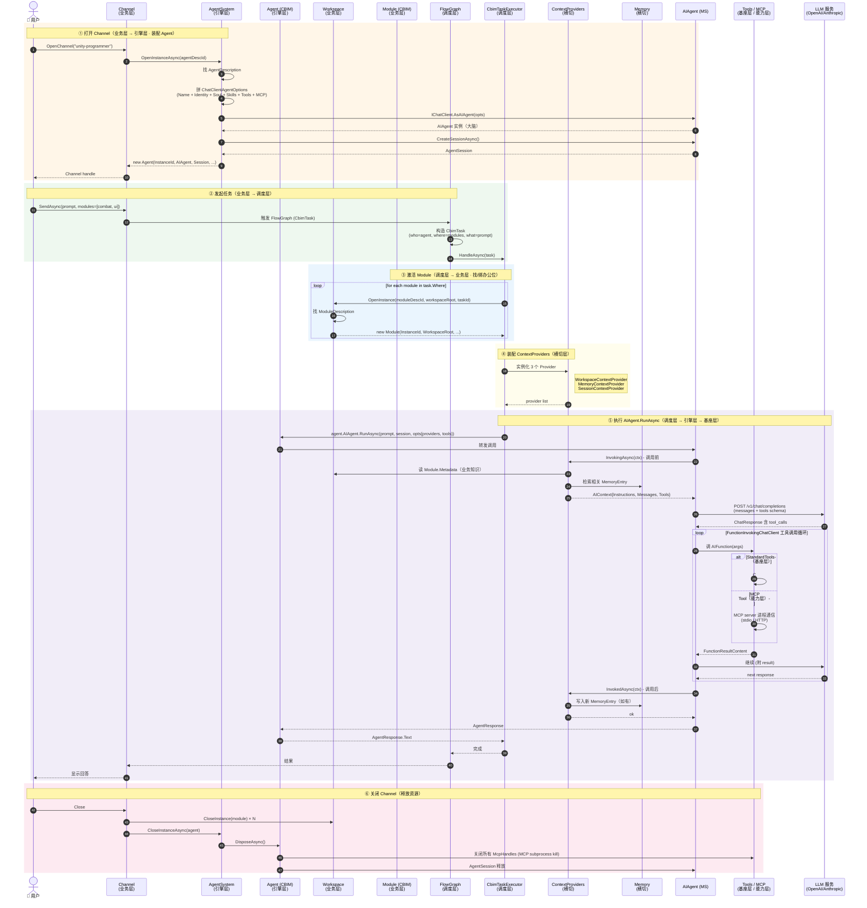

# CBIM v2 Unity 架构全景

本文档是 CBIM v2 Unity 实现的顶层架构地图。更细节的描述见各模块 `.dna/module.md`。

---

## 一、核心设计哲学

**两条主线贯穿整个 CBIM v2：**

```
不造轮子（C6 稳定抽象）：
  能用 Microsoft Agent Framework 替代的，全部交出去
  CBIM 只写"业务独有"的薄胶水层

六层切分（C2 单一职责 + C3 单向依赖）：
  调度 → 引擎 → 业务 → 能力 → 基座
  扩展层（外部 Agent 适配器）从引擎层向外横切
  每一层的稳定性自上而下递增，依赖严格单向
```

---

## 二、六层架构总览

CBIM v2 按照「稳定性递增 + 职责单一」原则切分为 **5 个纵向主层 + 1 个横向扩展层**：

| 层级 | 系统 | 核心职责 | 模块归属 |
|------|------|---------|---------|
| **调度层** | CBIM 调度器 | 执行确定性流程图，硬性控制「助手 → 架构师 → HR → 程序员」的协作流程 | `Kernel/FlowGraph` + `Kernel/TaskScheduler` |
| **引擎层** | Agent 引擎 | 双模驱动 + 适配器。内置引擎（C# 原生）和外部引擎抽象（Claude Code / Cursor / Codex） | `AgentSystem`（内置） + `ExternalAdapter`（外部抽象） |
| **业务层** | 工作区系统 | 管理模块拓扑树（本地文件夹或云端空间），承载业务 Skill 与业务 MCP | `Workspace` + `Channel` |
| **能力层** | Agent Skill & MCP | 可移植领域能力 + 连接外部 AI 工具的协议，由 HR 治理 | `Skills` + `Mcp` |
| **基座层** | 工具系统 | 所有操作的最终执行者，文件读写 / 代码执行等原子操作 | `Tools` + `Tools/Standard` + `Storage` |
| **扩展层** | 外部 Agent 适配器 | 三策略向外部 Agent 注册 CBIM 能力（提示词注入 / MCP 协议桥接 / 能力网关代理） | `ExternalAdapter` 三策略实现 |

**两条额外横切关注点：**

- **记忆系统（Memory）** —— 跨层共享的事实 / 决策沉淀，由调度层与引擎层共同使用。
- **Microsoft Agent Framework** —— 所有 CBIM 模块的横向底座（不属于任何一层）。

---

## 三、全景依赖图

```mermaid
flowchart TB
    classDef scheduling fill:#ffe0b2,stroke:#e65100,color:#000
    classDef engine fill:#c8e6c9,stroke:#1b5e20,color:#000
    classDef business fill:#bbdefb,stroke:#0d47a1,color:#000
    classDef capability fill:#fff9c4,stroke:#f57f17,color:#000
    classDef foundation fill:#d1c4e9,stroke:#311b92,color:#000
    classDef extension fill:#ffccbc,stroke:#bf360c,color:#000
    classDef msai fill:#f8bbd0,stroke:#880e4f,color:#000
    classDef external fill:#eeeeee,stroke:#424242,color:#000,stroke-dasharray:5 5
    classDef cross fill:#f0f4c3,stroke:#827717,color:#000

    subgraph SchedulingLayer["调度层 · CBIM 调度器"]
        FG["FlowGraph<br/>确定性流程图 + CbimTaskExecutor"]
        TS["TaskScheduler<br/>CbimTask 不可变三元组<br/>who / where / what"]
        FG --> TS
    end

    subgraph EngineLayer["引擎层 · Agent 引擎（双模驱动）"]
        AS["AgentSystem · 内置引擎<br/>C# 原生<br/>AgentDescription / Agent / Session"]
        EA["ExternalAdapter · 外部引擎抽象<br/>IExternalEngineAdapter<br/>ExternalAgentHandle"]
    end

    subgraph BusinessLayer["业务层 · 工作区系统"]
        WS["Workspace<br/>模块拓扑树<br/>ModuleDescription / Module / Owners"]
        CH["Channel<br/>入口 · AgentSession 薄封装"]
    end

    subgraph CapabilityLayer["能力层 · Skill & MCP（HR 治理）"]
        SK["Skills<br/>SkillDescriptor<br/>可移植领域能力"]
        MCP["Mcp<br/>McpDescriptor<br/>+ Stdio/Http 子类"]
    end

    subgraph FoundationLayer["基座层 · 工具系统"]
        T["Tools<br/>ToolDescriptor 抽象"]
        TSTD["Tools/Standard<br/>Files / Search 内置工具家族"]
        STG["Storage<br/>FileBackend · root 注入"]
        T --> TSTD
    end

    subgraph ExtensionLayer["扩展层 · 外部 Agent 适配器（三策略）"]
        SA["策略 A · PromptInjection<br/>提示词注入"]
        SB["策略 B · McpBridge<br/>MCP 协议桥接"]
        SC["策略 C · CapabilityGateway<br/>能力网关代理"]
    end

    subgraph CrossCutting["横切关注点"]
        MEM["Memory<br/>MemoryEntry CRUD"]
        CP["ContextProviders<br/>Workspace / Memory / Session<br/>三 AIContextProvider"]
    end

    subgraph MSAI["📦 Microsoft Agent Framework（NuGet · 底座）"]
        direction LR
        MSAgent["AIAgent / ChatClientAgent<br/>AgentSession"]
        MSWF["Workflow / Executor"]
        MSChat["IChatClient"]
        MSCP["AIContextProvider"]
        MSFn["AIFunction"]
    end

    subgraph ExternalEngines["🌐 外部 Agent 引擎（黑盒）"]
        direction LR
        EXT_CC["Claude Code CLI"]
        EXT_CUR["Cursor"]
        EXT_COD["Codex / 任意 HTTP LLM"]
    end

    %% 调度层 → 引擎层
    FG --> AS
    FG --> EA
    FG --> CP
    FG -.基于.-> MSWF

    %% 业务层 → 调度层 / 引擎层
    CH --> FG
    CH --> AS
    CH -.RunAsync.-> MSAgent

    %% 引擎层 → 能力层 + 基座层
    AS --> SK
    AS --> MCP
    AS --> T
    AS --> STG
    AS -.AsAIAgent.-> MSAgent
    AS -.consumes.-> MSChat

    %% 业务层 → 能力层 + 基座层
    WS --> SK
    WS --> MCP
    WS --> T
    WS --> STG

    %% 能力层 / 基座层 → Microsoft
    T -.produces.-> MSFn
    MCP -.tools/list.-> MSFn

    %% 横切：ContextProviders 跨层注入
    CP --> WS
    CP --> AS
    CP --> MEM
    CP -.implements.-> MSCP
    MEM --> STG

    %% 扩展层（基于引擎层 ExternalAdapter）→ 三策略适配外部引擎
    EA --> SA
    EA --> SB
    EA --> SC
    SA --> SK
    SA --> T
    SB --> MCP
    SC --> T
    SC --> MCP
    EA -.读元数据.-> WS
    EA --> STG

    %% 扩展层 → 外部引擎进程（虚线 = 协议/进程边界）
    SA -.提示词注入.-> EXT_CC
    SB -.MCP 协议.-> EXT_CUR
    SC -.AIFunction 代理.-> EXT_COD

    class FG,TS scheduling
    class AS,EA engine
    class WS,CH business
    class SK,MCP capability
    class T,TSTD,STG foundation
    class SA,SB,SC extension
    class MEM,CP cross
    class MSAgent,MSChat,MSWF,MSCP,MSFn msai
    class EXT_CC,EXT_CUR,EXT_COD external
```



**图例：**
- 🟧 调度层 / 🟩 引擎层 / 🟦 业务层 / 🟨 能力层 / 🟪 基座层 / 🟫 扩展层
- 🟡 横切关注点（Memory / ContextProviders）/ 🟥 Microsoft 框架 / ⬜ 外部引擎黑盒
- **实线箭头** = 直接代码依赖；**虚线箭头** = 实现接口 / 协议边界 / 跨进程通信

---

## 四、依赖单向铁律

```
调度层 → 引擎层 → 业务层 → 能力层 → 基座层
                                       ↓
                                  Microsoft 框架

扩展层（基于引擎层 ExternalAdapter）→ 能力层 + 基座层 + 业务层（只读）→ 外部引擎进程
                                                                       （外向 · 不被反向引用）
```

**铁律：**

1. **稳定性自下而上递增** —— 基座层（Tools / Storage）最稳定；调度层与扩展层最易变。
2. **依赖只能从易变指向稳定** —— 调度层依赖引擎层，引擎层依赖业务层 / 能力层 / 基座层；反向严禁。
3. **能力层与基座层是横向共享池** —— 业务层与引擎层都引用同一组能力 / 工具，但能力 / 工具不反向引用任何业务概念。
4. **扩展层向外不向内** —— 仅 `ExternalAdapter` 入口被引擎层暴露，三策略的内部实现不被任何稳定层引用。
5. **Microsoft 框架是横向底座** —— 不属于任何 CBIM 层；所有 CBIM 模块都在其上构建。

---

## 五、各层详解

### 5.1 调度层 · CBIM 调度器

**核心职责：** 执行确定性流程图，硬性控制多角色协作流程。

| 子模块 | 职责 |
|--------|------|
| `Kernel/TaskScheduler` | `CbimTask` 不可变 record，三元组 `(who: Agent, where: Module[], what: Requirement)` |
| `Kernel/FlowGraph` | 基于 Microsoft.Agents.AI.Workflows，业务拓扑装配 + `CbimTaskExecutor` |

**关键约定：**

- **流程是确定的，不是 LLM 决策的。** 调度层用代码描述「助手 → 架构师 → HR → 程序员」的协作链路；何时调谁是流程图的边，不是 prompt 里的「请决定下一步」。
- **CbimTask 是 CBIM 唯一的业务词汇。** 三元组 `who/where/what` 同时容纳内置 AIAgent 与外部 Agent 句柄——调度层不区分二者。
- **Microsoft.Agents.AI.Workflows 是唯一执行底层。** CBIM 不自写业务工作流引擎、Executor、Edge 路由；只写业务装配类（ChatWorkflow / DispatchWorkflow / ArchExecWorkflow）。

### 5.2 引擎层 · Agent 引擎（双模驱动 + 适配器）

**核心职责：** 提供「Agent 执行体」抽象；产出可被调度层调度的 `task.Who`。

| 子模块 | 模式 | 职责 |
|--------|------|------|
| `AgentSystem` | **内置引擎（C# 原生）** | 装配 Microsoft `AIAgent`；从 `AgentDescription` 拼装 Soul / Identity / Skills / Tools / MCP |
| `ExternalAdapter` | **外部引擎抽象** | 适配非 Microsoft.Agents.AI 引擎（Claude Code / Cursor / Codex），统一为 `ExternalAgentHandle` |

**双模对偶：**

| 维度 | 内置引擎（AgentSystem） | 外部引擎（ExternalAdapter） |
|------|-------------------------|------------------------------|
| 引擎来源 | Microsoft.Agents.AI（一种） | 任意第三方引擎（多种） |
| 句柄类型 | `AIAgent`（Microsoft 类型） | `ExternalAgentHandle`（CBIM 自定义不透明类型） |
| 稳定性 | 跟 Microsoft 框架版本，稳定 | 跟外部引擎版本与协议，易变 |
| 对调度层可见性 | 透明 —— 产出 `task.Who` | 透明 —— 产出 `task.Who` |

**`AgentSystem ⊕ ExternalAdapter = 完整的 task.Who 来源域`** —— 调度层不区分谁来执行。

**为什么是双模而不是单模：** AgentSystem 的稳定职责是装配 Microsoft AIAgent；若把外部引擎（Claude Code / Cursor / Codex）适配塞进 AgentSystem，会迫使稳定的内置引擎反向依赖**高频变化**的外部 SDK / CLI 协议，违反 C3 单向依赖。两条引擎家通过引擎层并列存在，互不耦合。

### 5.3 业务层 · 工作区系统

**核心职责：** 管理模块拓扑树（本地文件夹或云端空间），承载业务 Skill 与业务 MCP。

| 子模块 | 职责 |
|--------|------|
| `Workspace` | `ModuleDescription` + `Module` 运行时实例；管理「办公位」生命周期 |
| `Channel` | 入口 · Microsoft `AgentSession` 薄封装 + `SendAsync` 调用约定 |

**模块拓扑树的两种物理形态：**

| 形态 | 描述 | `ModuleMetadata` 子类 |
|------|------|-----------------------|
| **本地文件夹** | Unity 工程内的 Assets 目录 / 本机文件系统 | `LocalModuleMetadata`（FilePath） |
| **云端空间** | 远程协作空间（Slack / Notion / GitHub Repo 等） | `RemoteModuleMetadata`（Endpoint + AuthToken） |

**业务 Skill 与业务 MCP：**

- 业务 Skill：`ModuleDescription.Workflows` —— 该工作区的标准作业流程清单（贴在墙上的规章）。
- 业务 MCP：`ModuleDescription.McpList` —— 该工作区接入的外部业务系统（企业 ERP / CDN 控制台 / Jira）。

**与能力层的关系：** 业务层引用能力层抽象（`SkillDescriptor` / `McpDescriptor`），但语义归属不同——业务侧的 Skill / MCP「跟办公位走」，能力侧的「跟人走」。

### 5.4 能力层 · Agent Skill & MCP（HR 治理）

**核心职责：** 可移植领域能力 + 连接外部 AI 工具的协议。**HR 负责治理这一层。**

| 子模块 | 职责 |
|--------|------|
| `Skills` | `SkillDescriptor` —— 跨 agent 复用的领域能力（如 `code-review`、`unity-shader-debug`） |
| `Mcp` | `McpDescriptor` abstract + `StdioMcpDescriptor` / `HttpMcpDescriptor` —— 连接外部 AI 工具的协议端点 |

**为什么独立成层：**

- 能力是**可移植**的 —— 同一个 Skill 可以装到不同 agent 身上；同一个 MCP 端点可以被不同 agent 与不同 module 引用。
- 能力层不依赖业务层或引擎层 —— 业务层与引擎层引用能力层，反向严禁。
- **HR 治理职责：** 招募 / 训练 / 评估 / 匹配 agent 时，HR 维护的就是「哪个 agent 配什么 Skill / 接什么 MCP」—— 这是能力层的写侧。

**跨维度共享：** `McpDescriptor` 同时被 `AgentDescription.McpList`（能力侧 · 跟人走）与 `ModuleDescription.McpList`（业务侧 · 跟办公位走）引用——同一抽象、不同归属，CBIM 内唯一的跨维度共享点。

### 5.5 基座层 · 工具系统

**核心职责：** 所有操作的最终执行者，文件读写 / 代码执行 / 网络访问等原子操作。

| 子模块 | 职责 |
|--------|------|
| `Tools` | `ToolDescriptor` —— 工具抽象，能产出 `AIFunction` |
| `Tools/Standard` | CBIM 内置标准工具家族 —— Files / Search（未来扩展 Web / Code） |
| `Storage` | 本地 IO 原语 —— 原子写 / JSON 快照 / append-only transcript |

**铁律：所有副作用必须穿过基座层。**

- 无论内置 AIAgent 还是外部引擎，所有副作用最终都必须穿过 `Tools/Standard` 或 `Mcp` 协议。
- 这是 CBIM 「Tool 是唯一安全边界」的物理落点 —— 见第 8 节「扩展层」。

### 5.6 扩展层 · 外部 Agent 适配器（三策略）

**核心职责：** 通过三种策略向外部 Agent 注册 CBIM 能力，把外部引擎纳入 CBIM 治理。

**三策略对比：**

| 维度 | 策略 A · PromptInjection | 策略 B · McpBridge | 策略 C · CapabilityGateway |
|------|--------------------------|---------------------|-----------------------------|
| **集成方式** | 提示词注入 | MCP 协议桥接 | 能力网关代理 |
| **目标引擎** | 只接受 prose 的引擎（Claude Code CLI / Cursor 编辑器模式） | 原生支持 MCP 协议的引擎（Cursor MCP / Claude Code MCP client） | headless / 程序化引擎（Codex API / 自研 LLM 包装） |
| **工具暴露方式** | 把 Skills / Tools / Workspace metadata **渲染为提示词** | CBIM 自起 **MCP server**，把 Tools / Skills / Workspace 暴露为标准 MCP tools | 把每个 CBIM 工具用 `AIFunction` **包成代理**（外部引擎调代理 → CBIM 同步执行） |
| **工具调用环** | 外部引擎自家闭环 | 走 MCP 协议 | 全程经 CBIM |
| **CBIM 对账** | 结果解析 + 回放（**事后对账**） | MCP server 端日志即 Session（**实时对账**） | 调用链路即 Session（**强实时对账**） |
| **治理强度** | 弱 | 中 | 强 |

**策略选型决策树：**

```
                         接入新外部引擎
                              │
                              ▼
              ┌──「引擎是否原生支持 MCP？」
              │                              │
             否                              是
              │                              │
              ▼                              ▼
   ┌──「引擎是否暴露函数调用 API？」      策略 B · McpBridge
   │                              │       （治理中，零侵入）
  否                              是
   │                              │
   ▼                              ▼
策略 A · PromptInjection      策略 C · CapabilityGateway
（治理弱，仅 prose）          （治理强，全程在链路）
```

**决策原则：** 引擎越封闭（只吃 prose）→ 只能用策略 A → CBIM 治理最弱；引擎越开放（原生 MCP / 函数调用 API）→ 可上策略 B/C → CBIM 治理最强。

---

## 六、"人 + 办公位" 类比

抽象描述精确但难记。换个 mental model —— CBIM 一次任务的两个主角，是**一个人坐到一个办公位上干活**。

### Agent（人）—— 引擎层产出

| 字段 | 类比 | 所属层 |
|------|------|--------|
| `AIAgent`（MS）/ `ExternalAgentHandle` | 大脑（决策思考） | 引擎层 |
| `Description.Soul` / `Identity` | 人格 / 身份 | 引擎层 |
| `Description.Skills` | 经验技能（会做的事） | 能力层 |
| `Description.SystemTools` | 随身工具（笔记本 / IDE） | 基座层 |
| `Description.McpList` | 协作能力（接外部系统的本事） | 能力层 |
| `Session` | 当下思考记录 | 引擎层 |
| `McpHandles` | 启动中的工具进程 | 能力层 |
| `DisposeAsync` | 下班关电脑 | 引擎层 |

### Module（办公位）—— 业务层产出

| 字段 | 类比 | 所属层 |
|------|------|--------|
| `WorkspaceRoot` | 办公位位置 | 业务层 |
| `Description.Metadata` | 工作资料 + 操作说明（贴在墙上的规章） | 业务层 |
| `Description.Workflows` | 工作流程（标准作业流程清单） | 业务层 + 能力层 |
| `Description.Tools` | 办公设备（打印机 / 扫描仪 / 专用屏） | 基座层 |
| `Description.McpList` | 接入业务系统（连企业 ERP / CDN 控制台） | 能力层 |
| `Description.Owners` | 工位负责人（开发 + 审计） | 业务层 |
| `ActivatedByTaskId` | 这次工单 | 调度层 |

### Task = 工单 —— 调度层产出

```
派 [某个人] 去 [一个或多个办公位] 干 [某件事]
   ↑              ↑                 ↑
   who (引擎层)   where (业务层)    what (调度层)
```

- 人**带着**自己的经验 / 工具 / MCP（跟人走）
- 用办公位的**资料 / 设备 / 接入系统**（跟工位走）
- 同一个人坐不同办公位 → 经验通用 + 工位资源不同
- 同一个办公位被不同人坐 → 工位资源通用 + 经验不同

### Agent 主动 vs Module 被动

| | Agent（人） | Module（办公位） |
|--|------------|-----------------|
| 主动性 | 主动：有大脑会思考 | 被动：等人来用 |
| 资源生命周期 | 重 —— 启动 MCP / 维护 Session / 需 Dispose | 轻 —— 纯激活记录 |
| 谁能离开 | 下班关电脑（DisposeAsync） | 工位不关电脑 |

---

## 七、数据模型（5 层）

```
第 1 层 · MS 框架底座
  IChatClient / AIAgent / ChatClientAgent / AgentSession
  AIContextProvider / AIFunction / Workflow / Executor

第 2 层 · CBIM 能力层抽象（顶层共享）
  SkillDescriptor / McpDescriptor

第 3 层 · CBIM 基座层抽象
  ToolDescriptor / Storage

第 4 层 · 静态描述符（维度专属）
  AgentDescription      ← 引擎层（能力侧）
  ModuleDescription     ← 业务层
  + 子对象：ModuleMetadata (Local/Remote) / ModuleOwners

第 5 层 · 运行时实例
  Agent  (引擎层 · 人，IAsyncDisposable)
  Module (业务层 · 办公位，纯激活记录)
  ExternalAgentHandle (扩展层 · 不透明)
```

---

## 八、Tool 是唯一安全边界（扩展层铁律）

**铁律：** 无论内置 AIAgent 还是外部引擎，**所有副作用最终都必须穿过 `Tools/Standard` 或 `Mcp`**。

- **外部 Agent 无特权通道。** Claude Code / Cursor / Codex 等不能绕过 CBIM 安全层直接访问文件 / 网络 / shell —— 仅能通过 ExternalAdapter 三策略提供的 `Tools/Standard` / `Mcp` 接口调用。
- **与内置 AIAgent 同等待遇。** 外部引擎不享受任何「黑名单豁免」或「快通道」—— 与 CBIM 内置 Agent 共享同一沙盒 / 审计 / 追踪体系。
- **为什么是「唯一」？** 外部引擎独立进程 / 内部不可控 → CBIM 唯一可控点只能是「外部引擎发起的副作用」，那仅能在 Tool / MCP 层拦截。如果外部引擎可以绕过 Tool 直接访问文件 / 网络 / shell，那所有安全事都是空谈。
- **本条为 CBIM 多引擎家接入的设计刚纲。** 任何新增引擎适配（增加路由、代理、提示词注入点）都不得绕过 Tool / MCP 边界。**违反本条 = 违反架构**，没有商量余地。

---

## 九、装配链路（Task 触发后）

```
Task = Agent + ModuleList + Requirement
   ↓
【调度层】FlowGraph 接收 CbimTask
   ↓
【引擎层】AgentSystem.OpenInstanceAsync(agentDescId)    ← 内置引擎
        或 ExternalAdapter.OpenInstance(desc, opts)    ← 外部引擎
   ↓
  内部装配（内置引擎为例）：
   1. 找 AgentDescription（能力层 + 基座层提供抽象）
   2. 装配 ChatClientAgentOptions
      - Name = desc.Name
      - Description = desc.Identity
      - Instructions = desc.Soul
      - Tools = [SystemTools + MCP discovered tools]
   3. _chatClient.AsAIAgent(opts) → AIAgent
   4. agent.CreateSessionAsync() → AgentSession
   5. new Agent(...) 返回
   ↓
【业务层】Workspace.OpenInstance(moduleDescId, workspaceRoot)
   ↓
   返回 Module
   ↓
【调度层】CbimTaskExecutor（FlowGraph 内部）
   ↓
   Agent.AIAgent.RunAsync(prompt, Agent.Session)
   ↓
   Microsoft Agent Framework 内部循环
   （工具调用 → 基座层 Tools/Standard 或能力层 Mcp）
   ↓
   AgentResponse
   ↓
Task 结束：
  AgentSystem.CloseInstanceAsync(agent) → Dispose
  Workspace.CloseInstance(module)
```

---

## 十、当前完成度

```
✅ 已完成（代码 + .dna）
   ├── 基座层
   │   ├── Storage（root 注入，去 Unity 耦合）
   │   ├── Tools（顶层抽象 + Standard 实现）
   ├── 能力层
   │   ├── Skills（顶层抽象）
   │   └── Mcp（顶层抽象 Stdio/Http，无 Runtime）
   ├── 引擎层
   │   └── AgentSystem（Description + Agent + 服务门面）
   ├── 业务层
   │   └── Workspace（Description + Metadata + Owners + Module + 服务门面）
   ├── 横切
   │   └── ThirdParty/MsExtensionsAI（44 DLL 全套）
   └── 5 个 MSAI 学习 Demo + smoke test

⏳ 待实施
   ├── 调度层
   │   ├── Kernel/TaskScheduler/CbimTask（三元组数据类）
   │   └── Kernel/FlowGraph（基于 MS Workflows + CbimTaskExecutor）
   ├── 横切
   │   ├── Kernel/ContextProviders（3 个 AIContextProvider）
   │   └── Memory（MemoryEntry CRUD）
   ├── 业务层
   │   └── Channel（AgentSession 薄封装）
   ├── 门面
   │   └── AgenticOS（装配根）
   ├── 能力层
   │   └── Mcp/McpRuntime + McpServerHandle（运行时启动器，等真用时再写）
   └── 扩展层
       └── ExternalAdapter
           ├── IExternalEngineAdapter 接口 + ExternalAgentHandle 抽象
           ├── 策略 A · PromptInjectionAdapter（Claude Code CLI 最小可用版本）
           ├── 策略 B · McpBridgeAdapter（Cursor / 原生 MCP 客户端）
           └── 策略 C · CapabilityGatewayAdapter（Codex / 任意 HTTP LLM 包装）

⏳ 长期补全
   ├── AgentSystem.OpenInstance 三源装配
   │   （SystemTools + Skills + MCP discovery 都接入）
   ├── ContextProviders 真实数据注入
   └── 示例 AgentDescription / ModuleDescription
```

---

## 十一、关键文件清单

| 层级 | 模块 | 文件 |
|------|------|------|
| **基座层** | Tools | `Tools/ToolDescriptor.cs` |
| **基座层** | Tools/Standard | `Tools/Standard/StandardToolsService.cs` + `Sandbox/` + `Families/` |
| **基座层** | Storage | `Storage.cs`（FileBackend + Json） |
| **能力层** | Skills | `Skills/SkillDescriptor.cs` |
| **能力层** | Mcp | `Mcp/McpDescriptor.cs`（abstract） + `Stdio/HttpMcpDescriptor.cs` |
| **业务层** | Workspace | `ModuleDescription.cs` + `ModuleMetadata.cs` + `ModuleOwners.cs` + `Module.cs` + `Workspace.cs` |
| **业务层** | Channel | （待实施） |
| **引擎层** | AgentSystem | `AgentDescription.cs` + `Agent.cs` + `AgentSystem.cs` |
| **引擎层** | ExternalAdapter | `ExternalAdapter/.dna/module.md`（待落地） |
| **调度层** | Kernel | `Kernel/TaskScheduler/` + `Kernel/FlowGraph/`（待实施） |
| **横切** | MS DLLs | `ThirdParty/MsExtensionsAI/`（44 个） |

---

## 十二、运行时时序图（一次 Task 全流程）

下图覆盖从「用户打开 Channel」到「任务完成关闭」的完整运行时调用链，
六个阶段标注在左侧，对应六层架构的协作链路。



### 关键时序约定

| 阶段 | 谁主动 | 关键约束 |
|------|-------|---------|
| ① 装配 Agent | 业务层 Channel → 引擎层 AgentSystem | 一个 Channel 一次性绑一个 Agent；AsAIAgent 完成大脑就绪 |
| ② 触发任务 | 用户 → 业务层 Channel | Task 是不可变 record；Channel 不直接调 AIAgent，必走 FlowGraph |
| ③ 激活 Module | 调度层 → 业务层 Workspace | 多 module 时 OpenInstance 多次（每个独立 instanceId） |
| ④ 装配 Context | 调度层 → 横切 CP factory | Provider 是无状态实例，每次任务新构造，不复用 |
| ⑤ LLM 执行 | 引擎层 → MS Framework | 工具调用循环全在 MS 框架内部，最终穿过基座层/能力层 |
| ⑥ 释放 | 业务层 → 各 service | Agent.DisposeAsync 必关 McpHandles；Module 无资源仅清记录 |

---

## 十三、参考文档

- 各模块 `.dna/module.md` —— 单模块完整设计
  - `ExternalAdapter/.dna/module.md` —— 外部引擎适配层完整契约（含 `IExternalEngineAdapter` C# 草案）
- `ThirdParty/MsExtensionsAI/_README.md` —— DLL 清单 + 升级路径
- `ThirdParty/MsExtensionsAI/_MSAI_Architecture.md` —— Microsoft Agent Framework 架构图
- `ThirdParty/MsExtensionsAI/_MSAI_ClassReference.md` —— Microsoft 类参考手册
- `ThirdParty/MsExtensionsAI/_MCP_EVAL_REPORT.md` —— MCP 包 Unity 兼容性评估
