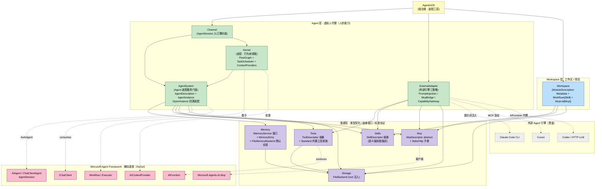
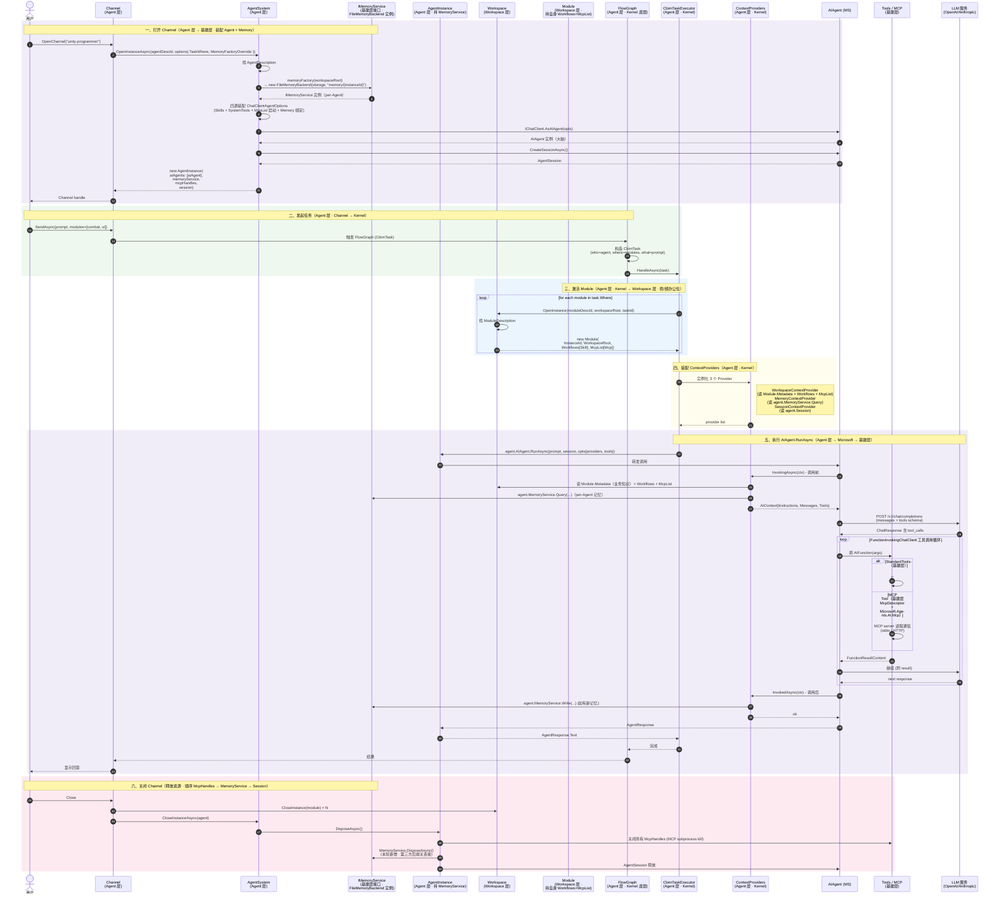

# CBIM v2 Unity 架构全景

本文档是 CBIM v2 Unity 实现的顶层架构地图。更细节的描述见各模块 `.dna/module.md`。

---

## 零、CBIM 认知框架（顶层 mental model）

在阅读后续技术分层之前，先记住这一条认知前提——它是整套架构的"宪法序言"：

> **CBIM 是一个"复合 Agent"——一个拥有全知全能的人。**

| 隐喻 | CBIM 对应物 | 三层归属 |
|------|-------------|----------|
| **这个全能的人** | CBIM 整体（`AgenticOS` 装配根） | 跨三层 |
| **大脑皮层 / 协调中枢** | 行为树调度（`Kernel/FlowGraph` + `Kernel/TaskScheduler`） | Agent 层内部 |
| **脑干 / 小脑 / 各专项脑区** | 内部各 Agent 实例 / 外部 Agent 句柄 | Agent 层 |
| **长期记忆** | Memory 实例（绑定 Agent） | 基建抽象（`IMemoryService`）+ Agent 持实例 |
| **工具与武器** | Tool 接口 / Skill 接口 / MCP 协议 | 基建（类型契约）+ Agent / Workspace 各自实例化 |
| **办公位 / 工作空间** | Module 模块对象 | Workspace 层 |
| **当下思考流** | AgentSession 运行态 | Agent 层（Microsoft AgentSession host） |

### 核心三定理（复合 Agent 行为铁律 · 沿用不变）

1. **皮层定理（行为树 = 协调）**——复合 Agent 的所有跨子 Agent / 跨工作区 / 跨轮次的协作流程，都由行为树调度以确定性流程图驱动；行为树的边即"皮层突触"，不是 prompt 里的"请决定下一步"。
2. **脑区定理（子 Agent = ReAct）**——每个内部 Agent 只做 Reason-Act 自身循环（读上下文 → 想一步 → 调工具 → 产结果）；子 Agent 不调度其他子 Agent，不感知行为树的存在。
3. **武器库定理（Tool / Skill / MCP = 共享标准 + 私有实例）**——**接口标准跨场景共享**（基建层一份），**实例集合各方独立持有**（Agent 持自己的 Tool/Skill/MCP 集合，Workspace 模块也持自己的 MCP/Skill 集合）。同一标准、不同实例——这是三层模型对原"跨维度共享抽象"的精确化表达。

### 三定理与三层模型的关系

三定理是 **行为视角**（这个复合 Agent 怎么动），三层模型是 **源码视角**（代码怎么组织）。二者正交：

- 皮层定理在源码上落地为 Agent 层内部的 `Kernel/FlowGraph`——皮层是脑功能，归 Agent 层。
- 脑区定理在源码上落地为 Agent 层装配出的每个 Agent 实例——一个脑区就是一个 Agent 实例。
- 武器库定理在源码上跨基建层（类型契约）与 Agent / Workspace 层（实例集合），是「类型 vs 实例」原则的具象。

```
        ┌─────────────────────────────────────────────┐
        │  CBIM = 一个复合 Agent（这个人）             │
        │                                             │
        │  Agent 层（虚拟人代理）                      │
        │    ├ 皮层（Kernel/FlowGraph）                │
        │    ├ 脑区集合（AgentSystem / ExternalAdapter│
        │    │   装配出来的 Agent 实例 / 外部 Agent 句柄）│
        │    └ 入口（Channel）                         │
        │                                             │
        │  Workspace 层（办公位 / 工作区）             │
        │    └ 模块对象（Module）                      │
        │                                             │
        │  基建层（类型契约 · 武器库底座）              │
        │    └ Tool / Skill / MCP / IMemoryService /  │
        │      Storage（接口与默认实现）               │
        └─────────────────────────────────────────────┘
```

后续第一节~第十二节是这套认知的技术分层落地。**记不住时，回到这一节。**

---

## 一、核心设计哲学

**两条主线贯穿整个 CBIM v2：**

```
不造轮子（C6 稳定抽象）：
  能用 Microsoft Agent Framework 替代的，全部交出去
  CBIM 只写"业务独有"的薄胶水层

三层切分（C2 单一职责 + C3 单向依赖）：
  基建层      ← 最稳定（类型契约 / 抽象接口 / 标准协议）
  Agent 层    ← 中等稳定（人 = Memory + Tool/Skill/MCP 集合 + AIAgent 脑区集合）
  Workspace 层← 易变（工位 + 业务流程 + 业务接入点）
  Agent 层 ⊥ Workspace 层 —— 二者互不依赖，task 期由 Kernel 组合
```

**为什么从六层收敛到三层：** 之前的「调度 / 引擎 / 业务 / 能力 / 基座 / 扩展」六层是源码组织的精确分类，但顶层心智负载过高（要记 6 个层、6 个职责、6 套铁律）。本轮收敛为「基建 / Agent / Workspace」三层——三个名字、三句话、三个清晰职责。六层并未消失，只是退化为三层内部的子结构（调度、外部 Agent 适配仍在 Agent 层内部存在）。

---

## 二、三层架构总览

CBIM v2 按照「稳定性递增 + 职责单一」原则切分为 **三个层级**：

| 层级 | 核心职责 | 模块归属 |
|------|----------|----------|
| **基建层**<br/>（Infrastructure Primitives · 类型契约） | 定义 Agent 与 Workspace 共同遵守的类型约定、抽象接口、标准协议；不承载业务行为、不持业务状态 | `Tools/` + `Skills/` + `Mcp/` + `Memory/`（含 `IMemoryService` 接口 + `FileMemoryBackend` 默认实现）+ `Storage/` |
| **Agent 层**<br/>（虚拟人代理 · 人的能力） | 一个 Agent 实例 = 一个虚拟人代理 = 多个 AIAgent 脑区 + per-Agent 的 Memory 实例 + Tool/Skill/MCP 实例集合；包括皮层（行为树调度）与会话入口 | `AgentSystem/` + `ExternalAdapter/` + `Kernel/` + `Channel/` |
| **Workspace 层**<br/>（工作区 / 项目 · 工位） | 模块树 + 模块对象（业务知识 + 业务 Skill 集合 + 业务 MCP 集合 + 模块负责人编制）；模块不持记忆 | `Workspace/` |

**两条铁律性约束：**

- **基建抽象稳定优于完整** —— 接口暴露最小必要表面；Tool/Skill/MCP/Memory 四件套是依赖图最底层，变更影响全栈。
- **Agent 层 ⊥ Workspace 层** —— 二者互不依赖。Agent 实例进入某 Workspace 模块执行任务时，Agent 自带的 Tool/MCP/Skill 与 Workspace 自带的 Skill/MCP 在装配点合并（按 Id 去重）——这是 **task 期的运行期组合**，由 Kernel 完成，不是模块间的静态依赖。

**Microsoft Agent Framework 是横向底座（NuGet）** —— 不属于任何 CBIM 层；所有 CBIM 模块都在其上构建。

---

## 三、全景依赖图



**图例：**
- 紫 = 基建层 / 绿 = Agent 层 / 蓝 = Workspace 层
- 粉 = Microsoft Agent Framework 横向底座 / 灰 = 外部引擎黑盒 / 黄 = 组合根
- **实线箭头** = 直接代码依赖；**虚线箭头** = 实现接口 / 协议边界 / 跨进程通信

**关键观察：**

- Agent 层与 Workspace 层各自向基建层引用 `Tools` / `Skills` / `Mcp`（Agent 层还引用 `Memory`）；二者**不互相连边**——这是「Agent 层 ⊥ Workspace 层」铁律的图上体现。
- 三层都不反向引用 `AgenticOS`——组合根仅装配，不参与运行期数据流。

---

## 四、依赖单向铁律

```
Workspace 层 → 基建层
Agent 层    → 基建层
Agent 层    ⊥ Workspace 层    (互不依赖；task 期由 Kernel 组合)
基建层      ⊥ 任何 CBIM 同级层 (依赖图最稳定底层)
组合根      → 三层             (仅装配；不参与运行期数据流)

外向虚线 (不被反向引用)：
基建 / Agent / Workspace → Microsoft Agent Framework
Agent 层 (ExternalAdapter) → 外部引擎进程
```

**铁律：**

1. **基建层是依赖图最稳定底层** —— 不依赖任何 CBIM 同级层；变更基建抽象 = 全栈影响，需高度审慎。
2. **依赖只能从易变指向稳定** —— Workspace 层与 Agent 层都依赖基建层；反向严禁。
3. **Agent 层 ⊥ Workspace 层** —— 二者互不依赖。所有跨层协同走运行期组合（Kernel / ContextProvider / 组合根），不走静态引用。
4. **类型契约共享 / 实例集合独立** —— 同一基建抽象（如 `McpDescriptor`）被 Agent 与 Workspace 同时引用是合理的；引用的是 **类型**，不是 **实例**。两侧的实例集合独立，仅在 task 期装配点合并去重。
5. **外部引擎单向纳入** —— ExternalAdapter 是 Agent 层的一支，对外通过三策略与外部引擎进程通信；外部引擎不反向引用 CBIM。
6. **Microsoft 框架是横向底座** —— 不属于任何 CBIM 层；所有 CBIM 模块都在其上构建。

---

## 五、各层详解

### 5.1 基建层 · 类型契约 / 抽象接口 / 标准协议

> **定位：** 整个系统的稳定底层。本层不承载任何业务行为，只定义「Agent 层和 Workspace 层共同遵守的标准」。

**五件类型契约：**

| 子模块 | 提供的类型契约 | 关键事实 |
|--------|---------------|----------|
| `Tools/` | `ToolDescriptor`——工具家族声明抽象 | 含 `Standard/` 子模块（Files / Search 内置工具家族） |
| `Skills/` | `SkillDescriptor`——技能 / 工作流描述抽象（语义级，含 `Content`） | 业务侧以 `ModuleDescription.Workflows` 别名复用同抽象 |
| `Mcp/` | `McpDescriptor`（abstract + Stdio/Http 子类）+ `McpTransportKind` 枚举 | 不持「角色」字段——既可描述「client 去连 server」也可描述「自起 server 暴露给外部引擎」 |
| `Memory/` | `IMemoryService` 接口 + `MemoryEntry` 记录类型 + `FileMemoryBackend` 默认实现 | **本轮重点**：从「全局服务」抽为「per-Agent 实例化的接口 + 默认实现」 |
| `Storage/` | `FileBackend`——文件系统原语（原子写 / JSON / 路径解析） | root 注入，去 Unity 耦合 |

**基建层铁律：**

- 基建层模块**不依赖**任何 Agent 层 / Workspace 层模块——它是依赖图最稳定的底层。
- 基建层只定义类型与接口，**不持业务状态**（`FileBackend` 持有 root 路径不算业务状态；那是 IO 配置）。
- 基建抽象一旦定义稳定，Agent 层 / Workspace 层可自由派生具体实例；后续接入 Pinecone / 第三方 MCP server / 自定义工具家族都不需要改基建层。
- **Tool / Skill / MCP / Memory 四件套不再被叫做「能力层」**——它们是「能力的类型契约」。能力（具体的 Tool / Skill / MCP / Memory 实例集合）属于谁，看谁实例化谁。

**接口 + 默认实现是基建层标准范式：**

| 抽象 | 默认实现 | 第三方派生路径 |
|------|---------|----------------|
| `ToolDescriptor` | `Tools/Standard/StandardToolsService.CreateFamilies` | 增加新家族（改 `Standard/`） |
| `SkillDescriptor` | （仅类型 · 无默认实现，由调用方实例化）| 加载 SKILL.md 转描述符（未来 Loader） |
| `McpDescriptor` | （仅类型 · 协议由 `Microsoft.Agents.AI.Mcp` 客户端承载）| 增加新传输形态（如 named pipe）→ 加子类 |
| `IMemoryService` | `FileMemoryBackend`（基于 `FileBackend` 的本地 JSON）| 实现新 `IMemoryService` 接 Pinecone / Weaviate / VectorStore |

### 5.2 Agent 层 · 虚拟人代理（人的能力）

> **定位：** 「人」的能力。一个 Agent 实例 = 一个虚拟人代理。

**Agent 实例的五件事拼装：**

```
Agent 实例 = {
   思维对象集合：封装 Microsoft AIAgent（多个 ChatClientAgent 共享下方 4 项资源）
   Memory 实例：实现基建 IMemoryService 接口（per-Agent 一份）
   Tool 集合：按基建 Tool 标准派生（per-Agent 独立实例集）
   MCP 集合：按基建 MCP 标准派生（per-Agent 独立实例集）
   Skill 集合：按基建 Skill 标准派生（per-Agent 独立实例集）
}
```

**思维对象集合 = 多脑区** —— 一个 Agent 内部可装配多个 Microsoft `AIAgent`（如 Reasoner + Critic + Summarizer），这些「脑区」**共享同一份** Memory / Tool / MCP / Skill 资源池。这是「复合 Agent 的脑区共用同一具身」的物理落地——人有左右脑，但记忆和身体是一份。

**Agent 层物理模块构成：**

| 子模块 | 一句话职责 | 在 Agent 层中的角色 |
|--------|----------|---------------------|
| `AgentSystem/` | Agent 装配服务门面（AgentDescription schema + OpenInstance 四源装配 + Session 写侧 + 持 IMemoryService 实例）| 内置 Microsoft AIAgent 装配家 |
| `ExternalAdapter/` | 外部 Agent 引擎适配层（Claude Code / Cursor / Codex 三策略）| 外部引擎装配家——同样产出 `task.Who`，与 AgentSystem **互不感知、互不依赖** |
| `Kernel/` | 行为树调度 + `CbimTask` 不可变三元组 + 三个 `AIContextProvider`（Workspace / Memory / Session）| 皮层——跨脑区协调的"突触网络" |
| `Channel/` | Microsoft AgentSession 薄封装 | Agent 层入口（用户视角的会话句柄）|

**Agent 层依赖基建层**：`AgentSystem` 引用 `CBIM.Tools` / `CBIM.Skills` / `CBIM.Mcp` / `CBIM.Memory.IMemoryService` / `CBIM.Storage`；不反向。

**AgentSystem 概念上重命名为 Agent 层（物理目录保留）：**

| 维度 | 旧表达 | 新表达 |
|------|--------|--------|
| 概念名 | AgentSystem 引擎层 | **Agent 层**（虚拟人代理） |
| 服务门面 | `AgentSystem` 服务类 | 保留——可类比 `PersonnelService 装配 Person` |
| 物理目录 | `AgentSystem/` | **保留**——下切片视代码迁移成本再决定是否改为 `Agent/` |
| C# 命名空间 | `CBIM.AgentSystem` | 本轮不动 |

**Agent 裂变规则（铁律）：** 不做「全能 agent」，保持专精。`SystemTools 家族数 > 4` / `McpList server 数 > 3` / `Skills 数 > 8` / 专精领域跨度 > 1 主领域 / `Soul > 3000 token` 任一命中 → HR 立即触发裂变。详见 `AgentSystem/.dna/module.md`。

**双装配家平级铁律：** AgentSystem 与 ExternalAdapter 是 Agent 层内的两条装配家路径，平级、互不感知、互不依赖。统一在 `Kernel/FlowGraph` 侧达成——同为 `task.Who` 的可调度目标。

### 5.3 Workspace 层 · 工作区 / 项目（工位）

> **定位：** 「工位」+「工位上贴的规章」+「工位接的外部系统」+「工位负责人编制」。

**模块对象的三段式组成：**

| 段 | 字段 | 语义 | 类型来源 |
|----|------|------|----------|
| **是什么** | `Metadata` | 业务知识载体（Local: `.dna/module.md` 文件 / Remote: 文档 endpoint）| 本模块 `ModuleMetadata`（含 `LocalModuleMetadata` / `RemoteModuleMetadata`）|
| **能做什么** | `Workflows: IReadOnlyList<SkillDescriptor>` | 业务 Skill 集合（贴在墙上的标准作业流程清单）| **基建层 `CBIM.Skills.SkillDescriptor`**（同抽象的业务别名）|
| **怎么做** | `McpList: IReadOnlyList<McpDescriptor>` | 业务 MCP 集合（业务模块接入哪些外部业务系统）| **基建层 `CBIM.Mcp.McpDescriptor`**（同抽象、不同语义归属）|

**业务 Skill 与业务 MCP 是 Workspace 层的核心挂载点：**

- 业务 Skill（`Workflows` 字段名）—— 该工作区的标准作业流程清单。
- 业务 MCP（`McpList` 字段名）—— 该工作区接入的外部业务系统（企业 ERP / CDN 控制台 / Jira）。

**与基建层的派生关系**：模块的 Skill 集合和 MCP 集合**实例**归属 Workspace 模块，**类型契约**来自基建层。这是「类型共享 / 实例不共享」原则的具象落地。

**模块拓扑树的两种物理形态：**

| 形态 | 描述 | `ModuleMetadata` 子类 |
|------|------|-----------------------|
| **本地文件夹** | Unity 工程内的 Assets 目录 / 本机文件系统 | `LocalModuleMetadata`（FilePath） |
| **云端空间** | 远程协作空间（远端 wiki / OpenAPI 文档服务 / spec registry）| `RemoteModuleMetadata`（Endpoint + AuthToken）—— 虚拟网关模块 |

**Workspace 层依赖基建层**：`Workspace` 引用 `CBIM.Mcp` + `CBIM.Skills` + `CBIM.Storage`（三个基建抽象）。**不依赖 Agent 层**——这是 v2 三层模型的最重要约束之一。**不持 Memory**——记忆是 Agent 的，不是模块的；模块只有规章、流程、接入点。

---

## 六、类型契约共享 vs 实例集合独立（武器库定理的精确表达）

本节是 v2 三层模型相对原六层模型的**核心表达升级**。

### 旧表达：跨维度共享抽象

旧六层下，常说「`McpDescriptor` 同时被 `AgentDescription.McpList` 与 `ModuleDescription.McpList` 引用——同一抽象、不同归属，CBIM 内唯一的跨维度共享点」。

**问题**：「跨维度共享」字面让人误以为「Agent 和 Workspace 共享同一份 `McpList` 实例集合」。事实并非如此——两侧持的是同抽象类型的不同实例集合。

### 新表达：类型契约共享 / 实例集合独立

**类型契约由基建层提供一份**——`ToolDescriptor` / `SkillDescriptor` / `McpDescriptor` / `IMemoryService` 都是基建层一份抽象。

**实例集合由 Agent 与 Workspace 各自独立持有**：

| 类型契约 | Agent 侧实例集合 | Workspace 侧实例集合 |
|----------|------------------|----------------------|
| `ToolDescriptor` | `AgentDescription.SystemTools`——agent 自带的工具家族 | （Workspace 不持工具——工具归 Agent） |
| `SkillDescriptor` | `AgentDescription.Skills`——agent 会的手艺 | `ModuleDescription.Workflows`——业务能走的流程 |
| `McpDescriptor` | `AgentDescription.McpList`——agent 自带的 MCP（跟人走）| `ModuleDescription.McpList`——业务自带的 MCP（跟业务走）|
| `IMemoryService` | `AgentInstance.MemoryService`——per-Agent 一份 | （Workspace 不持 Memory——模块没有记忆）|

**关键判断：**

1. **同一标准** —— 两侧引用同一基建抽象类型；协议变更只改基建层一处。
2. **不同实例** —— Agent / 各 Module 各持各的实例集合；模块间互不感知。
3. **task 期合并** —— `Agent` 进入某 `Module` 执行任务时，由 Kernel 在装配点合并（按 Id 去重）；模块离开后 Agent 不携带 Module 资源。

### 为什么 Memory 与 Tool 不对称

- **Memory** —— 只 Agent 持，Workspace 不持。人有记忆，工位没有「工位的记忆」。
- **Tool** —— 只 Agent 持，Workspace 不持。工具能力是「谁会用」而非「在哪用」。
- **Skill** —— 双侧都持（业务侧以 `Workflows` 别名）。业务流程是工位的财产，技能是人的财产，本质都是「该如何走这件事」。
- **MCP** —— 双侧都持。MCP server 既可以是「人会用的接入点」（git-mcp 跟 agent 走）也可以是「业务自带的接入点」（cdn-prod-mcp 跟具体 CDN 实例走）。

**这种不对称是设计意图，不是疏漏** —— 反映了三层模型对「能力归属」的精确判断。

---

## 七、"人 + 办公位" 类比

抽象描述精确但难记。换个 mental model —— CBIM 一次任务的两个主角，是**一个人坐到一个办公位上干活**。

> **隐喻分层警告：** 本节"Agent = 一个人"是**Agent 层视角**——指被装配出的单个 AIAgent 实例（脑区）。
> 不要与"零、CBIM 认知框架"的"CBIM 整体 = 复合 Agent / 一个人"混淆——那是**系统视角**，指整套 Unity 进程。
> 两层都成立：CBIM 整体是一个复合 Agent（这个全能的人），其内部每个 Agent 实例都是这个复合体里的一个专项脑区。

| 视角 | "人"指什么 | 模块归属 |
|------|------------|----------|
| **系统视角**（顶层认知框架） | CBIM 整体 = 一个复合 Agent | `AgenticOS` 装配根（跨三层） |
| **Agent 层视角**（本节）| 单个 Agent 实例 = 这个复合 Agent 的一个脑区 | `AgentSystem` / `ExternalAdapter` 产出的 `AgentInstance` / `ExternalAgentHandle` |

### Agent（人 · 脑区视角）—— Agent 层产出

| 字段 | 类比 | 类型契约来源 |
|------|------|--------------|
| `AIAgents`（思维对象集合）| 大脑（多个脑区共享身体）| Microsoft `AIAgent` |
| `Description.Soul` / `Identity` | 人格 / 身份 | Agent 层（`AgentDescription`）|
| `Description.Skills` | 经验技能（会做的事）| 基建层（`SkillDescriptor`）|
| `Description.SystemTools` | 随身工具（笔记本 / IDE）| 基建层（`ToolDescriptor`）|
| `Description.McpList` | 协作能力（接外部系统的本事）| 基建层（`McpDescriptor`）|
| `MemoryService` | 长期记忆 | 基建层（`IMemoryService` 接口 + `FileMemoryBackend` 默认实现）|
| `Session` | 当下思考记录 | Agent 层（Microsoft `AgentSession`）|
| `McpHandles` | 启动中的工具进程 | Agent 层（运行期资源）|
| `DisposeAsync` | 下班关电脑 | Agent 层（释放顺序：McpHandles → MemoryService → Session）|

### Module（办公位）—— Workspace 层产出

| 字段 | 类比 | 类型契约来源 |
|------|------|--------------|
| `WorkspaceRoot` | 办公位位置 | Workspace 层 |
| `Description.Metadata` | 工作资料 + 操作说明（贴在墙上的规章）| Workspace 层（`ModuleMetadata`）|
| `Description.Workflows` | 工作流程（标准作业流程清单）| 基建层（`SkillDescriptor`）|
| `Description.McpList` | 接入业务系统（连企业 ERP / CDN 控制台）| 基建层（`McpDescriptor`）|
| `ActivatedByTaskId` | 这次工单 | Agent 层（`Kernel/TaskScheduler` 产出）|

### Task = 工单 —— Agent 层（Kernel）产出

```
派 [某个人] 去 [一个或多个办公位] 干 [某件事]
   ↑              ↑                 ↑
   who            where             what
   (Agent 层)     (Workspace 层)    (Agent 层 · Kernel)
```

- 人**带着**自己的经验 / 工具 / MCP / 记忆（跟人走 · per-Agent 实例）
- 用办公位的**资料 / 流程 / 接入系统**（跟工位走 · per-Module 实例）
- 同一个人坐不同办公位 → 经验 / 记忆通用 + 工位资源不同
- 同一个办公位被不同人坐 → 工位资源通用 + 经验 / 记忆不同

### Agent 主动 vs Module 被动

| | Agent（人） | Module（办公位） |
|--|------------|-----------------|
| 主动性 | 主动：有大脑会思考 | 被动：等人来用 |
| 资源生命周期 | 重 —— 启动 MCP / 维护 Session / 持 Memory 实例 / 需 Dispose | 轻 —— 纯激活记录 |
| 谁能离开 | 下班关电脑（DisposeAsync）| 工位不关电脑 |

---

## 八、数据模型（5 层）

```
第 1 层 · MS 框架底座
  IChatClient / AIAgent / ChatClientAgent / AgentSession
  AIContextProvider / AIFunction / Workflow / Executor
  Microsoft.Agents.AI.Mcp（client）

第 2 层 · CBIM 基建层抽象（类型契约 · 跨层共享）
  ToolDescriptor / SkillDescriptor / McpDescriptor
  IMemoryService（接口）+ MemoryEntry
  FileBackend

第 3 层 · CBIM 基建层默认实现
  Tools/Standard/StandardToolsService（工具家族实现）
  FileMemoryBackend（IMemoryService 默认实现）

第 4 层 · 静态描述符（层归属 · 实例集合独立）
  AgentDescription      ← Agent 层（持 Skills / SystemTools / McpList / MemoryFactory）
  ModuleDescription     ← Workspace 层（持 Workflows[Skill] / McpList）
  + 子对象：ModuleMetadata (Local/Remote)

第 5 层 · 运行时实例
  AgentInstance  (Agent 层 · 人，IAsyncDisposable，持 IMemoryService 实例)
  Module (Workspace 层 · 办公位，纯激活记录)
  ExternalAgentHandle (Agent 层 · ExternalAdapter 产出 · 不透明)
```

---

## 九、Tool 是唯一安全边界（沿用铁律）

**铁律：** 无论内置 AIAgent 还是外部引擎，**所有副作用最终都必须穿过基建层的 `Tools/Standard` 或 `Mcp`**。

- **外部 Agent 无特权通道。** Claude Code / Cursor / Codex 等不能绕过 CBIM 安全层直接访问文件 / 网络 / shell —— 仅能通过 ExternalAdapter 三策略提供的 `Tools/Standard` / `Mcp` 接口调用。
- **与内置 AIAgent 同等待遇。** 外部引擎不享受任何「黑名单豁免」或「快通道」—— 与 CBIM 内置 Agent 共享同一沙盒 / 审计 / 追踪体系。
- **基建层是这条铁律的物理落点。** Tool 接口与 MCP 协议都在基建层定义，所有 Agent / Workspace 副作用最终都回到基建层抽象——这是「基建层是依赖图最稳定底层」的安全意义。
- **为什么是「唯一」？** 外部引擎独立进程 / 内部不可控 → CBIM 唯一可控点只能是「外部引擎发起的副作用」，那仅能在 Tool / MCP 层拦截。如果外部引擎可以绕过 Tool 直接访问文件 / 网络 / shell，那所有安全事都是空谈。
- **本条为 CBIM 多引擎家接入的设计刚纲。** 任何新增引擎适配（增加路由、代理、提示词注入点）都不得绕过 Tool / MCP 边界。**违反本条 = 违反架构**，没有商量余地。

---

## 十、装配链路（Task 触发后）

按三层归属标注每一步：

```
Task = Agent + ModuleList + Requirement       (Agent 层 · Kernel/TaskScheduler 产出)
   ↓
【Agent 层 · Kernel】FlowGraph 接收 CbimTask
   ↓
【Agent 层 · AgentSystem】OpenInstance(agentDescId, options{ TaskWhere, MemoryFactoryOverride })
        或【Agent 层 · ExternalAdapter】OpenInstance(desc, opts)    ← 外部引擎路径
   ↓
  AgentSystem 内部四源装配：
   0. Memory  (本轮新增)
      memoryFactory = options.MemoryFactoryOverride
                    ?? desc.MemoryFactory
                    ?? (root => new FileMemoryBackend(storage, $"memory/{instanceId}"))
      memoryService = memoryFactory(workspaceRoot)         ← 基建层 IMemoryService 实例
   1. Skills  → AgentSkillsProvider.Render(desc.Skills)    ← 基建层 SkillDescriptor
   2. SystemTools → StandardToolsService.CreateFamilies    ← 基建层 ToolDescriptor / Standard
   3. McpList → 启 server / 进远端 + 包 AIFunction         ← 基建层 McpDescriptor + Microsoft.Agents.AI.Mcp
   4. 合并 → allFns
      装配 ChatClientAgentOptions
        - Name = desc.Name
        - Description = desc.Identity
        - Instructions = desc.Soul + skill content
        - Tools = allFns
      _chatClient.AsAIAgent(opts) → AIAgent
      agent.CreateSessionAsync() → AgentSession
      new AgentInstance(
          aiAgents: [aiAgent],
          memoryService,
          mcpHandles,
          session)
   ↓
【Workspace 层】Workspace.OpenInstance(moduleDescId, workspaceRoot)
   ↓
   返回 Module（持自身 Workflows[Skill] + McpList[Mcp]）
   ↓
【Agent 层 · Kernel】CbimTaskExecutor (FlowGraph 内部)
   ↓
   装配 3 个 ContextProvider:
     - WorkspaceContextProvider (读 Module.Metadata + Workflows + Module.McpList)
     - MemoryContextProvider (读 AgentInstance.MemoryService.Query)
     - SessionContextProvider (读 AgentInstance.Session)
   ↓
   AgentInstance.AIAgent.RunAsync(prompt, AgentInstance.Session, providers, tools)
   ↓
   Microsoft Agent Framework 内部循环
   (工具调用 → 基建层 Tools/Standard 或 Mcp client)
   ↓
   AgentResponse
   ↓
Task 结束:
【Agent 层】AgentSystem.CloseInstance(agent)
   → DisposeAsync 顺序: McpHandles → MemoryService → Session
【Workspace 层】Workspace.CloseInstance(module)
```

**Memory + MCP 是唯二需显式释放的源**——前者可能持外部连接（Pinecone client），后者持外部 server 进程 / 连接。`CloseInstance` 接口存在的最强动机是二者。

---

## 十一、当前完成度

```
已完成（代码 + .dna）
   ├── 基建层
   │   ├── Storage（FileBackend root 注入）
   │   ├── Tools（顶层抽象 + Standard 实现）
   │   ├── Skills（SkillDescriptor 顶层抽象）
   │   ├── Mcp（McpDescriptor abstract + Stdio/Http 子类）
   │   └── Memory（MemoryService 单类实现 · 待按本轮抽接口）
   ├── Agent 层
   │   ├── AgentSystem（AgentDescription + AgentInstance + 服务门面 · 待补 Memory 字段）
   │   └── ExternalAdapter（.dna 已就位 · 代码待落地）
   ├── Workspace 层
   │   └── Workspace（ModuleDescription + Metadata + 服务门面）
   └── Microsoft Agent Framework（ThirdParty/MsExtensionsAI 44 DLL 全套）+ 5 个学习 Demo

待实施（本轮 .dna 已规约 · 下切片代码落地）
   ├── 基建层 · Memory 接口抽取
   │   ├── 拆 MemoryService.cs → IMemoryService.cs（接口）+ FileMemoryBackend.cs（默认实现）
   │   └── MemoryEntry / MemoryScanFilter / MemoryStats 不可变 record
   ├── Agent 层 · Memory 接线
   │   ├── AgentDescription 增 MemoryFactory 字段
   │   ├── OpenInstanceOptions 增 MemoryFactoryOverride 字段
   │   ├── AgentInstance 增 MemoryService: IMemoryService 字段
   │   ├── AgentInstance 增 AIAgents: IReadOnlyList<AIAgent> 字段（预留多脑区）
   │   └── CloseInstance 调 MemoryService.DisposeAsync
   ├── Agent 层 · Kernel
   │   ├── Kernel/TaskScheduler/CbimTask（三元组数据类）
   │   ├── Kernel/FlowGraph（基于 MS Workflows + CbimTaskExecutor）
   │   └── Kernel/ContextProviders（Workspace / Memory / Session 三个 AIContextProvider）
   ├── Agent 层 · Channel（AgentSession 薄封装）
   ├── Agent 层 · ExternalAdapter 三策略实现
   │   ├── PromptInjectionAdapter（Claude Code CLI）
   │   ├── McpBridgeAdapter（Cursor / 原生 MCP 客户端）
   │   └── CapabilityGatewayAdapter（Codex / 任意 HTTP LLM）
   └── 门面 · AgenticOS（组合根 · 装配三层）

长期补全
   ├── AgentSystem.OpenInstance 四源装配实际接线
   ├── ContextProviders 真实数据注入
   └── 示例 AgentDescription / ModuleDescription
```

---

## 十二、关键文件清单（按三层归属）

| 层级 | 模块 | 文件 |
|------|------|------|
| **基建层** | Storage | `Storage.cs`（FileBackend + Json）|
| **基建层** | Tools | `Tools/ToolDescriptor.cs` |
| **基建层** | Tools/Standard | `Tools/Standard/StandardToolsService.cs` + `Sandbox/` + `Families/` |
| **基建层** | Skills | `Skills/SkillDescriptor.cs` |
| **基建层** | Mcp | `Mcp/McpDescriptor.cs`（abstract）+ `Mcp/StdioMcpDescriptor.cs` + `Mcp/HttpMcpDescriptor.cs` + `Mcp/McpTransportKind.cs` |
| **基建层** | Memory | `Memory/IMemoryService.cs`（接口 · 待拆）+ `Memory/MemoryEntry.cs` + `Memory/FileMemoryBackend.cs`（默认实现 · 待拆）|
| **Agent 层** | AgentSystem | `AgentSystem/AgentDescription.cs` + `AgentSystem/AgentInstance.cs` + `AgentSystem/AgentSystemService.cs` |
| **Agent 层** | ExternalAdapter | `ExternalAdapter/.dna/module.md`（代码待落地）|
| **Agent 层** | Kernel | `Kernel/TaskScheduler/` + `Kernel/FlowGraph/` + `Kernel/ContextProviders/`（代码待落地）|
| **Agent 层** | Channel | `Channel/`（代码待落地）|
| **Workspace 层** | Workspace | `Workspace/ModuleDescription.cs` + `Workspace/ModuleMetadata.cs` + `Workspace/Module.cs` + `Workspace/WorkspaceService.cs` |
| **组合根** | AgenticOS | `AgenticOS.cs`（待装配三层）|
| **横向底座** | MS DLLs | `ThirdParty/MsExtensionsAI/`（44 个）|

---

## 十三、运行时时序图（一次 Task 全流程）

下图覆盖从「用户打开 Channel」到「任务完成关闭」的完整运行时调用链，
六个阶段标注在左侧，对应三层架构的协作链路。



### 关键时序约定

| 阶段 | 谁主动 | 关键约束 |
|------|-------|---------|
| 一、装配 Agent | Agent 层 Channel → Agent 层 AgentSystem → 基建层 Memory | 一个 Channel 一次性绑一个 Agent；四源装配（Memory + Skills + SystemTools + McpList）；MemoryFactory 优先级 = Override > Description > 默认 FileMemoryBackend |
| 二、触发任务 | 用户 → Agent 层 Channel | Task 是不可变 record；Channel 不直接调 AIAgent，必走 FlowGraph |
| 三、激活 Module | Agent 层 Kernel → Workspace 层 Workspace | 多 module 时 OpenInstance 多次（每个独立 instanceId）；Module 自带 Workflows + McpList |
| 四、装配 Context | Agent 层 Kernel → 3 个 Provider | Provider 是无状态实例，每次任务新构造，不复用；同时读 Workspace 与 Memory |
| 五、LLM 执行 | Agent 层 → MS Framework → 基建层 | 工具调用循环全在 MS 框架内部，最终穿过基建层 Tools/Standard 或 Mcp |
| 六、释放 | Agent 层 Channel → 各 service | AgentInstance.DisposeAsync 必关 McpHandles + MemoryService；Module 无资源仅清记录 |

---

## 十四、参考文档

- 各模块 `.dna/module.md` —— 单模块完整设计
  - `.dna/module.md`（根）—— v2 三层模型总纲
  - `AgentSystem/.dna/module.md` —— Agent 装配服务门面（含 Memory 接线 + 四源装配）
  - `Workspace/.dna/module.md` —— Workspace 层模块对象三段式（含业务 MCP + 业务 Skill 挂载点）
  - `Memory/.dna/module.md` —— IMemoryService 接口 + FileMemoryBackend 默认实现 + per-Agent 实例化
  - `Tools/.dna/module.md` / `Skills/.dna/module.md` / `Mcp/.dna/module.md` —— 三件基建类型契约
  - `ExternalAdapter/.dna/module.md` —— 外部引擎适配层完整契约（含 `IExternalEngineAdapter` C# 草案）
- `ThirdParty/MsExtensionsAI/_README.md` —— DLL 清单 + 升级路径
- `ThirdParty/MsExtensionsAI/_MSAI_Architecture.md` —— Microsoft Agent Framework 架构图
- `ThirdParty/MsExtensionsAI/_MSAI_ClassReference.md` —— Microsoft 类参考手册
- `ThirdParty/MsExtensionsAI/_MCP_EVAL_REPORT.md` —— MCP 包 Unity 兼容性评估
