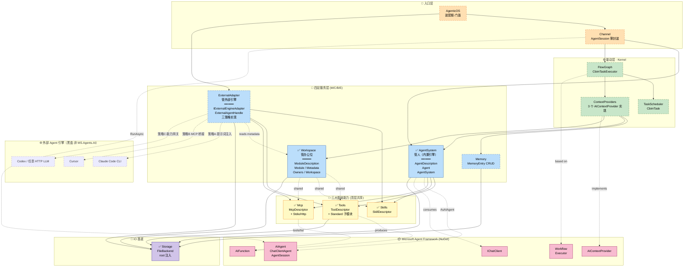
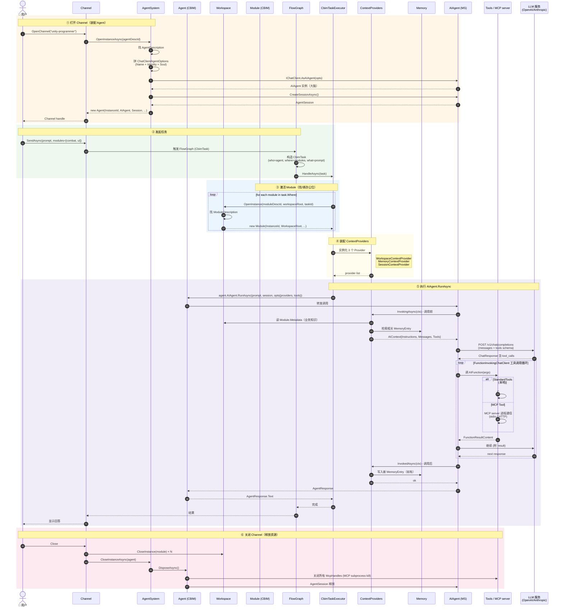

# CBIM v2 Unity 架构全景

本文档是 CBIM v2 Unity 实现的顶层架构地图。更细节的描述见各模块 `.dna/module.md`。

---

## 一、核心设计哲学

**两条主线贯穿整个 CBIM v2：**

```
不造轮子（C6 稳定抽象）：
  能用 Microsoft Agent Framework 替代的，全部交出去
  CBIM 只写"业务独有"的薄胶水层

维度对偶（C2 单一职责）：
  能力（Capability）= Agent  ← 谁能动 + 拿什么动
  业务（Business）  = Module ← 在什么工作区干、能干什么
  二者正交，由 Task 在运行时交叉成立
```

---

## 二、全景依赖图



**图例：**
- 🟧 入口层 / 🟩 驱动层 / 🟦 服务层（M/C/B/E 四足）/ 🟨 基础能力 / 🟪 IO 基底 / 🟥 Microsoft 框架 / 🌐 外部引擎黑盒
- **`✅`** 代码已落地 / **虚线框** 待实施
- **实线箭头** 直接代码依赖 / **虚线箭头** 实现接口 / 使用关系 / 跨维度共享 / 跨进程协议边界

---

## 三、关键拓扑特征

### 单一程序集 + 严格分层

- 全部 .cs 归 `CBIM.asmdef` 一个程序集
- 命名空间承担分层语义
- `noEngineReferences: true` —— CBIM 零 Unity 耦合（Unity 接缝仅在 `Assets/Desktop/`）

### 依赖单调向下

```
入口 → 驱动 → 服务(M/C/B/E) → 基础能力 → Storage
                ↘                ↗
                 共享基础能力（无反向）
                ↘                ↗
                 Microsoft 框架  ←  ExternalAdapter →  外部引擎进程
                                    （E 仅外向访问，不被任何稳定层反向引用）
```

### 跨维度共享点（CBIM 唯一）

`AgentSystem` 和 `Workspace` 都引用 `Tools/Skills/Mcp`，但 Tools/Skills/Mcp 不反向引用任何一边。

完全对称——能力侧和业务侧地位平等。

### 四足服务层（M / C / B / E）

CBIM 服务层从 v2 上轮的 M/C/B 三足扩展为 **M/C/B/E 四足**，四者平级、互不依赖、共享同一组基础能力（Tools/Skills/Mcp）：

| 缩写 | 服务层 | 职责 | 引擎来源 |
|------|--------|------|---------|
| **M** | `Memory/` | MemoryEntry CRUD | 无 |
| **C** | `AgentSystem/` | 装配 Microsoft AIAgent（内置引擎家） | Microsoft.Agents.AI（一种） |
| **B** | `Workspace/` | 业务模块知识图谱 | 无 |
| **E** | `ExternalAdapter/` | 适配非 MS.Agents.AI 外部引擎（外部引擎家） | Claude Code / Cursor / Codex / ...（多种） |

**对偶要点：** C 和 E 都产出 `task.Who`（可被 Kernel 调度的执行体），但来源不同——C 装内置 AIAgent，E 装外部 Agent 句柄；Kernel/FlowGraph 调度时不区分二者。这是 CBIM 实现『引擎无关编排』的关键拼图，详「十二·外部引擎扩展」节。

### Microsoft 框架的位置

不是某一层的依赖，而是**所有 CBIM 模块的横向底座**。

```
CBIM = 业务薄胶水 + MS 框架内核
```

---

## 四、"人 + 办公位" 类比

抽象描述精确但难记。换个 mental model——CBIM 一次任务的两个主角，是**一个人坐到一个办公位上干活**。

### Agent（人）

| 字段 | 类比 |
|------|------|
| `AIAgent` (MS) | 大脑（决策思考）|
| `Description.Soul` / `Identity` | 人格 / 身份 |
| `Description.Skills` | 经验技能（会做的事）|
| `Description.SystemTools` | 随身工具（笔记本 / IDE）|
| `Description.McpList` | 协作能力（接外部系统的本事）|
| `Session` | 当下思考记录 |
| `McpHandles` | 启动中的工具进程 |
| `DisposeAsync` | 下班关电脑 |

### Module（办公位）

| 字段 | 类比 |
|------|------|
| `WorkspaceRoot` | 办公位位置 |
| `Description.Metadata` | 工作资料 + 操作说明（贴在墙上的规章）|
| `Description.Workflows` | 工作流程（标准作业流程清单）|
| `Description.Tools` | 办公设备（打印机 / 扫描仪 / 专用屏）|
| `Description.McpList` | 接入业务系统（连企业 ERP / CDN 控制台）|
| `Description.Owners` | 工位负责人（开发 + 审计）|
| `ActivatedByTaskId` | 这次工单 |

### Task = 工单

```
派 [某个人] 去 [一个或多个办公位] 干 [某件事]
```

- 人**带着**自己的经验 / 工具 / MCP（跟人走）
- 用办公位的**资料 / 设备 / 接入系统**（跟工位走）
- 同一个人坐不同办公位 → 经验通用 + 工位资源不同
- 同一个办公位被不同人坐 → 工位资源通用 + 经验不同

### Agent 主动 vs Module 被动

| | Agent（人）| Module（办公位）|
|--|------------|-----------------|
| 主动性 | 主动：有大脑会思考 | 被动：等人来用 |
| 资源生命周期 | 重——启动 MCP / 维护 Session / 需 Dispose | 轻——纯激活记录 |
| 谁能离开 | 下班关电脑（DisposeAsync）| 工位不关电脑 |

---

## 五、数据模型（5 层）

```
第 1 层 · MS 框架底座
  IChatClient / AIAgent / ChatClientAgent / AgentSession
  AIContextProvider / AIFunction / Workflow / Executor

第 2 层 · CBIM 基础能力抽象（顶层共享）
  ToolDescriptor / SkillDescriptor / McpDescriptor

第 3 层 · 静态描述符（维度专属）
  AgentDescription      ← 能力侧
  ModuleDescription     ← 业务侧
  + 子对象：ModuleMetadata (Local/Remote) / ModuleOwners

第 4 层 · 运行时实例
  Agent  (人，IAsyncDisposable)
  Module (办公位，纯激活记录)

第 5 层 · 服务门面
  AgentSystem (管人)
  Workspace   (管工位)
```

---

## 六、跨维度共享映射

| 抽象 | 能力侧用 | 业务侧用 | 备注 |
|------|---------|---------|------|
| `ToolDescriptor` | `AgentDescription.SystemTools` | `ModuleDescription.Tools` | 同抽象，归属不同 |
| `SkillDescriptor` | `AgentDescription.Skills` | `ModuleDescription.Workflows` | 业务侧叫 "Workflow" |
| `McpDescriptor` | `AgentDescription.McpList` | `ModuleDescription.McpList` | 跟人走 vs 跟业务走 |

**铁律：依赖单向** —— `Workspace → CBIM.Tools/Skills/Mcp`，反向严禁。

> **注脚（E 服务层共用同抽象）：** `ExternalAdapter` 作为 E 服务层，与 C/B 平等地**消费同一组基础能力抽象**——
> 三策略适配器都通过 `CBIM.Tools` / `CBIM.Skills` / `CBIM.Mcp` 读取工具/技能/MCP 端点的元数据，
> 再按自身策略（提示词渲染 / MCP server 暴露 / AIFunction 代理）投喂给外部引擎。
> 外部 Agent 不享受任何特权通道，所有副作用必须穿过 `Tools.Standard` 或 `Mcp`——
> 与内置 AIAgent 同等待遇。详「十二·外部引擎扩展」节。
> 依赖方向：`ExternalAdapter → CBIM.Tools/Skills/Mcp/Workspace(只读)`，反向严禁。

---

## 七、装配链路（Task 触发后）

```
Task = Agent + ModuleList + Requirement
   ↓
AgentSystem.OpenInstanceAsync(agentDescId)
   ↓
  内部：
   1. 找 AgentDescription
   2. 装配 ChatClientAgentOptions
      - Name = desc.Name
      - Description = desc.Identity
      - Instructions = desc.Soul
      - Tools = [SystemTools + MCP discovered tools]  ← 未来填充
   3. _chatClient.AsAIAgent(opts) → AIAgent
   4. agent.CreateSessionAsync() → AgentSession
   5. new Agent(...) 返回
   ↓
Workspace.OpenInstance(moduleDescId, workspaceRoot)
   ↓
   返回 Module
   ↓
TaskRunner / CbimTaskExecutor (Kernel/FlowGraph)
   ↓
   Agent.AIAgent.RunAsync(prompt, Agent.Session)
   ↓
   Microsoft Agent Framework 内部循环（工具调用 / 流式）
   ↓
   AgentResponse
   ↓
Task 结束：
  AgentSystem.CloseInstanceAsync(agent) → Dispose
  Workspace.CloseInstance(module)
```

---

## 八、当前完成度

```
✅ 已完成（代码 + .dna）
   ├── Storage (root 注入，去 Unity 耦合)
   ├── Tools (顶层抽象 + Standard 实现)
   ├── Skills (顶层抽象)
   ├── Mcp (顶层抽象 Stdio/Http，无 Runtime)
   ├── AgentSystem (Description + Agent + 服务门面)
   ├── Workspace (Description + Metadata + Owners + Module + 服务门面)
   ├── ThirdParty/MsExtensionsAI (44 DLL 全套)
   └── 5 个 MSAI 学习 Demo + smoke test

⏳ 待实施
   ├── Kernel/TaskScheduler/CbimTask (三元组数据类)
   ├── Kernel/ContextProviders (3 个 AIContextProvider)
   ├── Kernel/FlowGraph (基于 MS Workflows + CbimTaskExecutor)
   ├── Channel (AgentSession 薄封装)
   ├── AgenticOS (装配根)
   ├── Memory (MemoryEntry CRUD)
   ├── Mcp/McpRuntime + McpServerHandle (运行时启动器，等真用时再写)
   └── ExternalAdapter (第 4 服务层 · E)
       ├── IExternalEngineAdapter 接口 + ExternalAgentHandle 抽象
       ├── 策略 A · PromptInjectionAdapter (Claude Code CLI 最小可用版本)
       ├── 策略 B · McpBridgeAdapter (Cursor / 原生 MCP 客户端)
       └── 策略 C · CapabilityGatewayAdapter (Codex / 任意 HTTP LLM 包装)

⏳ 长期补全
   ├── AgentSystem.OpenInstance 三源装配
   │   (SystemTools + Skills + MCP discovery 都接入)
   ├── ContextProviders 真实数据注入
   └── 示例 AgentDescription / ModuleDescription
```

---

## 九、关键文件清单

| 模块 | 文件 |
|------|------|
| **Tools** | `Tools/ToolDescriptor.cs` |
| **Tools/Standard** | `Tools/Standard/StandardToolsService.cs` + `Sandbox/` + `Families/` |
| **Skills** | `Skills/SkillDescriptor.cs` |
| **Mcp** | `Mcp/McpDescriptor.cs` (abstract) + `Stdio/HttpMcpDescriptor.cs` |
| **AgentSystem** | `AgentDescription.cs` + `Agent.cs` + `AgentSystem.cs` |
| **Workspace** | `ModuleDescription.cs` + `ModuleMetadata.cs` + `ModuleOwners.cs` + `Module.cs` + `Workspace.cs` |
| **Storage** | `Storage.cs` (FileBackend + Json) |
| **MS DLLs** | `ThirdParty/MsExtensionsAI/` (44 个) |

---

## 十、运行时时序图（一次 Task 全流程）

下图覆盖从"用户打开 Channel"到"任务完成关闭"的完整运行时调用链，
六个阶段标注在左侧。



### 关键时序约定

| 阶段 | 谁主动 | 关键约束 |
|------|-------|---------|
| ① 装配 Agent | Channel → AgentSystem | 一个 Channel 一次性绑一个 Agent；AIAgent.AsAIAgent 完成大脑就绪 |
| ② 触发任务 | User → Channel | Task 是不可变 record；Channel 不直接调 AIAgent，必走 FlowGraph |
| ③ 激活 Module | Executor → Workspace | 多 module 时 OpenInstance 多次（每个独立 instanceId）|
| ④ 装配 Context | Executor → CP factory | Provider 是无状态实例，每次任务新构造，不复用 |
| ⑤ LLM 执行 | AIAgent → MS Framework | 工具调用循环全在 MS 框架内部，CBIM 不介入 |
| ⑥ 释放 | Channel → 各 service | Agent.DisposeAsync 必关 McpHandles；Module 无资源仅清记录 |

### 运行时的两个"动态"

**1. 工具动态注入**（不全局）：
```
没有全局工具表
agent 选哪个 → AgentDescription.SystemTools + Skills + McpList 决定工具集
task 选哪些 module → 合并 module.Tools + module.McpList
合并去重 → 仅本次 RunAsync 生效
任务结束 → 全部失效
```

**2. 上下文动态拼接**：
```
LLM 看到的 prompt = 
  系统提示 (Soul)
  + 业务知识 (Workspace context)
  + 历史记忆 (Memory query)
  + 上次对话 (Session tail)
  + 用户输入
每次调用都重新拼，不持久化拼接结果
```

---

## 十一、参考文档

- 各模块 `.dna/module.md` —— 单模块完整设计
  - `ExternalAdapter/.dna/module.md` —— 外部引擎适配层完整契约（含 `IExternalEngineAdapter` C# 草案）
- `ThirdParty/MsExtensionsAI/_README.md` —— DLL 清单 + 升级路径
- `ThirdParty/MsExtensionsAI/_MSAI_Architecture.md` —— Microsoft Agent Framework 架构图
- `ThirdParty/MsExtensionsAI/_MSAI_ClassReference.md` —— Microsoft 类参考手册
- `ThirdParty/MsExtensionsAI/_MCP_EVAL_REPORT.md` —— MCP 包 Unity 兼容性评估

---

## 十二、外部引擎扩展（External Adapter）

> CBIM 服务层从 M/C/B 三足扩展为 **M/C/B/E 四足**——`ExternalAdapter` 是第 4 服务层（E = External Engine）。
> 完整设计见 `ExternalAdapter/.dna/module.md`；本节给出**架构级**摘要。

### 12.1 为什么独立成顶层（不并入 AgentSystem）

CBIM v2 的核心承诺是『让任何 Agent 都能成为治理体系中的可调度执行体』。但 AgentSystem 的稳定职责是**装配 Microsoft AIAgent**——若把外部引擎（Claude Code / Cursor / Codex / 各 SaaS Agent）适配塞进 AgentSystem，会迫使稳定的能力系统反向依赖**高频变化**的外部 SDK / CLI 协议，违反 C3 单向依赖。

```
稳定 ←────────────────────────────────────────────── 易变

Kernel  ──→  AgentSystem ──→ Microsoft.Agents.AI SDK   （稳定耦合）
        ──→  Workspace                                  （稳定耦合）
        ──→  Memory                                     （稳定耦合）
        ──→  ExternalAdapter ──→ Claude Code CLI       （高频变化）
                            ──→ Cursor MCP schema       （高频变化）
                            ──→ Codex HTTP API          （高频变化）
                            ──→ 各 SaaS Agent SDK       （高频变化）
```

**结论：** 独立顶层让 AgentSystem 不感知外部引擎存在；外部引擎的版本变迁、协议升级、新增 SaaS 接入，全部隔离在 ExternalAdapter 内部。

### 12.2 与 AgentSystem 的对偶

| 维度 | `AgentSystem` (C) | `ExternalAdapter` (E) |
|------|-------------------|------------------------|
| 引擎来源 | Microsoft.Agents.AI（一种） | 任意第三方引擎（多种） |
| 句柄类型 | `AIAgent`（Microsoft 类型） | `ExternalAgentHandle`（本模块自定义不透明类型） |
| 工具集成方式 | 直接 `AIAgentBuilder.AddTools(...)` | 三策略二选一（提示词渲染 / MCP server / AIFunction 代理） |
| 稳定性层级 | 稳定（跟 Microsoft 框架版本） | 易变（跟外部引擎版本与协议） |
| 对 Kernel 的可见性 | 透明——产出 `task.Who` | 透明——产出 `task.Who` |

**`AgentSystem ⊕ ExternalAdapter = 完整的 task.Who 来源域`** —— Kernel/FlowGraph 在调度层面不再区分『谁来执行』。

### 12.3 三大集成策略对比

这是 **同一个 `IExternalEngineAdapter` 接口的三种实现策略**，不是三个子模块。选哪种取决于外部引擎对『CBIM 工具集』的接入能力。

| 维度 | 策略 A · PromptInjection | 策略 B · McpBridge | 策略 C · CapabilityGateway |
|------|--------------------------|---------------------|-----------------------------|
| **目标引擎** | 只接受 prose 的引擎（Claude Code CLI / Cursor 编辑器模式） | 原生支持 MCP 协议的引擎（Cursor MCP / Claude Code MCP client） | headless / 程序化引擎（Codex API / 自研 LLM 包装 / 任意 HTTP LLM） |
| **工具暴露方式** | 把 Skills/Tools/Workspace metadata **渲染为提示词** | CBIM 自起 **MCP server**，把 Tools/Skills/Workspace 子集暴露为标准 MCP tools | 把每个 CBIM 工具用 `AIFunction` **包成代理**（外部引擎调代理 → CBIM 同步执行） |
| **工具调用环** | 外部引擎自家闭环（CBIM 不在调用链路中） | 走 MCP 协议（CBIM 在 server 侧响应每次调用） | 全程经 CBIM（强实时） |
| **CBIM 对账方式** | 结果解析 + 回放 Session 写（**事后对账**） | MCP server 端日志即 Session（**实时对账**） | 调用链路即 Session（**强实时对账**） |
| **侵入性** | 零侵入 | 零侵入 | 零侵入 |
| **治理强度** | 弱（依赖外部引擎遵守提示词） | 中（受 MCP 协议约束） | 强（CBIM 全程在路径上） |
| **典型用例** | Claude Code 当作『带 CBIM Skills 上下文的 prose Agent』 | Cursor 接成『能调 CBIM 工具的 IDE Agent』 | Codex API 包成『CBIM 治理下的 headless worker』 |

**集成策略 = 治理强度滑块。** 选哪种本质是『用户愿意把多少治理权让渡给外部引擎』的权衡，不是技术选型问题。

### 12.4 策略选型决策树

```
                         接入新外部引擎
                              │
                              ▼
              ┌───────『引擎是否原生支持 MCP？』
              │                              │
             否                              是
              │                              │
              ▼                              ▼
   ┌──『引擎是否暴露函数调用 API？』      策略 B · McpBridge
   │                              │       （治理中，零侵入）
  否                              是
   │                              │
   ▼                              ▼
策略 A · PromptInjection      策略 C · CapabilityGateway
（治理弱，仅 prose）          （治理强，全程在链路）
```

**决策原则：**
- 引擎越封闭（只吃 prose）→ 只能用策略 A → CBIM 治理最弱；
- 引擎越开放（原生 MCP / 函数调用 API）→ 可上策略 B/C → CBIM 治理最强。
- 这条等式给出 CBIM 评估『是否值得接入某个外部引擎』的硬指标——**可治理性 ∝ 工具协议开放度**。

### 12.5 Tool 层是唯一安全边界

**铁律：** 无论内置 AIAgent 还是外部引擎，**所有副作用最终都必须穿过 `CBIM.Tools.Standard` 或 `CBIM.Mcp`**。

- **外部 Agent 无特权通道。** Claude Code / Cursor / Codex 等不能绕过 CBIM 安全层直接访问文件 / 网络 / shell——仅能通过 ExternalAdapter 三策略提供的 `Tools.Standard` / `Mcp` 接口调用。
- **与内置 AIAgent 同等待遇。** 外部引擎不享受任何『黑名单豁免』或『快通道』——与 CBIM 内置 Agent 共享同一沙盒 / 审计 / 追踪体系。
- **为什么是『唯一』？** 外部引擎独立进程 / 内部不可控 → CBIM 唯一可控点只能是『外部引擎发起的副作用』，那仅能在 Tool/MCP 层拦截。如果外部引擎可以绕过 Tool 直接访问文件 / 网络 / shell，那所有安全事都是空谈——这是『Tool 是唯一安全边界』从经验现象上升为架构刚纲的逻辑起源。
- **本条为 CBIM 多引擎家接入的设计刚纲。** 任何新增引擎适配（增加路由、代理、提示词注入点）都不得绕过 Tool/MCP 边界。**违反本条 = 违反架构**，没有商量余地。

### 12.6 生命周期（外部 Agent 实例）

```
组合根 AgenticOS
   │
   ▼
ExternalAdapter.OpenInstance(desc, opts)
   │  ├─ 选 Adapter (按 EngineId + Strategy)
   │  ├─ 启动底层（启 CLI 子进程 / 建 MCP client / 建 HTTP session）
   │  └─ 渲染上下文（按策略把 Tools/Skills/Workspace 投喂给引擎）
   ▼
ExternalAgentHandle (不透明)
   │
   ▼
组合根包装为 task.Who
   │
   ▼
Kernel/FlowGraph 调度（与内置 AIAgent 不区分）
   │
   ▼
adapter.RunAsync(handle, task, ct)
   │  ├─ 调外部引擎（按策略 A/B/C 各自调用链）
   │  ├─ 工具调用回写 Session（策略 A 事后回放 / B/C 实时）
   │  └─ 归一异常为 CBIM 故障类型
   ▼
AgentRunResponse (与 AgentSystem 同形)
   │
   ▼
Task 结束：adapter.CloseInstanceAsync(handle)
   └─ 关 CLI 子进程 / 注销 MCP 客户端 / 释放 SaaS session
```

**契约不变量：**
- `RunAsync` 必须返回 `AgentRunResponse`——与内置 Agent 一致，Kernel 不知道是哪种引擎。
- Adapter 不得把外部引擎特有异常 / 类型（`ClaudeCodeProcess` / `CursorWebSocket` / ...）穿透出去。
- Adapter 必须在 `RunAsync` 期间把工具调用 / 模型输出回写为 CBIM Session 记录。
- `ExternalAgentHandle` 必须不透明；外部引擎特有概念封装在 Adapter 内部。

### 12.7 涌现性洞见

1. **集成策略不是技术选型，是治理强度滑块。** 策略 A→弱 / B→中 / C→强，选哪种是权衡。
2. **外部引擎的可治理性 ∝ 它对工具协议的开放度。** 给出『是否值得接入』的硬指标。
3. **AgentSystem ⊕ ExternalAdapter = 完整的 task.Who 来源域。** Kernel 不必区分谁来执行——CBIM 实现引擎无关编排的关键拼图。
4. **CBIM.Mcp 同时被两种角色使用——server 与 client。** 内置场景下 Mcp 作 client 调外部 MCP server；策略 B 让 Mcp 反过来作 server 被外部引擎拉。这要求 `CBIM.Mcp` **双向健壮**——从 AgentSystem 视角看不见，只有从 ExternalAdapter 视角才显现。
