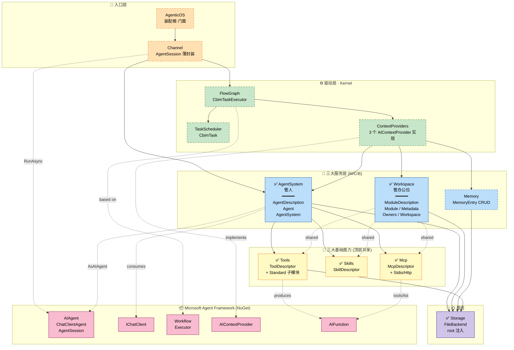
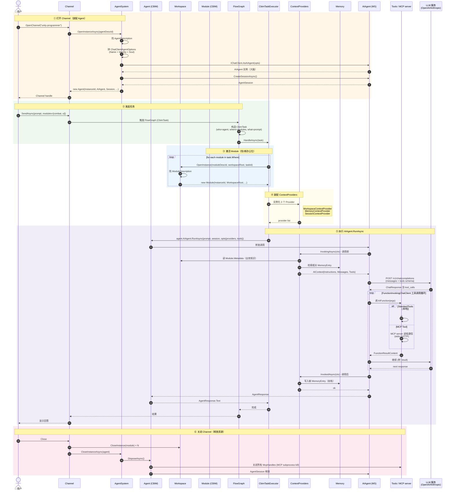

# CBIM v2 Unity 架构全景

本文档是 CBIM v2 Unity 实现的顶层架构地图。更细节的描述见各模块 `.dna/module.md`。

---

## 一、核心设计哲学

**两条主线贯穿整个 CBIM v2：**

```
不造轮子（C6 稳定抽象）：
  能用 Microsoft Agent Framework 替代的，全部交出去
  CBIM 只写"业务独有"的薄胶水层

维度对偶（C2 单一职责）：
  能力（Capability）= Agent  ← 谁能动 + 拿什么动
  业务（Business）  = Module ← 在什么工作区干、能干什么
  二者正交，由 Task 在运行时交叉成立
```

---

## 二、全景依赖图



**图例：**
- 🟧 入口层 / 🟩 驱动层 / 🟦 服务层 / 🟨 基础能力 / 🟪 IO 基底 / 🟥 Microsoft 框架
- **`✅`** 代码已落地 / **虚线框** 待实施
- **实线箭头** 直接代码依赖 / **虚线箭头** 实现接口 / 使用关系 / 跨维度共享

---

## 三、关键拓扑特征

### 单一程序集 + 严格分层

- 全部 .cs 归 `CBIM.asmdef` 一个程序集
- 命名空间承担分层语义
- `noEngineReferences: true` —— CBIM 零 Unity 耦合（Unity 接缝仅在 `Assets/Desktop/`）

### 依赖单调向下

```
入口 → 驱动 → 服务 → 基础能力 → Storage
                ↘                ↗
                 共享基础能力（无反向）
                ↘                ↗
                 Microsoft 框架
```

### 跨维度共享点（CBIM 唯一）

`AgentSystem` 和 `Workspace` 都引用 `Tools/Skills/Mcp`，但 Tools/Skills/Mcp 不反向引用任何一边。

完全对称——能力侧和业务侧地位平等。

### Microsoft 框架的位置

不是某一层的依赖，而是**所有 CBIM 模块的横向底座**。

```
CBIM = 业务薄胶水 + MS 框架内核
```

---

## 四、"人 + 办公位" 类比

抽象描述精确但难记。换个 mental model——CBIM 一次任务的两个主角，是**一个人坐到一个办公位上干活**。

### Agent（人）

| 字段 | 类比 |
|------|------|
| `AIAgent` (MS) | 大脑（决策思考）|
| `Description.Soul` / `Identity` | 人格 / 身份 |
| `Description.Skills` | 经验技能（会做的事）|
| `Description.SystemTools` | 随身工具（笔记本 / IDE）|
| `Description.McpList` | 协作能力（接外部系统的本事）|
| `Session` | 当下思考记录 |
| `McpHandles` | 启动中的工具进程 |
| `DisposeAsync` | 下班关电脑 |

### Module（办公位）

| 字段 | 类比 |
|------|------|
| `WorkspaceRoot` | 办公位位置 |
| `Description.Metadata` | 工作资料 + 操作说明（贴在墙上的规章）|
| `Description.Workflows` | 工作流程（标准作业流程清单）|
| `Description.Tools` | 办公设备（打印机 / 扫描仪 / 专用屏）|
| `Description.McpList` | 接入业务系统（连企业 ERP / CDN 控制台）|
| `Description.Owners` | 工位负责人（开发 + 审计）|
| `ActivatedByTaskId` | 这次工单 |

### Task = 工单

```
派 [某个人] 去 [一个或多个办公位] 干 [某件事]
```

- 人**带着**自己的经验 / 工具 / MCP（跟人走）
- 用办公位的**资料 / 设备 / 接入系统**（跟工位走）
- 同一个人坐不同办公位 → 经验通用 + 工位资源不同
- 同一个办公位被不同人坐 → 工位资源通用 + 经验不同

### Agent 主动 vs Module 被动

| | Agent（人）| Module（办公位）|
|--|------------|-----------------|
| 主动性 | 主动：有大脑会思考 | 被动：等人来用 |
| 资源生命周期 | 重——启动 MCP / 维护 Session / 需 Dispose | 轻——纯激活记录 |
| 谁能离开 | 下班关电脑（DisposeAsync）| 工位不关电脑 |

---

## 五、数据模型（5 层）

```
第 1 层 · MS 框架底座
  IChatClient / AIAgent / ChatClientAgent / AgentSession
  AIContextProvider / AIFunction / Workflow / Executor

第 2 层 · CBIM 基础能力抽象（顶层共享）
  ToolDescriptor / SkillDescriptor / McpDescriptor

第 3 层 · 静态描述符（维度专属）
  AgentDescription      ← 能力侧
  ModuleDescription     ← 业务侧
  + 子对象：ModuleMetadata (Local/Remote) / ModuleOwners

第 4 层 · 运行时实例
  Agent  (人，IAsyncDisposable)
  Module (办公位，纯激活记录)

第 5 层 · 服务门面
  AgentSystem (管人)
  Workspace   (管工位)
```

---

## 六、跨维度共享映射

| 抽象 | 能力侧用 | 业务侧用 | 备注 |
|------|---------|---------|------|
| `ToolDescriptor` | `AgentDescription.SystemTools` | `ModuleDescription.Tools` | 同抽象，归属不同 |
| `SkillDescriptor` | `AgentDescription.Skills` | `ModuleDescription.Workflows` | 业务侧叫 "Workflow" |
| `McpDescriptor` | `AgentDescription.McpList` | `ModuleDescription.McpList` | 跟人走 vs 跟业务走 |

**铁律：依赖单向** —— `Workspace → CBIM.Tools/Skills/Mcp`，反向严禁。

---

## 七、装配链路（Task 触发后）

```
Task = Agent + ModuleList + Requirement
   ↓
AgentSystem.OpenInstanceAsync(agentDescId)
   ↓
  内部：
   1. 找 AgentDescription
   2. 装配 ChatClientAgentOptions
      - Name = desc.Name
      - Description = desc.Identity
      - Instructions = desc.Soul
      - Tools = [SystemTools + MCP discovered tools]  ← 未来填充
   3. _chatClient.AsAIAgent(opts) → AIAgent
   4. agent.CreateSessionAsync() → AgentSession
   5. new Agent(...) 返回
   ↓
Workspace.OpenInstance(moduleDescId, workspaceRoot)
   ↓
   返回 Module
   ↓
TaskRunner / CbimTaskExecutor (Kernel/FlowGraph)
   ↓
   Agent.AIAgent.RunAsync(prompt, Agent.Session)
   ↓
   Microsoft Agent Framework 内部循环（工具调用 / 流式）
   ↓
   AgentResponse
   ↓
Task 结束：
  AgentSystem.CloseInstanceAsync(agent) → Dispose
  Workspace.CloseInstance(module)
```

---

## 八、当前完成度

```
✅ 已完成（代码 + .dna）
   ├── Storage (root 注入，去 Unity 耦合)
   ├── Tools (顶层抽象 + Standard 实现)
   ├── Skills (顶层抽象)
   ├── Mcp (顶层抽象 Stdio/Http，无 Runtime)
   ├── AgentSystem (Description + Agent + 服务门面)
   ├── Workspace (Description + Metadata + Owners + Module + 服务门面)
   ├── ThirdParty/MsExtensionsAI (44 DLL 全套)
   └── 5 个 MSAI 学习 Demo + smoke test

⏳ 待实施
   ├── Kernel/TaskScheduler/CbimTask (三元组数据类)
   ├── Kernel/ContextProviders (3 个 AIContextProvider)
   ├── Kernel/FlowGraph (基于 MS Workflows + CbimTaskExecutor)
   ├── Channel (AgentSession 薄封装)
   ├── AgenticOS (装配根)
   ├── Memory (MemoryEntry CRUD)
   └── Mcp/McpRuntime + McpServerHandle (运行时启动器，等真用时再写)

⏳ 长期补全
   ├── AgentSystem.OpenInstance 三源装配
   │   (SystemTools + Skills + MCP discovery 都接入)
   ├── ContextProviders 真实数据注入
   └── 示例 AgentDescription / ModuleDescription
```

---

## 九、关键文件清单

| 模块 | 文件 |
|------|------|
| **Tools** | `Tools/ToolDescriptor.cs` |
| **Tools/Standard** | `Tools/Standard/StandardToolsService.cs` + `Sandbox/` + `Families/` |
| **Skills** | `Skills/SkillDescriptor.cs` |
| **Mcp** | `Mcp/McpDescriptor.cs` (abstract) + `Stdio/HttpMcpDescriptor.cs` |
| **AgentSystem** | `AgentDescription.cs` + `Agent.cs` + `AgentSystem.cs` |
| **Workspace** | `ModuleDescription.cs` + `ModuleMetadata.cs` + `ModuleOwners.cs` + `Module.cs` + `Workspace.cs` |
| **Storage** | `Storage.cs` (FileBackend + Json) |
| **MS DLLs** | `ThirdParty/MsExtensionsAI/` (44 个) |

---

## 十、运行时时序图（一次 Task 全流程）

下图覆盖从"用户打开 Channel"到"任务完成关闭"的完整运行时调用链，
六个阶段标注在左侧。



### 关键时序约定

| 阶段 | 谁主动 | 关键约束 |
|------|-------|---------|
| ① 装配 Agent | Channel → AgentSystem | 一个 Channel 一次性绑一个 Agent；AIAgent.AsAIAgent 完成大脑就绪 |
| ② 触发任务 | User → Channel | Task 是不可变 record；Channel 不直接调 AIAgent，必走 FlowGraph |
| ③ 激活 Module | Executor → Workspace | 多 module 时 OpenInstance 多次（每个独立 instanceId）|
| ④ 装配 Context | Executor → CP factory | Provider 是无状态实例，每次任务新构造，不复用 |
| ⑤ LLM 执行 | AIAgent → MS Framework | 工具调用循环全在 MS 框架内部，CBIM 不介入 |
| ⑥ 释放 | Channel → 各 service | Agent.DisposeAsync 必关 McpHandles；Module 无资源仅清记录 |

### 运行时的两个"动态"

**1. 工具动态注入**（不全局）：
```
没有全局工具表
agent 选哪个 → AgentDescription.SystemTools + Skills + McpList 决定工具集
task 选哪些 module → 合并 module.Tools + module.McpList
合并去重 → 仅本次 RunAsync 生效
任务结束 → 全部失效
```

**2. 上下文动态拼接**：
```
LLM 看到的 prompt = 
  系统提示 (Soul)
  + 业务知识 (Workspace context)
  + 历史记忆 (Memory query)
  + 上次对话 (Session tail)
  + 用户输入
每次调用都重新拼，不持久化拼接结果
```

---

## 十一、参考文档

- 各模块 `.dna/module.md` —— 单模块完整设计
- `ThirdParty/MsExtensionsAI/_README.md` —— DLL 清单 + 升级路径
- `ThirdParty/MsExtensionsAI/_MSAI_Architecture.md` —— Microsoft Agent Framework 架构图
- `ThirdParty/MsExtensionsAI/_MSAI_ClassReference.md` —— Microsoft 类参考手册
- `ThirdParty/MsExtensionsAI/_MCP_EVAL_REPORT.md` —— MCP 包 Unity 兼容性评估
