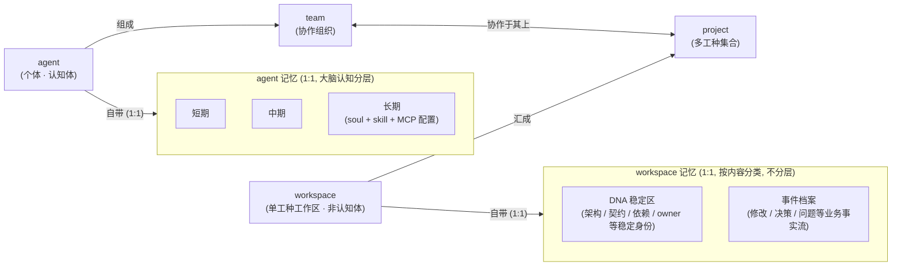

# CBIM v2 定位图

本文档只描述 CBIM 的五个核心概念——**agent / team / workspace / project / 记忆（知识）**——的角色与边界。
不写实现，不写数据结构，不写时序，不写代码。

实现细节见各模块 `.dna/module.md`。

---

## 一、概念关系图

- **agent** 是个体；多个 agent 按角色分工组成 **team**。
- **workspace** 是单一工种的工作空间；多个 workspace 汇成 **project**。
- **team** 与 **project** 在运行时配对——team 中的 agent 进入 project 中对应工种的 workspace 干活。
- **记忆（知识）** 分两条独立的线：agent 端按大脑认知模型分短/中/长三层；workspace 端按内容分 DNA 稳定区 / 事件档案两类，**不引入层级**。两条线互不吞并。

CBIM = team × project（一个 team 在一个 project 上协作）。

---

## 二、五个核心概念

### agent · 虚拟人代理

**它是什么。** CBIM 里的"工种"个体——一个具备特定专业能力的虚拟人，承担某一类工作（例如程序员、美术、策划）。

**它不是什么。** 不是"全能选手"，不是"一个进程"，不是"一个工具集合"。一个 agent 只代表一种工种身份。

**边界。** agent 的边界是"一个工种、一份职责"。超出本工种的事不归它做；跨工种的协作通过 team 完成，而不是让单个 agent 同时担任多个工种。

---

### team · agent 的协作组织架构

**它是什么。** 多个不同工种的 agent 按角色分工组成的协作单元——一支完整的"虚拟班子"。team 决定"这件事由哪些工种合力完成、各自负责什么"。

**它不是什么。** 不是 agent 的简单罗列；不是项目；不是任务流程本身。team 关心的是"谁与谁搭班子"，而不是"在哪里干"或"具体怎么干"。

**边界。** team 只描述组织关系（角色配置、分工边界），不描述工作内容、不持有工作产物。team 与 project 配对后才产生具体任务。

---

### workspace · 工作区

**它是什么。** 单一工种的工作空间——某一工种开展工作所需的资料、流程、外部系统接入点都汇聚于此。对应原架构里"模块 / 工作区"的概念。

**它不是什么。** 不是 agent 的容器（workspace 本身不持有 agent）；不是多工种共享的大杂烩——一个 workspace 只服务一种工种。

**边界。** workspace 是"被动的工位"——等 agent 进来使用。它定义"这个工种在这里能用什么资料、走什么流程、接什么系统"，但不主动思考、不主动行动。workspace **不是认知体**，因此不适用"短/中/长"这种大脑分层模型；它自带的记忆按内容分两类（DNA 稳定区 + 事件档案），见"记忆（知识）"。

---

### project · workspace 的集合

**它是什么。** 一个真实项目同时拥有的多工种工作空间集合——美术工作区、策划设计工作区、代码工作区……汇成一个 project。project 是"项目级"的统称容器。

**它不是什么。** 不是 team；不是单一工种的工作区；不是任务集合。project 不规定"谁来干"，只规定"这个项目有哪些工种的工作空间存在"。

**边界。** project 的边界等于"这个项目所包含的所有工种工作区的并集"。它与 team 正交——同一个 project 可以被不同的 team 接手协作。

---

### 记忆（知识） · agent 与 workspace 各自的状态/经验/身份/档案

**它是什么。** agent 与 workspace 的全部状态、经验、身份、档案在 CBIM 里统一称为**记忆**，也即**知识**。记忆按**归属**切分成两条独立的线，两条线遵循**不同的组织模型**——agent 端按大脑认知分层，workspace 端按内容分类：

| 归属 | 内容 | 层级（仅 agent 适用） |
|---|---|---|
| **agent** | soul + skill + MCP 配置 | 长期 |
| **agent** | 经验沉淀（自我学习、模式、启发式） | 短期 / 中期 |
| **workspace** | DNA 稳定区（架构、契约、依赖、owner 等稳定身份） | —（不适用层级） |
| **workspace** | 事件档案（修改 / 决策 / 问题等业务事实流） | —（不适用层级） |

> workspace 行的"层级"列**有意留空**：workspace 非认知体，不适用大脑分层模型——这是设计选择，不是疏漏。

- **agent 的长期记忆**——这个 agent 的稳定身份：soul（人格/职责）、skill（技能）、MCP 配置（可用工具的接入声明）。
- **agent 的短/中期记忆**——这个 agent 在思考与工作过程中沉淀的经验、模式、启发式，只属于这一个 agent。本文档不展开"短期与中期具体存什么、如何区分"，那是实现层的事。
- **workspace 的 DNA 稳定区**——这块工作区"是什么"的本体描述：架构、契约、依赖、owner 等稳定身份信息。
- **workspace 的事件档案**——这块工作区上发生的业务事实流：修改记录、决策记录、问题记录。

**它不是什么。** 不是 team 级或 project 级的共享知识库——记忆没有"团队层"或"项目层"的形态。不是跨 agent 可读写的公共存储——一个 agent 看不到也不依赖另一个 agent 的记忆。不是任务流水或调度日志。**不涉及任何检索机制**——精准查找、模糊召回等都是工程实现，与"是哪种记忆"正交，本架构文档不予描述。

**边界。**
- agent 记忆与 workspace 记忆**各自独立、互不吞并**：agent 私有经验不会被合并进 workspace 档案，workspace 演化档案也不会被合并进 agent 自身记忆。
- workspace 的记忆对**该 workspace 上工作的 agent 可见**（可读、可在协作时参考），但**不进入** agent 自身记忆。
- **短/中/长是 agent 端的大脑认知分层概念，workspace 端不引入该分层**——workspace 的记忆只按内容分类（DNA 稳定区 vs 事件档案），不按时间或认知阶段分层。
- 记忆随归属者走——agent 记忆随 agent 走，workspace 记忆随 workspace 走；agent 离开 workspace 后，workspace 的 DNA 与事件档案仍留在 workspace 上。
- 跨 agent 的信息流转只能走 team 协作渠道，不能走记忆。

---

## 三、复合关系

**CBIM = team × project。**

- **team**（一组 agent）提供"人手"——谁来干、各自什么工种。
- **project**（一组 workspace）提供"场地"——在哪里干、每个工种有哪个工位。
- 两者在运行时配对：team 中的某个工种 agent 进入 project 中对应工种的 workspace 完成具体工作。
- **记忆（知识）按归属切分成两条独立的线，且两条线的组织模型不同**：
  - **agent 端**——按大脑认知分层（短 / 中 / 长），随 agent 走，不进入 team 或 project 的共享层；长期层承载稳定身份（soul + skill + MCP 配置），短/中期层承载经验沉淀。
  - **workspace 端**——按内容分两类（DNA 稳定区 + 事件档案），**不引入层级**；随 workspace 走，对该 workspace 上的 agent 可见。
  - 两条线共同构成 CBIM 的**知识层**，但彼此互不合并、互不吞并：团队协作不靠"共享记忆"达成，只靠 team 内部约定的协作渠道。

这就是 CBIM 的全部顶层模型。其余一切（调度、装配、工具、协议、外部引擎接入……）都是这五个概念之下的实现细节，归各自模块的 `.dna/module.md`。
